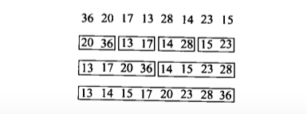
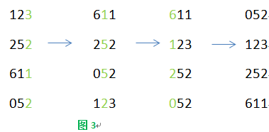

## 一 概论

数据结构是相互之间存在一种或多种特定关系的数据元素的集合。

### 基本概念和术语

数据：描述客观事物的符号，是计算机中可以操作的对象，是能被计算机识别并输入给计算机处理的符号集合。

数据元素：组成数据的、有一定意义的基本单位，在计算机中通常作为整体处理。

数据项：一个数据元素可以由若干个数据项组成，数据项是数据不可分割的最小单位

数据对象：是性质相同的数据元素的集合，是数据的子集

**数据结构**：相互之间存在一种或多种特定关系的数据元素的集合

逻辑结构：指数据对象中数据元素之间的相互关系(集合机构、线性结构、树形结构、图形结构)

物理结构（存储结构）：指数据的逻辑结构在计算机中的存储形式

>数据元素的存储结构形式：顺序存储和链式存储
>
>顺序存储结构：把数据存放到地址连续的存储单元里，逻辑关系和物理关系一致
>
>链式存储结构：把数据元素存放到任意的存储单元里，存储单元可连续也可不连续。需要一个指针存放地址

数据类型：指一组性质相同的值的集合及定义在此集合上的一些操作的总称

抽象数据类型：指一个数学模型及定义在该模型上的一组操作,其标准格式如下：

```shell
ADT 抽象数据类型名
{
Data:
	数据元素之间逻辑关系的定义；
Operation:
	操作1
		初始条件
		擦偶偶结果描述
	操作2
		......
	......
}
```

算法：五个基本特性（输入、输出、有穷形、确定性和可行性）

算法设计要求：正确性、可读性、健壮性、时间效率高和存储量低

算法时间复杂度：

>在进行算法分析时，语句总的执行次数T(n)是关于问题规模n的函数，进而分析T(n)随n的变化情况并确定T(n)的数量级。算法的时间复杂度，也就是算法的时间量度，记作：T(n) = O(f(n))。它表示随问题规模n的增大，算法执行时间的增长率和f(n)的增长率相同，称为算法的渐进时间复杂度，简称时间复杂度。

算法空间复杂度：通过计算算法所需的存储空间实现，S(n)=O(f(n)),n为问题的规则，f(n)为语句关于n所占存储空间的函数

数据结构与算法：数据结构负责数据的存储，算法负责对数据的处理并得出结果

## 二 线性表（List）

**线性表：零个或多个数据元素的有限序列**

>- 是一个序列，元素之间是有顺序的，元素有前驱和后继
>- 线性表是有限的
>- 线性表元素的个数m定义为线性表的长度，n=0时为空表

### 2.1 线性表的抽象数据类型

```shell
ADT 线性表（List）
Data
	数据对象集合,元素有前驱和后继，数据元素之间一对一的关系
Operation
	InitList(*L);	// 初始化操作，建立一个空的线性表L
	ListEmpty(L);	// 若线性表为空，返回true，否则返回false
	ClearList(*L);	// 清空线性表L
	GetElem(L,i,*e);	// 将线性表L中的第i个元素值返回给e
	LocateElem(L,e);	// 在线性表中查找与e相等的元素，若查找成功返回该元素在表中序号，否则返回0表示失败
	ListInsert(*L,i,e);	// 在线性表L中的第i个位置插入新元素e
	ListDelete(*L,i,*e);	// 删除线性表L中第i个位置元素，并用e返回其值
	ListLength(L);		// 返回线性表L的元素个数
endADT
```

### 2.2 线性表的顺序存储结构

**线性表的顺序存储结构，指的是用一段地址连续的存储单元依次存储线性表的数据元素**

顺序存储结构的三个属性：

- 存储空间的起始位置
- 线性表的最大存储容量
- 线性表的当前长度

**顺序存储结构示意图**


用数组存储顺序表意味着要分配固定长度的数组空间。存储器中的每个存储单元都有自己的编号，这个编号称为地址。

**顺序存储结构的插入与删除**

插入算法的思路：

- 如果插入位置不合理，抛出异常
- 如果线性表长度大于数组长度，抛出异常或动态增加容量
- 从最后一个元素开始向前遍历到第i个位置，分别将他们都向后移动一个位
- 在第i个位置插入元素
- 表长加 1

删除算法的思路：

- 如果删除位置不合理，抛出异常
- 取出删除元素
- 从删除元素位置开始遍历到最后一个元素位置，分别将他们向前移动一个位置
- 表长减 1

**顺序存储结构的优缺点**

优点：

- 无需为表示表中元素的逻辑关系增加额外的存储空间
- 可以快速地存取表中任意位置的元素

缺点：

- 插入和删除操作要移动大量元素
- 线性表长度变化较大时，难以确定存储空间的容量
- 造成存储空间的碎片

###　2.3 线性表的链式存储结构

链表是一种线性表，但并不按照线性的顺序存储结构，是一种物理空间上非连续、非顺序的存储结构。

链表通常由一系列结点组成，每个结点包含：

- 链域：它的值是线性表的上一个/下一个元素的位置，即地址
- 数据域：它的值存储的相应的实例数据的值

链表分为单链表和双向链表，单链表的存储结构如下图：


链表中第一个结点的存储位置叫做头指针，称为头结点，头结点数据域不存储任何信息。最后一个结点指针为空

>头指针：链表指向第一个结点的指针，是链表的必要元素
>
>头结点：放在第一个结点之前，其数据与一般无意义，不是链表的必要元素

**单链表的插入算法思路**

- 声明一结点p指向链表第一个结点，初始化 j 从1开始
- 当j<i时，遍历链表，让p的指针向后移动，不断指向下一结点，j++
- 若到链表末尾p为空，则说明第i个元素不存在
- 否则查找成功，在系统中生成一个空结点s
- 将数据元素e赋值给s->data
- 插入元素：`s->next=p_next; p->next=s`
- 返回成功

**单链表的删除算法思路**：

- 声明一个结点p指向链表第一个结点，初始化 j 从1开始
- 当 j < i 时，遍历链表，让 p 的指针向后移动，不断指向下一个结点， j++
- 若到链表末尾p为空，则说明第 i 个元素不存在
- 否则查找成功，将欲删除的结点p->next赋值给q
- 单链表删除：p->next = q->next
- 将 q 结点中的数据赋值给e，返回e
- 释放q结点
- 返回成功

**优缺点**

- 不需要事先知道数据大小，充分利用内存空间，实现灵活的动态内存管理
- 进行插入和删除操作，不需要频繁的移动其他元素的位置，只需要修改对应位置附近结点的链域的值即可

- 只能通过顺序访问，效率相对较低
- 每个链表的每个结点都有链域，占用空间较多

>**线性表的顺序存储结构是可以随机存取的**
>
>顺序存储和链式存储在逻辑上都是线性的，但是在存储结构上顺序存储的存储空间是连续的，因此可以随机存储，例如知道第一个元素的地址，可访问存取第一个元素，第一个元素地址加上10，可访问第10个元素；而链式存储结构的存储空间是不连续的，因此不能随机存取

### 2.4 静态链表

**用数组描述的链表叫做静态链表**

>数据域：存放结点数据
>
>游标：存放该元素的后继在数组中的下标
>
>可增加一条备用链表，连接各个空闲位置的链表，其作用是回收数组中未使用或之前使用过（目前未使用）的存储空间，留待后期使用

**优缺点**

优点：

- 插入和删除操作时只需要修改游标，不用移动元素

缺点：

- 连续存储分配使得表长难以确定
- 失去了顺序存储结构的随机存取的特性

**循环链表**

将单链表中终端结点的指针由空指针改为指向头结点，这种头尾相接的单链表就是单循环链表，简称循环链表

### 2.5 双向链表

双链表存储了两个指针：一个指向它的后继结点，一个指向它的前驱结点，这样可以随意访问它的前驱结点和后继结点

插入操作：

```shell
# 在 p 之后插入一个元素e的关键代码
s->prior = p;			// 把 p 赋值给s的前驱
s->next = p->next;		// 把p->next 赋值给 s 的后继
p->next->prior = s;		// 把 s 赋值给p->next的前驱
p->next = s;			// 把s赋值给p的后继

```

删除操作：

```shell
# 删除 p 结点
p->prior->next = p->next;		// 把 p->next 赋值给 p->prior 的后继
p->next->prior = p->prior;		// 把 p->prior 赋值给 p->next 的前驱
free(p);
```

## 三 栈与队列

### 3.1 栈

>堆栈空间分配：
>
>- 栈（操作系统）：由操作系统自动分配释放 ，存放函数的[参数值](https://baike.baidu.com/item/参数值)，[局部变量](https://baike.baidu.com/item/局部变量)的值等。其操作方式类似于数据结构中的栈。
>
>- 堆（操作系统）： 一般由程序员分配释放， 若程序员不释放，程序结束时可能由OS（操作系统）回收，分配方式倒是类似于链表。

**栈是限定在表尾进行插入和删除操作的线性表**

允许插入和删除的一端称为栈顶(top)，另一端称为栈底(bottom)，不含任何数据元素的栈称为空栈

栈又称后进先出的线性表，简称`LIFO`结构

**栈操作：**

- 插入操作：**入栈（push）**，先栈顶加 1，后元素入栈
- 删除操作：**出栈（pop）**，先元素出栈，后栈顶减 1

**栈的应用**：递归操作

- 直接调用自己或者通过一系列的调用语句间接调用自己的函数称为递归函数
- 每个递归定义必须至少有一个条件满足时不再进行递归，即不在引用自身而是返回值退出


### 3.2 队列

**队列是只允许在一端进行插入操作、而在另一端进行删除操作的线性表**

队列是一种先进先出的（FIFO）的线性表，简称FIFO，允许插入的一端称为队尾，允许删除的一端称为队头。

**队列的抽象数据类型**

```shell
ADT 队列（Queue）
Data
	同线性表，元素具有相同的类型，相邻元素具有前驱和后继关系
Operation
	InitQueue(*Q);				// 初始化操作，建立一个空队列
	DestroyQueue(*Q);			// 销毁队列
	ClearQueue(*Q); 			// 将队列清空
	QueueEmpty(*Q);				// 若队列为空返回true，否则返回false
	GetHead(Q, *e);				// 若队列存在非空，用e返回队列Q的队头元素
	EnQueue(*Q, e);				// 若队列Q存在，插入元素e到队列中成为队尾元素
	DeQueue(*Q, *e);			// 删除队列Q队头元素，并用e返回
	QueueLength(Q);				// 返回队列Q的元素个数
endADT
```

**循环队列**

引入指针`front`指向队头元素，引入指针`rear`指向队尾元素的下一个位置，当两个指针相同时，还剩一个元素

将队列的头尾相接的顺序存储结构称为循环队列

- 判断队列满的条件：`(rear + 1) % QueueSize == front`
- 判断队列为空的条件：`front == rear`
- 计算队列长度的公式：`(rear - front + QueueSize) % QueueSize`

## 四 树

树（Tree）：n 个结点的有限集。n = 0 时称为空树。

- 在任意一棵非空树中，有且仅有一个特定的称为**根**(Root)的结点
- 其余结点可分为 m 个互不相交的有限集，称为根的**子树**(`SubTree`)

### 4.1 结点介绍

- 结点的度：结点含有的子结点的个数，度为 0 的结点称为叶结点或终端节点

- 树的度：树分支结点的度的最大值

- 结点的子树的根称为该结点的孩子，相应地，该结点成为孩子的双亲

- 结点的祖先是从根到该结点所经分支上的所有结点，以某结点为根的子树中的任一结点都称为该结点的子孙。

- 结点的层次从根开始定义起，根为第一层，根的孩子为第二层

- 树的高度或深度：树中结点的最大层次

- 森林：是 m 棵互不相交的树的集合

### 4.2 树的抽象数据类型

```shell
ADT 树(Tree)
Data
	树是由一个根节点和若干棵子树构成，树中结点具有相同数据类型和层次关系
Operation
	InitTree(*T);							// 构造空树 T
	DestroyTree(*T);						// 销毁树 T
	CreateTree(*T， definition); 			// 按definition中给出树的定义来构造树
	ClearTree(*T);							// 若树 Ｔ　存在，则将树 T 清为空树
	TreeEmpty(T);							// 若　T　为空树，返回true，否则返回false
	TreeDepth(T);							// 返回 T 的深度
	Root(T);								// 返回 T 的根节点
	Value(T, cur_e);						// cur_e是树 T 的一个结点，返回此结点的值
	Assign(T, cur_e, value);				// 给树的结点 cur_e 赋值为value
	Parent(T, cur_e);						// 返回 cur_e 的双亲，否则返回空
	LeftChild(T, cur_e);					// 返回左孩子，否则返回空
	RightChild(T, cur_e);					// 返回右孩子，否则返回空
	InsertChild(*T, *p, i, c);				// 插入结点
	DeleteChild(*T, *p, i);					// 删除结点
endADT
```

### 4.3 树的存储结构

**双亲表示法**：在每个结点中，附设一个指示器指示其双亲结点到链表中的位置

- 数据域data：存储结点的数据信息
- 指针域parent：存储结点的双亲在数组中的下标
- 根结点的指针域设为 -1

**孩子表示法**：把每个结点的孩子结点排列起来，以单链表作存储结构，则 n 个结点有 n 个孩子链表，如果是孩子结点则此单链表为空。然后 n 个头指针又组成一个线性表，采用顺序存储结构，存放进一个一位数组中。

*孩子链表的孩子结点*

- 数据域child：存储某个结点在表头数组中的下标
- 指针域next：存储指向某结点的下一个孩子结点的指针

*表头数组的表头结点*

- 数据域data：存储某结点的数据信息
- 头指针域`firstchild`：存储该结点的孩子链表的头指针

**孩子兄弟表示法**：任一棵树，它的结点的第一个孩子如果存在就是唯一的，它的右兄弟如果存在也是唯一的。

- 数据域data
- 指针域`firstchild`：存储该结点的第一个孩子结点的存储地址
- 指针域`rightsib`：存储该结点的右兄弟结点的存储地址

### 4.4 二叉树

二叉树：n 个结点的有限集合，该集合或者为空集(称为空二叉树)，或者由一个根结点和两棵互不相交的、分别称为根结点左子树和右子树的二叉树组成

**二叉树特点**

- 每个结点最多有两棵子树，即度最大为 2
- 左子树和右子树是有顺序的，次序不能颠倒
- 即使树中某结点只有一棵子树，也要区分左右子树

**特殊的二叉树**

- 斜树：所有的结点都只有左子树或者右子树
- 满二叉树：所有分支结点都有左子树和右子树，并且所有叶子都在同一层上
- 完全二叉树：对于一棵具有 n 个结点的二叉树按照层序编号，编号为 i 的结点与同样深度的满二叉树中编号为 i 的结点在二叉树中位置完全相同，即二叉树中除去最后一层节点为满二叉树，且最后一层的结点依次从左到右分布
- 满二叉树一定是完全二叉树，完全二叉树不一定是满二叉树

**二叉查找树**：对于二叉查找树(`BST`)的任何一个结点，设其值为 K，则该结点左子树中任意一个结点的值都小于 K。该结点右子树中任意一个结点的值都大于或等于 K。

**二叉树的性质**

- 性质 1：在二叉树的第 i 层上至多有 2<sup>i-1</sup> 个结点
- 性质 2：深度为 k 的二叉树至多有 2 <sup>k</sup> - 1 个结点
- 性质 3：对任何一棵二叉树 T，如果其终端结点数为 n<sub>0</sub>，度为 2 的结点数 n<sub>2</sub>，则 n<sub>0</sub> = n<sub>2</sub> + 1
- 性质 4：具有 n 个结点的完全二叉树的深度为[ log<sub>2</sub>n ]+1,[x]表示不大于的最大整数

**二叉树的存储结构**

- 二叉树的顺序存储结构

  用一维数组存储二叉树中的结点，并且节点的存储位置也就是数组的下标位置能体现结点之间的逻辑关系

  不存在的结点设置为0，数组元素按层序编号`左结点序号 = 2 * 双亲序号 + 0，右结点序号 = 2 * 双亲序号 + 1`

- 二叉链表

  二叉树每个结点最多有两个孩子，为其设计数据域和指针域

  数据域data：存储结点的数据信息

  左指针域`lchild`：存放指向左孩子的指针

  右指针域`rchild`：存放指向右孩子的指针

**遍历二叉树**

从根节点开始，按照某种次序依次访问二叉树中所有结点，使得每个结点被访问一次且仅被访问一次

一般采用递归的方式实现遍历算法

- 前序遍历：先访问根结点，然后前序遍历左子树，再前序遍历右子树
- 中序遍历：从根结点开始，中序遍历根结点的左子树，然后是访问根结点，最后中序遍历右子树
- 后序遍历：从左到右先叶子结点的方式遍历访问左右子树，最后访问根结点
- 层序遍历：从树的第一层根结点开始访问，从上而下逐层遍历，在同一层中按从左到右的顺序依次访问结点

```shell
# 前序遍历算法
bool PreOrderTraverse(BiTree T)
{
	if(T == NULL)
		return false;
	/* 访问操作 */
	PreOrderTraverse(T->lchild);  /* 遍历左子树 */
	PreOrderTraverse(T->rchild);  /* 遍历右子树 */
	
	return true；
}

# 中序遍历算法
bool InOrderTraverse(BiTree T)
{
	if(T == NULL)
		return false;
	InOrderTraverse(T->lchild);		/* 遍历左子树 */
	/* 显示结点数据，对结点进行访问操作 */
	InOrderTraverse(T->rchild);		/* 遍历右子树 */
	
	return true；
}

# 后序遍历算法
bool PostOrderTraverse(BiTree T)
{
	if(T == NULL)
		return false;
	PostOrderTraverse(T->lchild);	/* 遍历左子树 */
	PostOrderTraverse(T->rchild);	/* 遍历右子树 */
	/* 对结点进行访问操作 */
	
	return true；
}
```

### 4.5 堆与优先队列

**堆数据结构**：

- 首先堆是一棵完全二叉树，用数组来实现
- 堆中存储的数据是局部有序的 （结点存储的值与其子节点存储的值之间存在联系）

**最大值堆与最小值堆**

- 最大值堆：任意一个结点的值都大于或等于其任意一个子结点存储的值
- 最小值堆：任意一个结点存储的值都小于或等于其任意一个子结点存储的值

### 4.6 赫夫曼编码

**赫夫曼算法描述**：

1. 根据给定的 n 个权值{w<sub>1</sub>,w<sub>2</sub>,w<sub>3</sub>,...,w<sub>n</sub>}构成n棵二叉树的集合F={T<sub>1</sub>,T<sub>2</sub>,...,T<sub>n</sub>}，其中每棵二叉树 T<sub>i</sub> 中只有一个带权为w<sub>i</sub>的根结点，其左右子树均为空
2. 在 F 中选取两棵根结点的权值最小的树作为左右子树构造一棵新的二叉树，且置新的二叉树的跟结点的权值为其左右子树上根结点的权值之和
3. 在 F 中删除这两棵树，同时将新得到的二叉树加入到 F 中
4. 重复步骤 2 和步骤 3，知道 F 只含一棵树为止，这棵树就是赫夫曼树

**赫夫曼编码**

设需要编码的字符集为{d<sub>1</sub>,d<sub>2</sub>,...,d<sub>n</sub>},各个字符出现的次数或频率集合为{w<sub>1</sub>,w<sub>2</sub>,w<sub>3</sub>,...,w<sub>n</sub>},以d<sub>1</sub>,d<sub>2</sub>,...,d<sub>n</sub>作为叶子结点，以w<sub>1</sub>,w<sub>2</sub>,w<sub>3</sub>,...,w<sub>n</sub>作为相应叶子结点的权值构造赫夫曼树。

规定生成的赫夫曼树的左子树代表0 0，右子树代表 1，则从根结点到叶子结点所经过的路径分支组成的 0 和 1 的序列便为该结点对应字符的编码，这就是赫夫曼编码。

## 五 内排序

在计算机主存内对一组记录进行排序

### 5.1 三种代价为O(n<sup>2</sup>)的排序方法

#### 5.1.1 插入排序

插入排序逐个处理待排序的记录，每个新纪录与前面已排序的子序列进行比较，将它插入到子序列中正确的位置。

数据项过多或者重复数据项过多的情况不适用插入排序

最差情况：O(n<sup>2</sup>)

最佳情况：O(n)

平均代价时间：O(n<sup>2</sup>)

```shell
/* 递增排序 */
for(int i = 0; i < n; i++)
{
	for(int j = i + 1; j > 0; j--)
	{
		if(a[j] < a[j - 1])
		{
			temp = a[j - 1];
			a[j - 1] = a[j];
			a[j] =temp;
		}
	}
}
```

#### 5.1.2 冒泡排序

冒泡排序是最慢的排序算法，效率最低

- 最佳情况：O(n<sup>2</sup>)
- 平均情况：O(n<sup>2</sup>)
- 最差情况：O(n<sup>2</sup>)

两两比较相邻的记录，如果反序则交换，直到没有反序的记录为止。

```shell
/* 递增排序 */
/* 初级版交换排序 */
for(int i = 0; i < n - 1; i++)
{
	for(int j = i + 1; j < n; j++)
	{
		if(a[j] < a[j-1])
		{
			temp = a[j-1];
			a[j-1] = a[j];
			a[j] = temp;
		}
	}
}

/* 正宗版冒泡排序 */
for(int i = 0; i < n - 1; i++)
{
	for(int j = n - 1; j >= i; j--)
	{
		if(a[j - 1] > a[j])
		{
			temp = a[j - 1];
			a[j - 1] = a[j];
			a[j] = temp;
		}
	}
}
```

#### 5.1.3 选择排序

- 最佳情况：O(n<sup>2</sup>)
- 平均情况：O(n<sup>2</sup>)
- 最差情况：O(n<sup>2</sup>)

选择排序的第 i 次是选择数组中第 i 小的记录，并将该记录放到数组的第 i 个位置。首先从未排序的序列中找到最小关键记录，记者是次小的，以此类推。

```shell
/* 递增排序 */
for(int i = 0; i < n - 1; i++)
{
	int temp = i;
	int tempNum = a[i];
	for(int j = n - 1; j > i; j--)
	{
		if(a[i] > a[j])
		{
			temp = j;
		}
	}
	a[i] = a[temp];
	a[temp] = tempNum;
}
```

### 5.2 Shell 排序

与交换排序不同的是，Shell排序是在不相邻的记录之间进行比较与交换。

平均时间代价`O(nlog(n))`,分组的合理性会对算法产生重要的影响。

比冒泡0和插入都快，对于数据量较小的数列重复排序效果很好。

子序列：将相聚某个增量的记录组成一个子序列

Shell是这样来分组并排序的：将序列分成子序列，然后分别对子序列进行插入排序，最后将子序列组合起来。Shell排序将数组元素分为虚拟子序列，每个子序列用插入排序方法进行排序；另一组子序列也是如此选取，然后排序，依此类推。

```
template <class Elem, class Comp>
void inssort2(Elem A[], int n, int incr)
{
	for(int i = incr; i < n; i += incr)
	{
		for(int j = i; (j >= incr)&&(Comp::it(A[j], A[j - incr])); j -= incr)
			swap(A, j, j - incr);
	}
}

template <class Elem, class Comp>
void shellsort(Elem A[], int n)
{
	for(int i = n/2; i > 2; i /= 2)
	{
		for(int j = 0; j < i; j++)
		{
			inssort2<Elem,Comp>(&A[j], n - j, i);
		}
	}
	inssort2<Elem, Comp>(A, n ,1);
}

```

### 5.3 快速排序

快速排序首先选择一个轴值，假设输入的数组中由 k 个小于轴值的结点，于是这些结点被放在数组最左边的 k 个位置上，而大于轴值的结点被放在数组最右边的 n - k 个位置上，这称为数组的一个分割，在给定的分割中的值不必被排序，只要求所有结点都放到了正确的位置。而轴值的位置就是下标 k。再对轴值的左右子数组分别进行类似的操作。

快速排序速度很快，利用分而治之的思想，采用递归调用，对于内存有限的机器效果很好。

 平均时间代价：`O(nlog(n))`

```shell
template <class Elem, class Comp>
void qsort(Elem A[], int i, int j)
{
	if(j <= i)
		return;
	int pivotIndex = (i + j)/2;		/* 找到中间值 */
	swap(A, pivotIndex, j);			/* 交换轴值到最后位置，确保在后续操作中不再改变 */
	int k = partition(A, i - 1, j, A[j]);	/* k 为右子数组的开始位置 */
	swap(A, k, j);					/* k 处即为轴值 */
	qsort(A, i, k - 1);				/* 递归快速排序左子数组 */
	qsort(A, k + 1, j);				/* 递归快速排序右子数组 */
}

/* 用双指针的方法，从首尾开始比较与轴值的大小，不满足时交换 */
template <class Elem, class Comp>
int partition(Elem A[], int l, int r, Elem& pivot)
{
	do{
		while(Comp::lt(A[++l], pivot));		/* 当小于轴值时，++l */
		while(Comp::lt(A[--r], pivot));		/* 当大于轴值时，--r */
		swap(A, l, r);
	}while(l < r);
	swap(A, l, r);							/* 反转交换 */
	return l;								/* 返回右子数组的第一个位置 */
}
```

### 5.4 归并排序

归并排序将一个序列分成两个长度相等的子序列，为每一个子序列排序，再将它们合并成一个序列。

合并两个有序子序列的过程称为归并。因为需要另一个存储空间来存储子序列，因此占用存储空间较多。

最佳、平均、最差的时间代价：`O(nlog(n)`)

归并排序步骤如下图：



```shell
template <class Elem, class Comp>
void mergesort(Elem A[], Elem temp[], int left, int right)
{
	if((right - left) <= THRESHOLD)
	{
		inssort<Elem,Comp>(&A[left], right - left + 1);
		return;
	}
	int i, j, k, mid = (left + right)/2;
	if(left == right) 	return;
	mergesort<Elem, Comp>(A, temp, left, mid);
	mergesort<Elem, Comp>(A, temp, mid + 1, right);
	for(i = mid; i >= left; i--)	temp[i] = A[i];
	for(j = 1; j <= right - mid; j++)	temp[right - j + 1] = A[j + mid];
	
	for(i = left, j = right, k = left; K <= right; k++)
	{
		if(temp[i] < temp[j])	A[k] = temp[i++];
		else 	A[k] = temp[j--];
	}
}
```

### 5.5 堆排序

最佳、平均、最差时间代价：`O(nlog(n))`

对空间的利用率很高，适用于那些数据集太大（不适用与在内存中排序）的情况

堆排序首先利用构造堆的算法将数组转化为一个满足堆定义的序列，然后将堆顶的最大元素去除，再对剩下的树排成堆并取出堆顶数组元素，如此下去直到堆为空。每次将堆顶的最大元素取出放到数组的最后。

### 5.6 分配排序和基数排序

排序过程无须比较关键字，通过分配和手机过程来实现排序，时间复杂度：O(n).

允许记录重复的情况下，使得数组元素成为可变长的盒子，也就是使得数组中的每个元素变成一个链表的头节点，于是所有具有关键码 i 的记录就被放在第 i 个盒子里。

```shell
for(i = 0; i < n; i++)
{
	B[A[i]] = A[i];
}
```

**桶排序**

假设有一组长度为N的待排关键字序列 K[1....n]。首先将这个序列划分成M个的子区间(桶) 。然后基于某种映射函数 ，将待排序列的关键字 k 映射到第 i 个桶中(即桶数组 B 的下标 i) ，那么该关键字 k 就作为 B[i] 中的元素(每个桶 B[i] 都是一组大小为 N/M 的序列)。接着对每个桶 B[i] 中的所有元素进行比较排序(可以使用快排)。然后依次枚举输出 B[0]....B[M] 中的全部内容即是一个有序序列。

如 K =  {49、38、35、97、76、73、27、49}，映射规则：f(k) = k / 10;

桶排序结果如下：


**基数排序**

将所有待比较数值(正整数)统一为同样的数位长度，数位较短的数前面补零。然后，从最低位开始，依次进行一次排序。这样从最低位排序一直到最高位排序完成以后，数列就变成一个有序序列。

如 K = {123、252、611、52}

基数排序结果如下：



### 5.7 各种排序算法的比较


## 六 文件管理和外排序

- 主存储器通常指随机访问存储器，辅助存储器指硬盘、软盘和磁盘这样的设备

### 6.1 磁盘

C++ 把存储在磁盘中可随机访问的文件看成一段连续的字节，而且可以把这些字节结合起来构成记录，这称为逻辑文件

- 文件管理器：当应用程序请求从逻辑文件中读取数据时，把这些逻辑为止映射为磁盘中的具体的物理位置
- 磁盘通常称为直接访问存储设备

**磁盘结构**：

- 一块硬盘由一个或多个圆形盘片组成，每个盘片的每个可用表面都有一个读/写磁头，或者称为 I/O 磁头
- 磁头在一个盘片的某个位置上可以访问的所有数据就构成磁道
- 与主轴具有相同距离、分布在各个盘片上的所有磁道称为一个柱面
- 每个磁道分为多个扇区，扇区是 I/O 的基本单位；两个相邻扇区之间有扇区间间隙，不存储数据
- 多个扇区集结成组，称为一个簇，文件分配的最小单位
- 存储容量 = 磁头数 x 磁道数 x 每道扇区数 x 每扇区字节数

**缓冲区和缓冲池**：

一旦读取了一个扇区，就把它的信息存储在主存中，这称为缓冲或缓存信息

缓冲作为用户和文件中介的过程称为缓冲文件，存储在一个缓冲区中的信息通常称为一页，这些缓冲区合起来称为缓冲池

### 6.2 外排序

当一组记录数量太大无法存放到主存中，必须驻留在外部存储器中进行排序，外排序的主要目标是减少读、写磁盘的信息量，待排序的文件是有一定顺序、固定大小的块。

I/O 时间对于任何外排序算法的总运行时间都起着决定性作用

**简单的外部排序方法**：把整个文件读入虚拟存储器中，然后运行一个内部排序方法

**归并算法**：对记录顺序地完成一系列扫描，在每一趟扫描中，归并的子列越来越来大

- 把文件分成大的出事顺串
- 把所有顺串归并到一起，形成一个已排序的文件

### 6.3 置换选择排序

置换选择排序方法把 RAM 看成一块大小为 M 的连续数组，再加上输入缓冲区和输出缓冲区，把输入输出文件都想象成记录流。在需要的时候从输入流中顺序地取出一条记录，然后一次一条记录地向输出流输出顺串。

置换选择方法工作方式如下：

1. 从磁盘中读出数据放到数组中，设置 LAST = M - 1；
2. 建立一个最小值堆（每个结点记录的关键值都小于其子结点记录的关键值码的完全二叉树）；
3. 重复以下步骤，直到数组为空：
   - 把具有最小关键值码的记录(根结点)送到输出缓冲区；
   - 设 R 是输入缓冲区中的下一条记录，如果 R 的关键值码大于刚刚输出的关键值码；
     - 则把 R 放到根结点；
     - 否则使用数组中 LAST 未知的记录代替根结点没然后把 R 放到 LAST 位置，LAST--
   - 筛选出根结点，重新排列堆

4. 当缓冲区填满时，就把它写回磁盘

### 6.4 多路归并

如果有 B 个顺串需要归并，从每个顺串中取出一个块放在主存中使用，那么 B 路归并算法仅仅查看 B 个值（每个输入顺串最前面的值），并且选择最小的一个输出，把这个值从它的顺串中移出，然后重复这个过程。

## 七 检索

### 7.1 基本概念

假定有一个包含 n 条记录的集合 C，形式如下：(k<sub>1</sub>, I<sub>1</sub>), (k<sub>2</sub>, I<sub>2</sub>), ...... , (k<sub>n</sub>, I<sub>n</sub>)，其中 I<sub>j</sub> 是 关键码值 k<sub>j</sub> 相关联的信息。检索问题就是在 C 中定位记录(k<sub>j</sub>, I<sub>j</sub>)，使得 k<sub>j</sub> = K。检索就是定位关键码值  k<sub>j</sub> = K 的记录的系统化方法。

查找表：由同一类型的数据元素（或记录）构成的集合

关键字：数据元素中某个数据项的值，又称为键值；若某个关键字可以唯一地标识一个数据元素则称为主关键字，反之不具有唯一性称为次关键字。

静态查找表：只作查找操作的查找表

动态查找表：在查找过程中同时插入查找表不存在的数据元素，或者从查找表中删除已经存在的某个数据元素

检索算法分为三类：

- 顺序表和线性表方法
- 根据关键码值直接访问方法(散列法)
- 树索引方法

### 7.2 顺序查找

又称线性查找，从表中第一个或者最后一个记录开始，逐个进行记录的关键字和给定值比较，若某个记录的关键字和给定值相等，则查找成功，否则失败

顺序查找需要每次循环都要判断是否越界，可设置一个哨兵，解决每次不需要比较 i 与 n

```shell
int a[0] = key;
int i = n;
while(a[i] != key)
{
	--i;
}

return i;
```

顺序查找在 n 很大时效率极为低下，但在对一些小型数据的查找时是可以适用

### 7.3 有序表查找

**折半查找**

又分为二分查找，前提是线性表中的记录必须是关键码有序，线性表采取顺序存储。

在有序表中，取中间记录作为比较对象，若给定值与中间记录的关键字相等则查找成功，若给定值小于中间记录的关键字，则在中间记录的左半区继续查找；若给定值大于中间记录的关键字，则在中间记录的右半区继续查找；不断重复

**插值查找**

在折半查找中；`mid = (low + high)/2 = low + (high - low)/2`;将其修改为：

`mid = low + (key - a[low])(high - low)/(a[high] - a[low])`;这就是插值查找

### 7.4 线性索引查找

索引：把一个关键字与它对应的记录相关联的过程

索引按照结构可以分为线性索引、树形索引和多级索引

线性索引（稠密索引、分块索引和倒排索引）就是将索引项集合组织为线性结构，也成为索引表

**稠密索引**：在线性索引中，将数据集中的每个记录对应一个索引项，对于稠密索引来说，索引项一定是按照关键码有序的排列

**分块索引**：把数据集的记录分成若干块，将每个块对应一个索引项，并且这些块需要满足两个条件

- 块内无序
- 块间有序

分块索引的索引项结构分三个数据项：

- 最大值关键码，便于下一块的最小关键码判断
- 存储块中的记录个数，以便循环时使用
- 用于指向块首数据元素的指针，便于开始对这一块中记录遍历

**倒排索引**

建立记录的索引表：

- 次关键码
- 记录号表

记录号表存储具有相同次关键字的所有记录的记录号（可以是指向记录的指针或者该记录的主关键字），通过查找次关键码来得到记录的位置，这就是倒排索引。是由属性值来确定记录的位置，而不是由记录来确定属性值

### 7.5 二叉排序树（二叉查找树）

二叉查找树或是一棵空树，或是具有以下性质的二叉树：

- 若它的左子树不空，则左子树上所有结点的值均小于它的根结点的值
- 若它的右子树不空，则右子树上所有结点的值均大于它的根结点的值
- 它的左右子树也分别为二叉查找树

**查找操作**：查找成功用一个指针指向该数据元素；否则指向查找路径上访问的最后一个结点

**插入操作**：先进行查找，没找到在指针对应位置插入 key

**删除操作**：

删除操作分为三种情况

- 叶子结点：直接删除

- 仅有左或右子树的结点，删除结点，将结点的左子树或右子树取代该结点

- 左右子树都有的结点

    利用找待删除的直接前驱或者后继来替代
    
    令结点 p 的左子树为其双亲结点的左子树；结点 p 的右子树为其自身直接前驱结点的右子树
    
    用结点 p 的直接前驱（或直接后继）来代替结点 p，同时在二叉排序树中对其直接前驱（或直接后继）做删除操作。

```shell
#include<stdio.h>
#include<stdlib.h>
#define TRUE 1
#define FALSE 0
#define ElemType int
#define  KeyType int
/* 二叉排序树的节点结构定义 */
typedef struct BiTNode
{
    int data;
    struct BiTNode *lchild, *rchild;
} BiTNode, *BiTree;
//二叉排序树查找算法
int SearchBST(BiTree T, KeyType key, BiTree f, BiTree *p) {
    //如果 T 指针为空，说明查找失败，令 p 指针指向查找过程中最后一个叶子结点，并返回查找失败的信息
    if (!T) {
        *p = f;
        return FALSE;
    }
    //如果相等，令 p 指针指向该关键字，并返回查找成功信息
    else if (key == T->data) {
        *p = T;
        return TRUE;
    }
    //如果 key 值比 T 根结点的值小，则查找其左子树；反之，查找其右子树
    else if (key < T->data) {
        return SearchBST(T->lchild, key, T, p);
    }
    else {
        return SearchBST(T->rchild, key, T, p);
    }
}
int InsertBST(BiTree *T, ElemType e) {
    BiTree p = NULL;
    //如果查找不成功，需做插入操作
    if (!SearchBST((*T), e, NULL, &p)) {
        //初始化插入结点
        BiTree s = (BiTree)malloc(sizeof(BiTNode));
        s->data = e;
        s->lchild = s->rchild = NULL;
        //如果 p 为NULL，说明该二叉排序树为空树，此时插入的结点为整棵树的根结点
        if (!p) {
            *T = s;
        }
        //如果 p 不为 NULL，则 p 指向的为查找失败的最后一个叶子结点，只需要通过比较 p 和 e 的值确定 s 到底是 p 的左孩子还是右孩子
        else if (e < p->data) {
            p->lchild = s;
        }
        else {
            p->rchild = s;
        }
        return TRUE;
    }
    //如果查找成功，不需要做插入操作，插入失败
    return FALSE;
}
//删除函数
int Delete(BiTree *p)
{
    BiTree q, s;
    //情况 1，结点 p 本身为叶子结点，直接删除即可
    if (!(*p)->lchild && !(*p)->rchild) {
        *p = NULL;
    }
    else if (!(*p)->lchild) { //左子树为空，只需用结点 p 的右子树根结点代替结点 p 即可；
        q = *p;
        *p = (*p)->rchild;
        free(q);
    }
    else if (!(*p)->rchild) {//右子树为空，只需用结点 p 的左子树根结点代替结点 p 即可；
        q = *p;
        *p = (*p)->lchild;//这里不是指针 *p 指向左子树，而是将左子树存储的结点的地址赋值给指针变量 p
        free(q);
    }
    else {//左右子树均不为空，采用第 2 种方式
        q = *p;
        s = (*p)->lchild;
        //遍历，找到结点 p 的直接前驱
        while (s->rchild)
        {
            q = s;
            s = s->rchild;
        }
        //直接改变结点 p 的值
        (*p)->data = s->data;
        //判断结点 p 的左子树 s 是否有右子树，分为两种情况讨论
        if (q != *p) {
            q->rchild = s->lchild;//若有，则在删除直接前驱结点的同时，令前驱的左孩子结点改为 q 指向结点的孩子结点
        }
        else {
            q->lchild = s->lchild;//否则，直接将左子树上移即可
        }
        free(s);
    }
    return TRUE;
}
int DeleteBST(BiTree *T, int key)
{
    if (!(*T)) {//不存在关键字等于key的数据元素
        return FALSE;
    }
    else
    {
        if (key == (*T)->data) {
            Delete(T);
            return TRUE;
        }
        else if (key < (*T)->data) {
            //使用递归的方式
            return DeleteBST(&(*T)->lchild, key);
        }
        else {
            return DeleteBST(&(*T)->rchild, key);
        }
    }
}
void order(BiTree t)//中序输出
{
    if (t == NULL) {
        return;
    }
    order(t->lchild);
    printf("%d ", t->data);
    order(t->rchild);
}
int main()
{
    int i;
    int a[5] = { 3,4,2,5,9 };
    BiTree T = NULL;
    for (i = 0; i < 5; i++) {
        InsertBST(&T, a[i]);
    }
    printf("中序遍历二叉排序树：\n");
    order(T);
    printf("\n");
    printf("删除3后，中序遍历二叉排序树：\n");
    DeleteBST(&T, 3);
    order(T);
}
```


### 7.6 平衡二叉树（AVL树）

是一种二叉排序树，其中每一个节点的左子树和右子树的高度差至多等于 1，二叉树中每棵子树都要求是平衡二叉树。

平衡因子 BF：二叉树上结点的左子树深度减去右子树深度的值，只能是 -1，0，1

最小不平衡子树：距离插入结点最近，且平衡因子的绝对值大于 1 的结点为根的子树

[平衡二叉树理解及算法实现] http://c.biancheng.net/view/3432.html

### 7.7 红黑树

红黑树本质是一种二叉查找树，在二叉查找树的基础上为每个结点添加了一个标记（颜色：红色或者黑色）。红黑树确保没有一条路径会比其他路径长出两倍，因而是接近平衡的，其插入、查找、删除的最坏时间复杂度都为 O(logn).


**红黑树的特点**：

- 每个结点要么是红色，要么是黑色
- 根结点永远是黑色的
- 所有的叶结点都是黑色的，这里的叶结点指的是上图的NIL结点或者NULL结点
- 每个红色结点的两个子结点一定都是黑色
- 从任一结点到其子树中每个叶子结点的路径都包含相同数量的黑色结点

**红黑树的左旋右旋**：


红黑树的左右旋是比较重要的操作，左右旋的目的是调整红黑节点结构，转移黑色节点位置，使其在进行插入、删除后仍能保持红黑树的 5 条性质。

**红黑树的插入主要分两步**：

- 首先和二叉查找树的插入一样，查找、插入
- 然后调整结构，保证满足红黑树状态
  - 对结点进行重新着色
  - 以及对树进行相关的旋转操作

红黑树的插入在二叉查找树插入的基础上，为了重新恢复平衡，继续做了插入修复操作

[深入理解红黑树] https://blog.csdn.net/u011240877/article/details/53329023?utm_medium=distribute.pc_relevant.none-task-blog-BlogCommendFromMachineLearnPai2-5.nonecase&depth_1-utm_source=distribute.pc_relevant.none-task-blog-BlogCommendFromMachineLearnPai2-5.nonecase

### 7.8 多路查找树

多路查找树：每一个结点的孩子数可以多于两个，且每一个结点处可以存储多个元素

**2-3树**：每一个结点都具有两个孩子（称之为 2 结点）或者三个孩子（称之为 3 结点）

- 一个 2 结点包含一个元素和两个孩子（或没有孩子），与二叉排序树相似
- 一个 3 结点包含一小一大两个元素和三个孩子（或没有孩子）

**B 树**：一种平衡的多路查找树，结点最大的孩子数目称为 B 树的阶

- 如果根结点不是叶结点，则至少有两棵子树
- 所有叶子结点都位于同一层次
- 所有分支结点包含下列数据信息（关键字、指向子树根结点的指针，关键字的个数）

**B+ 树**：在 B 树中，每一个元素在该树中只出现一次，有可能是叶子结点，也可能是分支结点，而在 B+ 树中，出现在分支结点中的元素会被当做他们在该分支结点位置的中序后继者（叶子结点）中再次列出，每一个叶子结点都会保存一个指向后一叶子结点的指针

### 7.9 散列表查找（哈希表）概述

散列技术：通过查找关键字不需要比较就可获得需要的记录的存储位置

散列技术是在记录的存储位置和它的关键字之间建立一个确定的对应关系 f，是的每个关键字 key 对应一个存储位置 f(key)

把这种对应关系 f 成为散列函数，又称为哈希（Hash）函数，采用散列技术将记录存储在一块连续的存储空间中，这块连续存储空间称为散列表或哈希表（Hash table）

**哈希函数的构造**

>哈希函数的构造方法分为以下 6 种：直接定址法、数字分析法、平方取中法、折叠法、除留余数法和随机数法
>
>直接定址法：
>
>- 哈希函数为一次函数；`H(key) = a*key + b;`
>
>数字分析法：
>
>- 如果关键字由多位字符或者数字组成，就可以考虑抽取其中的 2 位或者多位作为该关键字对应的哈希地址，在取法上尽量选择变化较多的位，避免冲突发生。
>
>平方取中法：
>
>- 对关键字做平方操作，取中间的几位作为哈希地址（较常用）
>
>折叠法：
>
>- 将关键字分割成位数相同的几部分（最后一部分位数可不同），然后取这几部分的叠加和作为哈希地址
>
>除留余数法：
>
>- 若已知整个哈希表的最大长度 m，可以取一个不大于 m 的数 p，然后对该关键字 key 做取余运算，即`H(key) = key%p`
>
>随机数法：
>
>- 是关键字的一个随机函数值作为哈希地址，即`H(key) = random(key);`
>
>选择合适的哈希函数需要考虑的因素：
>
>- 关键字的长度
>- 哈希表的大小
>- 关键字的分布情况
>- 查找表的查找频率
>- 计算哈希函数所需的时间（包含硬件指令）

**解决冲突的办法**

>1. 开放定址法：H(key) = (H(key) + d) MOD m; m 为哈希表长度，d 为一个增量
>
>   - 线性探测法：d = 1,2,3，...，m-1
>
>   - 二次探测法：d = 12， -12， 22， -22， 32，...
>
>   - 伪随机数探测法：d = 伪随机数
>
>     *在长度为 11 的哈希表中已填写好 17、60 和 29 这 3 个数据（如图 2（a） 所示），其中采用的哈希函数为：H（key）=key MOD 11，现有第 4 个数据 38 ，当通过哈希函数求得的哈希地址为 5，与 60 冲突，使用开放定址法解决冲突结果如下：*
>
>     
>
>2. 再哈希法：发生冲突时，使用另一个哈希函数计算，直到冲突不再发生
>
>3. 链地址法：将所有产生冲突的关键字对应的数据保存在同一个线性链表中
>
>   *将所有产生冲突的关键字所对应的数据全部存储在同一个线性链表中。例如有一组关键字为`{19,14,23,01,68,20,84,27,55,11,10,79}`，其哈希函数为：`H(key)=key MOD 13`，使用链地址法所构建的哈希表如图所示：*
>
>   
>
>4. 建立一个公共溢出区
>
>   建立两张表，一张基本表，存储没有发生冲突的数据；另一张溢出表，当关键字由哈希函数产生的哈希地址冲突时就将数据存入溢出表。

一个简单的hash查找实现：

```shell
/**
 * about: 	建立哈希表，实现哈希查找，插入等
 * by：		Winston
 * time：	2020.6.12
 */

#ifndef __HASH_H__
#define __HASH_H__

class HashTable
{
public:
	HashTable(int _size);	
	~HashTable();
	
	bool hash_full();
	void hash_insert(int new_data);
	int hash_find(int dst_data);
	void hash_print();

private:
	int m_size;		// 总大小
	int m_use;		// 已使用大小
	int *m_pdata;

};

#endif

#include <iostream>
#include <limits.h>
#include "Hash.h"

using namespace std;


HashTable::HashTable(int _size)
{
	m_size = _size;
	m_use = 0;
	m_pdata = new int(m_size);
	for(int i = 0; i < m_size; ++i)
	{
		m_pdata[i] = INT_MIN;
	}
}	

HashTable::~HashTable()
{
	delete[] m_pdata;
}
	
bool HashTable::hash_full()
{
	return m_use>=m_size;
}

void HashTable::hash_insert(int new_data)
{
	if(hash_full())
	{
		cout << "hash table is full" << endl;
		return;
	}

	// 哈希函数实现方式为除留余数法
	int hash_index = new_data % m_size;
	if(m_pdata[hash_index] == INT_MIN)
	{
		m_pdata[hash_index] = new_data;
		++m_use;
		return;
	}

	// hash冲突解决办法是开放定址法，增量增长方式为线性探测法
	for(int index = 1; index < m_size; ++index)
	{
		hash_index = (new_data + index) % m_size;
		if(m_pdata[hash_index] == INT_MIN)
			break;
	}
	m_pdata[hash_index] = new_data;
	++m_use;

}
int HashTable::hash_find(int dst_data)
{
	int hash_index = dst_data % m_size;
	if(m_pdata[hash_index] == INT_MIN)
		return -1;
	if(m_pdata[hash_index] == dst_data)
		return hash_index;

	for(int index = 1; index < m_size; ++index)
	{
		hash_index = (dst_data + index) % m_size;
		if(m_pdata[hash_index] == INT_MIN)
			return -1;
		if(m_pdata[hash_index] == dst_data)
			return hash_index;
	}

	return -1;
}

void HashTable::hash_print()
{
	cout << "hash表中数据如下：";
	for(int index = 0; index < m_use; ++index)
	{
		cout << m_pdata[index] << " ";
	}
	cout << endl;
}

测试函数：
#include <iostream>
#include "Hash.h"
#include <string>

using namespace std;

int main()
{
	HashTable hashTable(5);

	while(true)
	{
		cout << "请输入操作：INSERT(1) FIND(2) PRINT(3) QUIT(4): " << endl;
		int choice;
		cin >> choice;
		if(choice == 4)
			break;
		switch(choice)
		{
			case 1:
				if(hashTable.hash_full())
					cout << "没有足够的剩余空间" << endl;
				else
				{
					cout << "请输入要插入的数据：";
					int new_data;
					cin >> new_data;
					hashTable.hash_insert(new_data);
				}

				break;
			case 2:
				cout << "请输入要查找的数据: ";
				int dst_data;
				cin >> dst_data;
				cout << "dst_data_index = " << hashTable.hash_find(dst_data) << endl;
				break;

			case 3:
				hashTable.hash_print();
				break;
			default:
				break;
		}
	}

	return 0;
}
```


## 八 图结构

### 8.1 图的基本概念

- **图**是由顶点的有穷非空集合和顶点之间边的集合组成，通过表示为G(V,E)，其中，G标示一个图，V是图G中顶点的集合，E是图G中边的集合。是数据之间多对多的逻辑关系.
- 图按照有无方向分为**无向图**和**有向图**,无向图由顶点和**边`（V1，V2)`**构成;  有向图由顶点和**弧`<V1,V2>`**构成,弧有**弧尾**和**弧头**之分。有向图中无箭头一端的顶点称为狐尾，箭头直线的顶点称为狐头
- 图按照边或者弧的多少分为**稀疏图**和**稠密图**, 如果任意两个顶点之间都存在边叫做**完全图**. 有向的叫**有向完全图**.
- 途中顶点之间由邻接点,依附的概念,无向图顶点的边数叫做**度**,有向图顶点分为**入度**和**出度**；对于一个顶点V而言，箭头指向V的弧的数量为V的**入度**，箭头远离V的弧的数量为V的**出度**。
- 边或弧上带权的图称为则称为**网**
- 图中顶点存在路径,说明两顶点连通; 若任意的两顶点都是连通的, 则称为**连通图**,有向则称为**强连通图**. 图中有子图,若子图极大连通就是连通分量,有向的则称为强连通分量。
- 无论是无向图还是有向图，从一个顶点到另一顶点途径的所有顶点组成的序列（包含这两个顶点），称为一条**路径**。如果路径中第一个顶点和最后一个顶点相同，则此路径称为**"回路"（或"环"）**。并且，若路径中各顶点都不重复，此路径又被称为**"简单路径"**；同样，若回路中的顶点互不重复，此回路被称为**"简单回路"（或简单环）**。

### 8.2 图的存储结构

**顺序存储结构**

图的顺序存储采用的数组进行存储，使用了两个数组，一个数组存储图中顶点本身的数据（一位数组），另一个数组用于存储各顶点之间的关系（二维数组），这个二维数组叫做邻接矩阵，

**链式存储结构**

- 邻接表存储法

  >邻接表法适用于存储无向图，也适用于存储有向图
  >
  >邻接点：如果两个顶点连通，同一个一个顶点直接找到另一个顶点，称它们互为邻接点
  >
  >**邻接表存储图的实现方式是，给图中的各个顶点独自建立一个链表，用结点存储该顶点，用链表中其他结点存储各自的邻接点**
  >
  >邻接表的结点结构为：数据域+指针域（无向图）、数据域+指针域+权值域（有向图）
  >
  >**邻接表计算顶点的出度和入度**
  >
  >- 无向图：从数组中找到该顶点后然后统计此链表中结点的数量
  >- 有向图：
  >  - 出度：各个顶点的链表中的结点数量
  >  - 入度：遍历整个邻接表中的结点，统计数据域与该顶点所在数组下标相同的结点数量；建立一个逆邻接表，该表的各顶点链表专门存储以此顶点为弧头的所有顶点在数组中的下标位置

- 十字链表存储结构

  >十字链表法仅适用存储有向图和有向网，以图（网）中各顶点为首元结点建立多条链表，为了便于管理将所有链表的首元结点存储到同一数组（链表）中。
  >
  >首元结点结构：数据域+firstin指针域+firstout指针域
  >
  >- first指针：连接以当前顶点为弧头的其他结点构成的链表
  >- firstout指针：连接以当前顶点为弧尾的其他顶点构成的链表
  >- 数据域：存储该顶点中的数据

### 8.3 图的遍历

[图的搜索算法] https://www.cnblogs.com/kubixuesheng/p/4399705.html

**深度优先搜索（DFS）**

>1. 从图中的一个顶点出发，每次遍历访问顶点的邻接点，一直到访问的顶点没有未被访问过的邻接点为止
>2. 采用依 次回退的方式，查看来路上每一个顶点是否有未被访问的邻接点
>3. 访问完成后判断图中的顶点是否已经全部遍历，如果没有以未访问的顶点为起始点，重复上述步骤
>
>深度优先搜索是一个不断回溯的过程，类似于树的前序遍历

**广度优先搜索（BFS)**

>1. 从图中的某一顶点出发，遍历每一个顶点时，依次遍历其所有的邻接点
>2. 再从这些邻接点出发依次访问它们的邻接点，直到图中所有被访问的顶点的邻接点都被访问到
>3. 访问完成后检查图中是否存在未被访问的顶点，如果有就以该顶点为起始点，重复上述的步骤
>
>广度优先搜索借助队列先进先出的特点实现，类似于树的层序遍历

### 8.4 最小生成树

[图之最小生成树]https://blog.csdn.net/qq_35644234/article/details/59106779

[数据结构-最小生成树详解]https://blog.csdn.net/qq_35644234/article/details/59106779

对于一个带权值的网结构图，用最小的成本将所有元素连接起来，即n个顶点用n-1条边把连通图连接起来，并且使得权值的和最小。**把构造连通网的最小代价生成树称为最小生成树**。

**普利姆（Prim）算法**

>- 算法思路
>
>  首先就是从图中的一个起点a开始，把a加入U集合，然后，寻找从与a有关联的边中，权重最小的那条边并且该边的终点b在顶点集合：（V-U）中，我们也把b加入到集合U中，并且输出边（a，b）的信息，这样我们的集合U就有：{a,b}，然后，我们寻找与a关联和b关联的边中，权重最小的那条边并且该边的终点在集合：（V-U）中，我们把c加入到集合U中，并且输出对应的那条边的信息，这样我们的集合U就有：{a,b,c}这三个元素了，一次类推，直到所有顶点都加入到了集合U。

**克鲁斯卡算法（Kruskal）**

>算法思路：
>（1）将图中的所有边都去掉。
>（2）将边按权值从小到大的顺序添加到图中，保证添加的过程中不会形成环
>（3）重复上一步直到连接所有顶点，此时就生成了最小生成树。这是一种贪心策略。

### 8.5 拓扑排序

[拓扑排序详解] https://blog.csdn.net/qq_35644234/article/details/60578189#t0

拓扑排序：有向图顶点的线性排序，即如果是有个有向无环图（DAG），则拓扑排序是可能的。通常用来排序有依赖关系的任务

>DAG：有向无环图
>AOV网：顶点表示活动，边表示活动间先后关系的有向图
>

拓扑排序满足以下条件：

- 每个顶点出现且只出现一次
- 若存在一条从顶点A到顶点B的路径，那么在序列中顶点A出现在顶点B的前面
- 是有向无环图

实现方法：

1. 从 DAG 图中选择一个 没有前驱（即入度为0）的顶点并输出。
2. 从图中删除该顶点和所有以它为起点的有向边。
3. 重复 1 和 2 直到当前的 DAG 图为空或当前图中不存在无前驱的顶点为止。后一种情况说明有向图中必然存在环。

### 8.6 最短路径

对于网图而言，最短路径是指两顶点之间经过的边上权值之和最少的路径，并且称这条路径上的第一个顶点是源点，最后一个顶点是终点

**迪杰斯特拉（Dijkstra）算法**

>主要特点是以起始点为中心向外层扩展，直到扩展到终点为止。其基本原理是：每次新扩展一个距离最短的点，更新与其相邻的点的距离。当所有边权都为正时，由于不会存在一个距离更短的没扩展过的点，所以这个点的距离永远不会再被改变，因而保证了算法的正确性。
>
>算法的节本思想和流程
>
>```shell
>1. 初始化出发点到其它各点的距离dist[]以及各点的前一个访问点pre[]；
>2. for(i=2…n)
>{
>	找出dist[]中未访问过点中的最小值，记录为best；
>	以dist[best]为基准更新dist[]；
>	更新pre[]；
>}
>```
>
>[迪杰斯特拉算法详解]https://blog.csdn.net/cliukai/article/details/90769638?utm_medium=distribute.pc_relevant.none-task-blog-BlogCommendFromMachineLearnPai2-2.nonecase&depth_1-utm_source=distribute.pc_relevant.none-task-blog-BlogCommendFromMachineLearnPai2-2.nonecase

