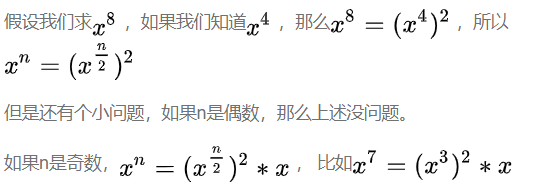

### 1. 反转链表

定义一个函数，输入链表的头节点，反转该链表并输出反转后链表的头节点

如 ：1->2->3->4->5->NULL    输出：5->4->3->2->1->NULL

**解法一：迭代**

在遍历列表时，temp保存当前节点（pre）的下一个节点信息，并将当前节点的next指针改为指向前一个节点，需要事先存储前一个节点的信息cur（cur初始化为NULL），每一次反转之后需要将前一个节点cur指向当前节点pre，当前节点指向下一个节点temp

**解法二：递归**

1. 使用递归函数，一直递归到最后一个节点，该节点就是反转之后的头节点，记作 ret 
2. 每次函数再返回的过程中让当前节点的下一个节点的next指向当前节点
3. 同时让当前节点的 next 指向 NULL
4. 完成递归后，链表反转完成

```c++
class Solution {
public:
    ListNode* ReverseList(ListNode* pHead) {
        // 迭代
        /*
        if(!pHead || !pHead->next) return pHead;
        
        
        ListNode* cur = ReverseList(pHead->next);
        pHead->next->next = pHead;
        pHead->next = NULL;
        return cur;
        */
        // 头插法/迭代
        if(!pHead)    return pHead;
        
        ListNode* pre = nullptr;
        ListNode* temp = pHead;
        while(pHead)
        {
            temp = pHead->next;
            pHead->next = pre;
            pre = pHead;
            pHead = temp;
            
         
            
        }
        
        return pre;
        
    }
};
```


### 2. 最大子序和

给定一个整数数组 `nums` ，找到一个具有最大和的连续子数组（子数组最少包含一个元素），返回其最大和。

```shell
输入：[-2,1,-3,4,-1,2,1,-5,4]
输出：6
解释：连续子数组[4,-1,2,1]的和最带，为6
```

**动态规划**

用 a<sub>i</sub> 代表 nums[i]，用 f(i) 代表第 i 个数据结尾的连续数组的最大和，那么要求的答案就是 最大的 f(i)

求出每一个位置的 f(i), 并判断 f(i-1) + a<sub>i</sub> 和 f(i-1) 的大小，当 f(i-1) < 0 时，对 a<sub>i</sub> 无增益，产生新的子数组开始 a<sub>i</sub>，

```shell
class Solution {
public:
    int maxSubArray(vector<int>& nums) {
        int pre = 0, maxAns = nums[0];
        for (const auto &x: nums) {
            pre = max(pre + x, x);
            maxAns = max(maxAns, pre);
        }
        return maxAns;
    }
};
```

**约瑟夫环**

[约瑟夫环三种解答](https://cloud.tencent.com/developer/article/1164728)

### 3. 字符串转换整数 (atoi)

题目链接：[字符串转换整数](https://leetcode-cn.com/problems/string-to-integer-atoi/)

**有限状态机**(DFA)

程序在每个时刻有一个状态 s，每次从序列中输入一个字符 c，根据不同的 c 转移到下一个状态 s。

下面是建立起来的状态表

|           | ' '   | +/-    | number    | other |
| --------- | ----- | ------ | --------- | ----- |
| start     | start | signed | in_number | end   |
| signed    | end   | end    | in_number | end   |
| in_number | end   | end    | in_number | end   |
| end       | end   | end    | end       | end   |

然后将这个表实现在代码中即可

- 先建立状态表
- 获取对应字符的下一状态
- 转换字符

**位运算求最大值**

题目主要注意三个方面：

- 转化过程防止越界
- 求 int 型的最大最小值 (((1<<30)-1)<<1)+1
- 各种边界条件判断

先判断到第一个非空字符，如果字符串为空或者不是 + - 0~9 中的字符，return 0

然后在判断符号标志，最后转换字符

### 4. KMP算法（字符串匹配）

问题：有一个文本串 S，和一个模式串 P，如何查找 P 在 S 中的位置

1. 暴力匹配算法

    假设文本串 S 匹配到 i 位置，模式串 P 匹配到 j 位置：

    - 如果当前字符匹配成功，(S[i] == S[j]) ，则 ++i，++j，继续匹配下一个字符
    - 如匹配失败(S[i] != S[j])，则 i = i - (j - 1), j = 0;，相当于每次匹配失败，i 回溯到这次比较的开始位置的下一位置，j 被置为 0

    ```shell
    int ViolentMatch(string s, string p)
    {
    	int i = 0;
    	int j = 0;
    	int sLen = s.size();
    	int pLen = p.size();
    	
    	while(i < sLen && j < pLen)
    	{
    		// 如果当前字符匹配成功（即S[i] == P[j]），则i++，j++ 
    		if(s[i] == s[j])
    		{
    			++i;
    			++j;
    		}
    		else
    		{
    			// 如果失配（即S[i]! = P[j]），令i = i - (j - 1)，j = 0   
    			i = i - j + 1;
    			j = 0;
    		}
    	}
    	// 匹配成功，返回模式串p在文本串s中的位置，否则返回-1
    	if(j == pLen)
    		return i - j;
    	else
    		return -1;
    }
    ```

    暴力匹配的方法实现简单，但是效率低，因为进行了很多重复性的比较，该算法复杂度为：O(n + m)

2. KMP 字符串匹配算法

    > 字符串的真前缀和真后缀
    >
    > 字符串：abcdac
    >
    > 真前缀：a、ab、abc、abcd、abcda
    >
    > 真后缀：cadcb、cadc、cad、ca、c

KMP算法的精妙之处在于：能够知道在匹配失败之后，有多少字符是不需要进行匹配可以直接跳过的

首先求解一个next[n]数组，这个数组的值表示了字符串下标 n 位置的最大真前后缀，当两者不匹配时，通过next[n]跳转到需要比较的模式串的相应下标处。

**next数组的求法**：

k表示后缀，j 表示前缀，后缀一直保持在递增的顺序，前缀则根据匹配的结果来变化，当 p[j] == p[k] 时，++i，++j，同时迭代next数组（next[k] = j），当 p[j] != p[k] 时，令后缀回到最初的状态，j = next[j]。

```shell
void getNext(string s, int next[])
{
	int sLen = s.size();
	next[0] = -1;
	int k = 0;
	int j = -1;
	
	while(k < pLen -1)
	{
		if(j == -1 || p[k] == p[j])
		{
			++k;
			++j;
			next[k] = j;
		}
		else
		{
			j = next[j];
		}
	}
}
```

得到了next[n] 数组，在进行比较文本串和模式串的时候，当 s[i] != p[j] 时，j = p[ next[j] ]；

```shell
int KMP(string s, string p, int next[])
{
	// 获取 next[n] 数组
	GetNext(p, next);
	
	int sLen = s.size();
	int pLen = p.size();
	int i = 0;
	int j = 0;
	while(i < sLen && j < pLen)
	{
		if(p[i] == p[j] || j == -1)	// p 的第一个字符不匹配或者 p[j] == s[i]
		{
			++i;
			++j;
		}
		else 
		{
			j = next[j];	// s[i] != p[j],j 跳转回到最大前缀的最后一个位置
		}
	}
	if(j == pLen)
		return i - j;
	return -1;
}
```

### 5. 二叉树的遍历方法

**前序遍历**：先访问根结点，在访问左节点，最后访问右节点

```shell
// 递归实现
void preorder_traverse(BiTree *tree)
{
	if(tree)
	{
		cout << tree->val << endl;
		preorder_traverse(tree->leftChild);
		preorder_traverse(tree->rightChild);
	}
}
// 非递归实现
void preorder_traverse(BiTree *tree)
{
	std::stack<BiTree *> node_stack;
	while(tree != NULL || !node_stack.empty())
	{
		if(tree != NULL)
		{
			cout << tree->val << endl;
			node_stack.push(tree);
			tree = tree->leftChild;
		}
		else
		{
			tree = node_stack.top();
			node_stack.pop();
			tree = tree->rightChild;
		}
	}
}
```


**中序遍历**：先访问左结点，在访问根结点，最后访问右结点

```shell
// 递归实现
void inorder_traverse(BiTree * tree)
{
	if(tree == NULL)
	{
		cout << "empty tree" << endl;
		return;
	}
	
	if(tree != NULL)
	{
		inorder_traverse(tree->leftChild);
		cout << tree->val << endl;
		inorder_traverse(tree->rightChild);
	}
}

// 非递归实现
viod inorder_traverse(BiTree *tree)
{
	std::stack<BiTree *> node_stack;
	while(tree != NULL || !node_stack.empty())
	{
		if(tree != NULL)
		{
			node_stack.push(tree);
			tree = tree->leftChild;
		}
		else
		{
			tree = node_stack.top();
			cout << tree->val << endl;
			node_stack.pop();
			tree = tree->rightChild;
		}
	}
}
```

**后序遍历**：先访问左结点，在访问右结点，最后访问根结点

```shell
// 递归实现
void postorder_traverse(BsTree *tree)
{
	if(tree != NULL)
	{
		postorder_traverse(tree->leftChild);
		postorder_traverse(tree->rightChild);
		cout << tree->val << endl;
	}
}

// 非递归实现
// 需要一个游标来判断是否遍历完左右结点
void postorder_traverse(BiTree *tree)
{	
	std::stack<BiTree *> node_stack;
	BiTree *label_node = tree;
	
	while(tree != NULL || !node_stack.empty())
	{
		if(tree != NULL)
		{
			node_stack.push(tree);
			tree = tree->leftChild;
		}
		else
		{
			tree = node_stack.top();
			
			if(tree->right == NULL || tree->right == label_node)
			{
				node_stack.pop();
				cout << tree->val << endl;
				label_node = tree;
				tree = NULL;
			}
			else
			{
				tree = tree->rightChild;
			}
		}
	}
}
```

**层序遍历**：按照二叉树从上到下，从左到右依次遍历每个结点

```shell
void levelorder_traverse(BiTree *tree)
{
	std::queue<BiTree *> node_queue;
	node_queue.push(tree);
	while(!node_queue.empty())
	{
		BiTree * temp_node = node_queue.front();
		cout << temp_node->val << endl;
		node_stack.pop();
		
		if(temp_node->leftChild != NULL)
		{
			node_queue.push(temp_node->leftChild);
		}
		if(temp_node->rightChild != NULL)
		{
			node-queue.push(temp_node->rightChild);
		}
	}
}
```

### 6. 赫夫曼编码

**赫夫曼算法描述**：

1. 根据给定的 n 个权值{w<sub>1</sub>,w<sub>2</sub>,w<sub>3</sub>,...,w<sub>n</sub>}构成n棵二叉树的集合F={T<sub>1</sub>,T<sub>2</sub>,...,T<sub>n</sub>}，其中每棵二叉树 T<sub>i</sub> 中只有一个带权为w<sub>i</sub>的根结点，其左右子树均为空
2. 在 F 中选取两棵根结点的权值最小的树作为左右子树构造一棵新的二叉树，且置新的二叉树的跟结点的权值为其左右子树上根结点的权值之和
3. 在 F 中删除这两棵树，同时将新得到的二叉树加入到 F 中
4. 重复步骤 2 和步骤 3，知道 F 只含一棵树为止，这棵树就是赫夫曼树

**赫夫曼编码**

设需要编码的字符集为{d<sub>1</sub>,d<sub>2</sub>,...,d<sub>n</sub>},各个字符出现的次数或频率集合为{w<sub>1</sub>,w<sub>2</sub>,w<sub>3</sub>,...,w<sub>n</sub>},以d<sub>1</sub>,d<sub>2</sub>,...,d<sub>n</sub>作为叶子结点，以w<sub>1</sub>,w<sub>2</sub>,w<sub>3</sub>,...,w<sub>n</sub>作为相应叶子结点的权值构造赫夫曼树。

规定生成的赫夫曼树的左子树代表0 0，右子树代表 1，则从根结点到叶子结点所经过的路径分支组成的 0 和 1 的序列便为该结点对应字符的编码，这就是赫夫曼编码。

### 7. 回溯算法

回溯算法：也叫试探法，一种系统的搜索问题的解的方法，基本思想是从一条路开始往前走，能进则进，不能进则退回上一步换一条路试一试，也就是在包含问题的所有解的解空间树中，按照深度优先的策略从根节点出发搜索解空间树。

解题步骤：

1.定义一个解空间，它包含问题的解；
2.利用适于搜索的方法组织解空间；
3.利用深度优先法搜索解空间；
4.利用限界函数避免移动到不可能产生解的子空间。

注意

- 回溯法存在会退到祖先结点的过程，所需要保存搜索过的结点，通常有两种方法：一是用自定义栈来保存；二是采用递归方法
- 避免无效搜索的方法：一是用约束函数在扩展结点处剪除不满足约束条件的路劲；二是用限界函数减去得不到问题的解或者最优解的路劲。这两类称为剪枝函数

八皇后问题：

[回溯算法详解] https://blog.csdn.net/Marmara01/article/details/84727406?utm_medium=distribute.pc_relevant.none-task-blog-baidujs-5 

[八皇后问题] https://www.cnblogs.com/huwt/p/10749234.html 

题目：输入一个字符串，打印出该字符串中字符的所有排列。

```c++

```


### 8. 重建二叉树

题目：输入某二叉树的前序遍历和中序遍历的结果，请重建出该二叉树。假设输入的前序遍历和中序遍历的结果中都不含重复的数字。例如输入前序遍历序列{1,2,4,7,3,5,6,8}和中序遍历序列{4,7,2,1,5,3,8,6}，则重建二叉树并返回。

前序遍历：根左右

中序遍历：左根右

前序遍历数组的首元素就是二叉树的根节点，根据根节点的值在中序遍历中找到根节点的位置，那么根节点左边的就是左子树，右边的就是右子树，依次迭代即可。主要维护两个数组的下标。

```C++
class Solution {
public:
    TreeNode* reConstructBinaryTree(vector<int> pre,vector<int> vin) {
  		return rebuild(pre, 0, pre.size()-1, vin, 0, vin.size()-1);  
    }
    
private：
    TreeNode* rebuild(vector<int> pre, pre_left, pre_right, vector<int> vin, vin_left, vin_right)
	{
    	if(pre_left > pre_right)
            return nullptr;
    	TreeNode* root = new TreeNode(pre[pre_left]);
   		for(int i = vin_left; i <= vin_right; ++i)
        {
            if(vin[i] == root->val)
            {
                root->left = rebuild(pre, pre_left+1, pre_left+i-vin_left, vin, vin_left, i-1);
                root->right = rebuild(pre, pre_left+i-vin_left+1, pre_right, vin, i+1, vin_right);
                break;
            }
            
        }
    return root;
	}
};
```


### 9 二维数组的查找

题目：在一个二维数组中（每个一维数组的长度相同），每一行都按照从左到右递增的顺序排序，每一列都按照从上到下递增的顺序排序。请完成一个函数，输入这样的一个二维数组和一个整数，判断数组中是否含有该整数。

思路：另类的二分查找，从右上角的元素开始，大于的元素在下方，小于的元素在上方

```c++
class Solution {
public:
    bool Find(int target, vector<vector<int> > array) {
        int size_row = array.size();
        int size_col = array[0].size();
        
        // judge empry
        if(size_row == 0 || size_col == 0)    return false;
        
        int index_x = size_col - 1;
        int index_y = 0;
        while(index_x >= 0 && index_y < size_row){
            if(array[index_y][index_x] == target)
                return true;
            else if(array[index_y][index_x] < target)
                ++index_y;
            else
                --index_x;
        }
        
        return false;
    }
};
```

### 10 数值的整数次方

题目：给定一个double类型的浮点数base和int类型的整数exponent。求base的exponent次方。

​			保证base和exponent不同时为0

思路：

1. 暴力求解：n个b相乘。循环n次

2. 快速迭代求幂

    

3. 位与运算

    

```c++
class Solution {
public:
    double Power(double base, int exponent) {
        // 暴力
        /*if(exponent == 0)    return 1;
        if(base == 0)    return 0;
        double res = 1;
        int n = abs(exponent);
        while(n--)
        {
            res = res * base;
        }
        if(exponent < 0)
            return 1/res;
        return res;
        */
        
        // 递归
        /*
        if(exponent == 0)    return 1;
        if(base == 0)    return 0;
        double res;
        int n = abs(exponent);
        if(n%2 == 1)    
            res = base * Power(base, n-1);
        else
            res = Power(base*base, n/2);
        if(exponent < 0)
            return 1/res;
        return res;
        */
        
        // 位与
        bool flag = false;
        if(exponent < 0){
            flag = true;
            exponent = -exponent;
        }
        
        double res = 1;
        while(exponent > 0)
        {
            if(exponent & 1)
                res *= base;
            exponent >>= 1;
            base *= base;
        }
        
        return flag? 1/res : res;
    }
};
```

### 11 旋转数组的最小值

题目：把一个数组最开始的若干个元素搬到数组的末尾，我们称之为数组的旋转。输入一个递增排序的数组的一个旋转，输出旋转数组的最小元素。例如，数组 [3,4,5,1,2] 为 [1,2,3,4,5] 的一个旋转，该数组的最小值为1。 

一个包含重复元素的升序数组在经过旋转之后，可以得到下面可视化的折线图：


我们考虑数组中的最后一个元素 xx：在最小值右侧的元素，它们的值一定都小于等于 xx；而在最小值左侧的元素，它们的值一定都大于等于 xx。因此，我们可以根据这一条性质，通过二分查找的方法找出最小值。

在二分查找中，左边界为left，右边界为 right，区间的中点为 

- num[mid] > num[right] ----> left = mid + 1
- num[mid] < num[right] ----> right = mid
- num[mid] == num[right] ----> right--

```c++
class Solution {
public:
    int minNumberInRotateArray(vector<int> num) {
        int size = num.size();
        if(0 == size)    return 0;
        // 暴力
        /*
        int index = 0;
        for(int i = 0; i < size - 1; ++i){
            if(num[i] <= num[i+1])
                continue;
            else{
                index = i;
                break;
            }
        }
        return num[0]>num[index+1] ? num[index+1] : num[0];
        */
        // 二分法
        int left = 0;
        int right = size - 1;
        while(left < right){
            if(num[left] < num[right])
                return num[left];
            int mid = left + (right - left)/2; // 不写成 （left+right)/2 是防止溢出
            if(num[mid] > num[right])
                left = mid + 1;
            else if(num[mid] < num[right])
                right = mid;
            else
                --right;
        }
        
        return num[left];
    }    
};
```

### 12 把二叉树打印成多行

题目：从上到下按层打印二叉树，同一层结点从左至右输出。每一层输出一行。

**层序遍历打印二叉树用队列实现**

BFS的模板为：

```c++
void bfs() {
 	vis[] = {0}; // or set
 	queue<int> pq(start_val);
 
 	while (!pq.empty()) {
     	int cur = pq.front(); pq.pop();
     	for (遍历cur所有的相邻节点nex) {
         	if (nex节点有效 && vis[nex]==0){
             	vis[nex] = 1;
             	pq.push(nex)
         	}
     	} // end for
	} // end while
}
```

如果要确定到哪一层，模板如下：

```c++
void bfs() {
 int level = 0;
 vis[] = {0}; // or set
 queue<int> pq(original_val);
 while (!pq.empty()) {
     int sz = pq.size();
 
     while (sz--) {
         int cur = pq.front(); 
         pq.pop();
         for (遍历cur所有的相邻节点nex) {
             if (nex节点有效 && vis[nex] == 0) {
                 vis[nex] = 1;
                 pq.push(nex)
             }
         } // end for
     } // end inner while
     level++;
 
 } // end outer while
}
```

此题的解法：

```c++
/*
struct TreeNode {
    int val;
    struct TreeNode *left;
    struct TreeNode *right;
    TreeNode(int x) :
            val(x), left(NULL), right(NULL) {
    }
};
*/
class Solution {
public:
        vector<vector<int> > Print(TreeNode* pRoot) {
            vector<vector<int> > res;
            if(!pRoot)    return res;
            queue<TreeNode*> node_queue;
            node_queue.push(pRoot);
            int size = 0;
            while(!node_queue.empty()){
                
                size = node_queue.size();
                vector<int> vec;
                while(size--)
                {
                  
                    
                    vec.push_back(node_queue.front()->val);
                    if(node_queue.front()->left != NULL){
                        node_queue.push(node_queue.front()->left);
                    }
                    
                    if(node_queue.front()->right !=  NULL){
                        node_queue.push(node_queue.front()->right);
                    }
                    node_queue.pop();
                }
                res.push_back(vec);
                
                    
            }
            return res;
        }
    
};
```

### 13 位运算的应用

- 判断int型变量是奇数还是偶数 a&1 = 0 偶数
- 取int型变量a的第k位：a>>K&1
-  将int型变量a的第k位清0，即a=a&~(1<<k)
- 将int型变量a的第k位置1， 即a=a|(1<<k)
- int型变量循环左移k次，即a=a<<k|a>>16-k
-  int型变量a循环右移k次，即a=a>>k|a<<16-k
- 整数的平均值： (x&y)+((x^y)>>1)
- 判断一个整数是不是2的幂,对于一个数 x >= 0，判断他是不是2的幂
- 

