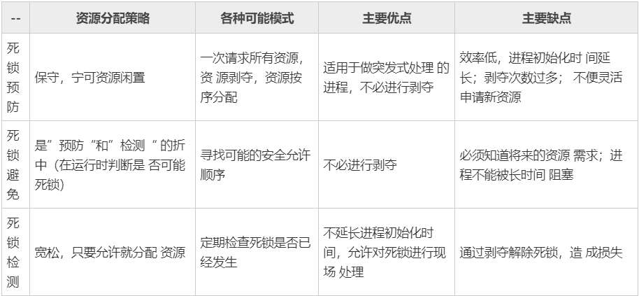
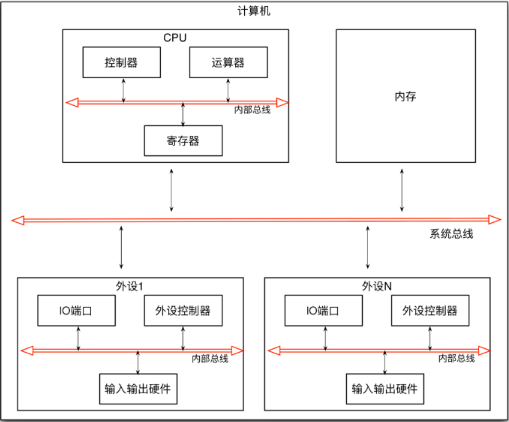
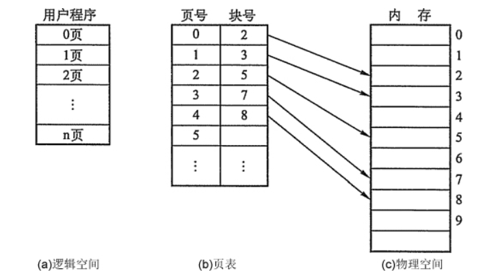
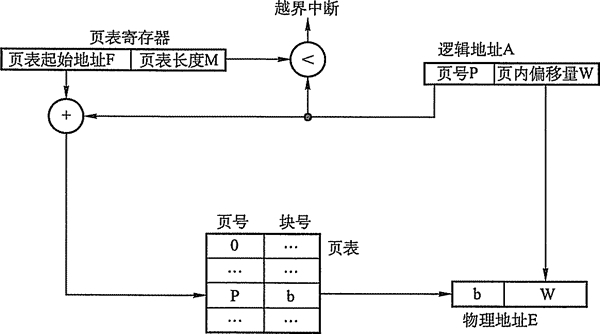
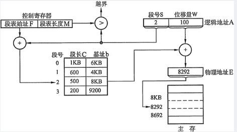
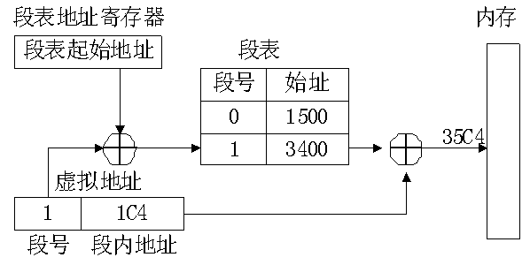
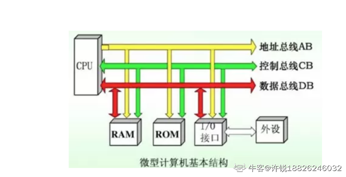
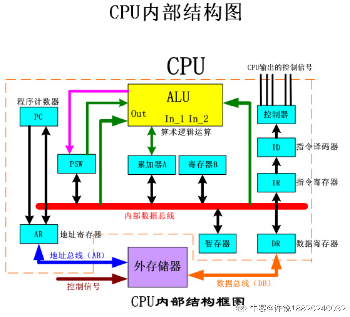
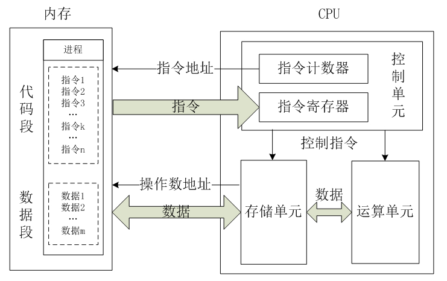
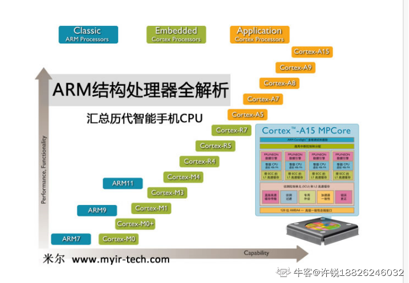

## 一 概述

操作系统(Operating System, OS)是指**控制和管理**整个计算机系统的硬件和软件资源，并合理地**组织调度**计算机的工作和资源的分配，以提供给用户和其他软件方便的**接口和环境**的程序集合。

### 1.1 基本特征

**并发**：==**同一时间间隔**==内运行多个程序，操作系统引入进程和线程，使程序并发运行

**并行**：==同一时刻==运行多个指令，需要硬件支持，如流水线、多核处理器、分布式计算系统

>同一时间间隔：一段时间内宏观上有多道程序在执行，但在每一时刻单处理器环境下仅有一个程序执行，所以微观上这些程序分时交替进行，**操作系统的并发性通过分时实现**

**共享**：系统资源可被多个并发进程共同使用，分为互斥共享和同时共享

- 互斥共享方式：==规定一段时间内只允许一个进程访问该资源==，这种资源叫做临界资源或独占资源，例如打印机、磁带机等物理设备
- 同时共享方式：==允许在一段时间内由多个进程同时进行访问==，这里的同时指的是宏观上的，微观上是交替地堆该资源进行访问，也就是==分时==的方式共享，例如磁盘设备
- 并发和共享互为存在条件，并发为共享提供前提，共享为并发顺利执行提供管理

**虚拟**：一个物理实体转换为多个逻辑实体，分为时分复用和空分复用技术，例如虚拟处理器、虚拟内存和虚拟外部设备等。多进程在同一处理器并发执行采用时分复用，虚拟内存采用空分复用

**异步**：在多道程序环境下，允许多个进程并发执行，但由于资源受限，进程执行不是一贯到底，而是走走停停，不会一次执行完。

### 1.2 基本功能

**进程管理(CPU管理)**：进程控制、进程同步、进程通信、死锁处理、处理机调度等。

**内存管理**：内存分配、地址映射、内存保护与共享、虚拟内存等。

**文件管理**：文件存储空间的管理、目录管理、文件读写管理和保护等。

**设备管理**：完成用户的 I/O 请求，方便用户使用各种设备，并提高设备的利用率。主要包括缓冲管理、设备分配、设备处理、虛拟设备等。


### 1.3 系统调用

用户程序需要使用内核态的功能（存储分配，进行IO传输、管理文件等），通过系统调用进入内核，由操作系统代为完成

操作系统在具体实现上分为：**用户态(用户程序）和核心态（内核）**

- 核心态：与硬件关联紧密的模块（时钟管理、中断处理、设备驱动等）和运行频率较高的程序（内存管理，进程管理、设备管理）
- 用户态：用户自编程序或者系统外层的应用程序

>用户态转核心态的例子：
>
>- 用户程序要求操作系统的服务，即系统调用
>- 发生一次中断
>- 用户程序产生一个错误状态
>- 用户程序企图执行一条特权指令
>
>用户态进入核心态，不仅仅状态切换，而且使用的堆栈也可能需要用户堆栈切换为系统堆栈

**大部分操作系统内核包括时钟管理、中断机制、原语、系统控制的数据结构和处理**

### 1.4 大内核与微内核

**大内核**：将操作系统功能作为一个紧密结合的整体放到内核；但层次之间交互关系复杂，内核代码维护困难

**微内核**：操作系统的最基本的功能移出内核成为独立的模块，内核中只有最基本的调度，内存管理。微内核运行在内核态，其他模块运行在用户态；频繁在用户和内核切换，切换的开销大

### 1.5 中断分类

**外中断**：由 CPU 执行指令以外事件引起，如 I/O 中断，时钟中断，控制台终端等

**异常**：由 CPU 执行指令的内部事件引起，如非法操作码，地址越界。算术溢出等

**陷入**：在用户程序中使用系统调用

## 二 进程管理

### 2.1 进程与线程

**进程**：资源分配的基本单位，进程控制块（PCB）描述进程的基本信息和运行状态，进程创建和撤销都是对 PCB 进行操作

​	引入进程的目的，是为了使多道程序并发执行，以提高资源利用率和系统吞吐量

- PCB：描述进程的基本情况和运行状态的数据结构，能保证进程独立运行
- 进程映像（实体）：程序段+PCB+相关数据段
- 进程：进程是进程实体的运行过程，是系统进行**资源分配**和调度的一个独立单位
    - 动态性：进程是程序的一次执行，有创建、活动、暂停、终止
    - 并发性：多个进程实体，同存于内存中，能在同一段时间内同时运行
    - 独立性：进程实体是一个能独立运行、独立获得资源和独立接受调度的基本单位
    - 异步性：由于进程的相互制约，使进程具有执行的间断性，即进程按各自独立的、 不可预知的速度向前推进
    - 结构性：每个进程都配置一个PCB对其进行描述

>**进程的组织**：控制块、程序段和数据段
>
>- 进程控制块：PCB是进程实体的一部分，是进程存在的唯一标志。
>
>    当创建一个进程时，系统为该进程建立一个PCB；当进程执行时，系统通过其PCB 了 解进程的现行状态信息，以便对其进行控制和管理；当进程结束时，系统收回其PCB,该进 程随之消亡。
>
>- 程序段：程序段就是能被进程调度程序调度到CPU执行的程序代码段。注意，程序可以被多个进程共享，就是说多个进程可以运行同一个程序。
>
>- 数据段：一个进程的数据段，可以是进程对应的程序加工处理的原始数据，也可以是程序执行时产生的中间或最终结果。

**线程**：**独立调度和分派**的基本单位，一个进程可有多个线程，他们共享进程资源

​		引入线程，则是为了减小程序在并发执行时所付出的时空开销，提高操作系统的并发性能

-  程序执行流的最小单元，由线程ID、程序计数器、寄存器集合、堆栈组成
- 不拥有自己的系统资源，共享进程所拥有的全部资源
- 线程在运行中出现间断性，有就绪、阻塞和运行三种基本状态
- 线程是处理机的独立调度单位，多个线程是可以并发执行的

**区别**：

- 拥有资源：进程进行资源分配，线程不拥有资源，访问隶属于进程的资源
- 调度：线程是独立调度的基本单位
- 系统开销：创建进程或撤销进程的开销远远大于创建或撤销线程的开销（分配回收资源），进程切换的开销也远远大于线程切换的开销（CPU环境保存设置）
- 通信：线程可直接读写同意进程中的数据进行通信，进程间需要 进程同步和互斥手段的辅助

### 2.2 进程状态间的切换


ready：就绪状态，等待被调度，缺乏处理机

running：运行状态

waiting：阻塞状态，等待资源

- 只有就绪态和运行态可相互转换，涉及 CPU 时间片的分配
- 阻塞状态是缺少需要的资源（不包括 CPU 时间片）从而由运行态转换而来

创建状态：进程正在创建，尚未到就绪状态

结束状态：进程正从系统中消失，这可能是进程正常结束或其他原因中断退出运行

>**进程控制**
>
>- 进程创建：允许一个进程创建另一个进程。此时创建者称为父进程，被创建的进程称为子进程。子进程可以继承父进程所拥有的资源。当子进程被撤销时，应将其从父进程那里获得的资源归还给父进程
>    - 为新进程分配一个唯一的进程标识号，并申请一个空白的PCB(PCB是有限的)。
>    - 为进程分配资源，为新进程的程序和数据、以及用户栈分配必要的内存空间（在PCB 中体现）。
>    - 初始化PCB,主要包括初始化标志信息、初始化处理机状态信息和初始化处理机控制信息，以及设置进程的优先级等。
>    - 如果进程就绪队列能够接纳新进程，就将新进程插入到就绪队列，等待被调度运行。
>
>- 进程终止：引起进程终止的事件主要有：正常结束，表示进程的任务已经完成和准备退出运行。异常结束是指进程在运行时，发生了某种异常事件，使程序无法继续运行，如存储区越界、保护错、非法指令、特权指令错、I/O故障等
>
>    - 根据被终止进程的标识符，检索PCB，从中读出该进程的状态。
>    - 若被终止进程处于执行状态，立即终止该进程的执行，将处理机资源分配给其他进程。
>    - 若该进程还有子进程，则应将其所有子进程终止。
>    - 将该进程所拥有的全部资源，或归还给其父进程或归还给操作系统。
>    - 将该PCB从所在队列（链表）中删除。
>
>- 进程的阻塞和唤醒
>
>    正在执行的进程，由于期待的某些事件未发生，如请求系统资源失败、等待某种操作的完成、新数据尚未到达或无新工作做等，则由系统自动执行阻塞原语(Block)，使自己由运行状态变为阻塞状态
>
>    - 找到将要被阻塞进程的标识号对应的PCB。
>    - 若该进程为运行状态，则保护其现场，将其状态转为阻塞状态，停止运行。
>    - 把该PCB插入到相应事件的等待队列中去
>
>    当被阻塞进程所期待的事件出现时，如它所启动的I/O操作已完成或其所期待的数据已到达，则由有关进程（比如，提供数据的进程）调用唤醒原语(Wakeup)，将等待该事件的进程唤醒
>
>    - 在该事件的等待队列中找到相应进程的PCB。
>    - 将其从等待队列中移出，并置其状态为就绪状态。
>    - 把该PCB插入就绪队列中，等待调度程序调度。
>
>- 进程切换：进程切换是指处理机从一个进程的运行转到另一个进程上运行，这个过程中，进程的运行环境产生了实质性的变化
>
>    - 保存处理机上下文，包括程序计数器和其他寄存器。
>    - 更新PCB信息。
>    - 把进程的PCB移入相应的队列，如就绪、在某事件阻塞等队列。
>    - 选择另一个进程执行，并更新其PCB。
>    - 更新内存管理的数据结构。
>    - 恢复处理机上下文。

### 2.3 进程调度算法

不同环境的调度算法不同

处理机调度是**对处理机进行分配**，就是从就绪队列中，按照一定的算法（公平、髙效）选择一个进程并将处理机分配给它运行，以实现进程并发地执行。

**批处理系统**：没有过多用户操作，保证吞吐量和周转时间（从提交到终止的事件）

- **先来先服务（FCFS**）：非抢占式，按请求顺序调度，有利于长作业，不利于短作业，适合CPU繁忙型，不适合I/O繁忙型
- **短作业优先（SJF**）：非抢占式，按估计运行时间最短顺序调度，长作业可能会一直等待，出现饥饿现象，未考虑作业的紧迫程度
- 最短剩余时间优先（SRTN）：抢占式，按剩余运行时间的顺序调度，

**交互式系统**：有大量用户交互操作，目标是快速地进行响应

- **时间片轮转**：所有就绪进程按 FCFS 原则排成队列，每次调度将 CPU 时间片分配给队首进程，时间片用完之后，停止执行，并送往队列末尾，同时将 CPU 时间片分配给对手进程。算法效率与时间片大小有关系。

- 优先级调度：为每个进程分配一个优先级，按优先级进行调度，可随时间推移增加等待进程的优先级

- **多级反馈队列**：多级队列为需要连续执行多个时间片的进程考虑。每个队列分配一个时间片，当前队列未执行完的进程进入下一个队列继续执行，必须等到当前队列所有进程执行相应的时间片之后才会调度进入下一个队列的进程

    

**实时系统**：要求一个请求在一个确定时间内得到响应

​	分为硬实时和软实时，前者必须满足绝对的截止时间，后者可以容忍一定的超时

### 2.4 进程同步

**临界资源**：把一次仅允许一个进程使用的资源称为临界资源

**临界区**：对临界资源进行访问的那段代码称为临界区，为了互斥访问临界资源，每个进程在进入临界区之前，需要进行检查

- 进入区：检查是否可以进入临界区，设置正在访问临界区的标识，阻止其他进程
- 临界区：访问临界区资源的代码
- 退出区：将正在访问临界区的标志删除
- 剩余区：代码中的其余部分

**同步与互斥**：

- 同步：多个进程由于合作产生的**直接制约关系**，使进程有一定的先后执行的关系

    输入进程A通过单缓冲向进程B提供数据，缓冲区为空，进程B不能获取数据而阻塞；进程A将数据送入缓冲区，进程B唤醒；反之缓冲区满

- 互斥：多个进程在同一个时刻只有一个进程能进入临界区，间接制约关系

>实现临界区互斥的办法
>
>- 软件实现：单标志法，双标志法，双标志后检查

- 信号量：一个整型变量，可对其执行 down 和 up 操作，即“P操作”和“V操作”
    - down：如果信号量大于 0，执行 -1 操作；等于 0，进程睡眠等待信号量大于 0
    - up：对信号量执行 +1 操作，唤醒睡眠的进程让其完成 down 操作
    - 如果信号量的取值只能为 0 或 1，就成为了互斥量，0 表示临界区加锁，1 表示临界区解锁
    
    ```c
    // 信号量实现同步
    semaphore S = 0;  //初始化信号量
    P1 ( ) {
        // …
        x;  //语句x
        V(S);  //告诉进程P2,语句乂已经完成
    }
    P2()）{
        // …
        P(S) ;  //检查语句x是否运行完成
        y;  // 检查无误，运行y语句
        // …
    }
    // 信号量实现互斥
    semaphore S = 1;  //初化信号量
    P1 ( ) {
        // …
        P(S);  // 准备开始访问临界资源，加锁
        // 进程P1的临界区
        V(S);  // 访问结束，解锁
        // …
    }
    P2() {
        // …
        P(S); //准备开始访问临界资源，加锁
        // 进程P2的临界区；
        V(S);  // 访问结束，解锁
        // …
    }
    ```
    
    
    
- 管程：使用信号量机制实现生产者消费者问题，需要客户端代码做很多控制，管程将控制代码独立出来，降错，调用容易；在一个时刻只能由一个进程使用管程

### 2.5 进程通信

进程同步和进程通信的区别

- 进程同步：控制多个进程按照一定顺序执行
- 进程通信（**IPC**）：进程间传输信息

**管道**：管道通过调用 `pipe `函数创建，会创建两个文件描述符：`fd[0]`用于读，`fd[1]`用于写

```shell
#include <unistd.h>
int pipe(int fd[2]);
```

- 只支持半双工通信（单向交替传输），有固定的读端和写端
- 只能在父子进程或者兄弟进程中使用


**FIFO**：命名管道，去除了管道只能在父子进程中使用的限制，是一种文件类型

```shell
#include <sys/stat.h>
int mkfifo(const char *path, mode_t mode);
int mkfifoat(int fd, const char *path, mode_t mode);
```

FIFO常用于客户-服务器应用程序，FIFO 用作汇聚点，在客户进程和服务器进程之间传递数据


FIFO最大的特性就是每个FIFO都有一个路径名与之相关联，从而允许无亲缘关系的任意两个进程间通过FIFO进行通信。所以，FIFO的两个特性：

- 和管道一样，FIFO仅提供**半双工**的数据通信，即只支持单向的数据流；和管道不同的是，FIFO可以支持**任意两个进程间的通信**
- **FIFO 和路径名相关联**，以一种特殊设备文件形式存在于文件系统中

**消息队列**：是消息的链接表，存放在内核中。一个消息队列由一个标识符（即队列ID）来标识。

- 独立于读写进程存在，进程终止时消息队列及其内容不会被删除
- 避免了 FIFO 的同步阻塞问题，不需要进程自己提供同步方法，消息具有特定的格式和优先级
- 可根据消息类型有选择的接收消息，不像 FIFO 默认的接受

**信息量**：相当于一个计数器，用于为多个进程提供对共享数据对象的访问，**实现进程之间的互斥和同步**

- 信号量用于进程间同步，若要在进程间传递数据需要结合共享内存
- 信号量基于操作系统的 PV 操作，程序对信号量的操作都是原子操作
- 每次对信号量的 PV 操作不仅限于对信号量值加 1 或减 1，而且可以加减任意正整数

**共享存储**：允许多个进程共享一个给定的存储区，需要使用信号量用来同步对共享存储的访问，多个进程可以将同一个文件映射到他们的地址空间实现共享内存

1. 共享内存是最快的一种 IPC，因为进程是直接对内存进行存取。
2. 因为多个进程可以同时操作，所以需要进行同步。
3. 信号量+共享内存通常结合在一起使用，信号量用来同步对共享内存的访问

**套接字**：可用于不同机器之间的进程通信

### 2.6 经典进程同步问题

- 生产者-消费者问题

    ```C++
    semaphore mutex=1; //临界区互斥信号量
    semaphore empty=n;  //空闲缓冲区
    semaphore full=0;  //缓冲区初始化为空
    producer () { //生产者进程
        while(1){
            produce an item in nextp;  //生产数据
            P(empty);  //获取空缓冲区单元
            P(mutex);  //进入临界区.
            add nextp to buffer;  //将数据放入缓冲区
            V(mutex);  //离开临界区,释放互斥信号量
            V(full);  //满缓冲区数加1
        }
    }
    consumer () {  //消费者进程
        while(1){
            P(full);  //获取满缓冲区单元
            P(mutex);  // 进入临界区
            remove an item from buffer;  //从缓冲区中取出数据
            V (mutex);  //离开临界区，释放互斥信号量
            V (empty) ;  //空缓冲区数加1
            consume the item;  //消费数据
        }
    }
    ```

    

## 三 死锁

### 3.1 什么是死锁

多线程和多进程改善了系统资源的利用率并提高了系统的处理能力，但并发执行也可能造成死锁问题。

死锁是指两个或两个以上的进程（线程）在运行过程中因争夺资源而造成的僵局，若无外力作用，这些进程（线程）都将无法向前推进，死锁会浪费大量系统资源，甚至导致系统崩溃

- 参与死锁的进程数至少为两个
- 参与死锁的所有进程均等待资源
- 参与死锁的进程至少有两个已经占有资源

饥饿是指一个进程一直得不到资源，死锁与饥饿都是由于竞争进程资源而引起的，饥饿不占有资源，死锁一定占有资源

### 3.2 资源的类型

**可重用资源和消耗性资源**

可重用资源（永久性资源）：可被多个进程多次使用，如所有硬件

- 只能分配给一个进程使用，不允许多个进程共享
- 进程在使用可重用资源时，必须按照请求资源、使用资源、释放资源这样的顺序
- 系统中每一类可重用资源中的单元数目是相对固定的，在运行期间不可创建，也不能删除

消耗性资源（临时性资源）：由进程在运行期间动态的创建和消耗的

- 在进程运行期间可以不断变化，有时可能为 0
- 在运行期间，课不断创造课消耗性资源的单元
- 在运行期间，可请求若干个可消耗性资源单元，用于进程自己消耗，不再将它们返回给该类资源类中

**可抢占资源和不可抢占资源**

可抢占资源：某进程获得这类资源后，该资源能再被其他进程或系统抢占，这类资源不会引起死锁，CPU 和主存属于可抢占性资源

不可抢占资源：一旦系统把这类资源分配给进程后，就不能将它强行收回，只能在进程用完后自行释放，磁带、打印机属于不可抢占性资源

### 3.3 死锁产生的原因

**竞争不可抢占资源引起死锁**：只有对不可抢占资源的竞争才能产生死锁，对可抢占资源的竞争是不会引起死锁的

**竞争可消耗资源引起死锁**：进程间通信的消息，进程A等待进程B地消息，进程B也等待进程A的消息

**进程推进顺序不当引起死锁**：一种因为所需资源被占用而阻塞，另一种因为等待对方的资源导致死锁

### 3.4 死锁产生的四个必要条件

- **互斥条件**：进程要求对所分配的资源（如打印机）进行排他性控制，即在一段时间内某资源仅为一个进程所占有
- **不可剥夺条件**：进程所获得的资源在未使用完毕之前，不能被其他进程强行夺走，即只能由获得该资源的进程自己来释放（只能是主动释放)。
- **请求与保持条件**：进程已经保持了至少一个资源，但又提出了新的资源请求，而该资源已被其他进程占有，此时请求进程被阻塞，但对自己已获得的资源保持不放。
- **循环等待条件**：存在一种进程资源的循环等待链，链中每一个进程已获得的资源同时被链中下一个进程所请求。

### 3.5 处理死锁的方法

- **预防死锁**：通过设置某些限制条件，去破坏产生死锁的四个必要条件中的一个或几个条件，来防止死锁的发生。
  
    - 破坏互斥条件（危险）
    - 破坏等待并占有条件：一次性分配方案；每个进程申请新资源时释放所占有资源
    - 破坏不可抢占条件
    - 破坏循环等待条件
    
- **避免死锁**：在资源的动态分配过程中，用某种方法去防止系统进入不安全状态，从而避免死锁的发生。
  
    - 有序资源分配法：按某种规则为系统中所有资源编号，申请时必须以上升次序
    - 银行家算法，详见[银行家算法](https://blog.csdn.net/qq_33414271/article/details/80245715?utm_medium=distribute.pc_relevant.none-task-blog-BlogCommendFromMachineLearnPai2-1.nonecase&depth_1-utm_source=distribute.pc_relevant.none-task-blog-BlogCommendFromMachineLearnPai2-1.nonecase)
    - 加锁技术：枷锁顺序，加锁时限，死锁检测
    
- **检测死锁**：允许系统在运行过程中发生死锁，但可设置检测机构及时检测死锁的发生，并采取适当措施加以清除。

    每种类型一个资源的死锁检测算法是通过检测有向图是否存在环来实现，从一个节点出发进行深度优先搜索，对访问过的节点进行标记，如果访问了已经标记的节点，就表示有向图存在环，也就是检测到死锁的发生。

- **解除死锁**：当检测出死锁后，便采取适当措施将进程从死锁状态中解脱出来
  
    - 资源剥夺法，挂起某些死锁进程，并抢占它的资源，将这些资源分配给其他的死锁进程
    - 撤销进程法：强制撤销部分，甚至全部死锁进程并剥夺这些进程的资源
    
    - 进程回退法：让一个或多个进程回退到足以回避死锁的地步
- **鸵鸟政策**

  因为解决死锁问题的代价很高，因此鸵鸟策略这种不采取任务措施的方案会获得更高的性能。

  当发生死锁时不会对用户造成多大影响，或发生死锁的概率很低，可以采用鸵鸟策略。

**死锁处理策略的比较**



### 3.6 进程和程序的区别与联系

- 进程是程序及其数据在计算机上的一次运行活动，是一个**动态**的概念。**进程的运行实体是程序**，**进程是由程序、数据和进程控制块(PCB)三部分组成**的。而**程序是一组有序的指令集合**，是一种静态的概念。
- **进程**是程序的一次执行过程，它是**动态地创建和消亡**的，具有一定的生命周期，是暂时存在的；而**程序**则是一组代码的集合，它是**永久存在的，可长期保存**。
- 一个进程可以执行一个或几个程序，一个程序也可以构成多个进程。进程可创建进程，而程序不可能形成新的程序。
- 进程与程序的组成不同。进程的组成包括程序、数据和PCB。


## 四 内存管理

计算机的存储器层次结构：少量的非常快速、昂贵、易变的**高速缓存(Cache)**；若干兆字节的中等速度、中等价格、易变的**主存储器(RAM)**，数百兆或数千兆的低速、廉价、不易变的**磁盘**

计算机系统结构如下图，一部分负责控制、一部分负责执行、一部分负责存储



### 4.1 内存管理的功能

- 内存空间的分配和回收

    由操作系统完成主存储器空间的分配和管理，是程序员摆脱存储分配的麻烦，提高编程效率

- 地址转换

    提供地址变换功能，把逻辑地址转换成相应的物理地址

- 存储保护和存储共享

    保证程序在各自的存储空间内运行，同时充分利用内存空间，共享内存中存放的信息

- 内存空间的扩充

    利用虚拟存储技术和自动覆盖技术，从逻辑上扩充内存

### 4.2 基本概念

- 虚拟地址：用户编程时将代码（或数据）分成若干个段，每条代码或每个数据的地址由段名称 + 段内相对地址构成，这样的程序地址称为虚拟地址
- 逻辑地址：虚拟地址中，段内相对地址部分称为逻辑地址
- 物理地址：实际物理内存中所看到的存储地址称为物理地址
- 逻辑地址空间：在实际应用中，将虚拟地址和逻辑地址经常不加区分，通称为逻辑地址。逻辑地址的集合称为逻辑地址空间
- 线性地址空间：CPU地址总线可以访问的所有地址集合称为线性地址空间
- 物理地址空间：实际存在的可访问的物理内存地址集合称为物理地址空间
- MMU(Memery Management Unit内存管理单元)：实现将用户程序的虚拟地址（逻辑地址） → 物理地址映射的CPU中的硬件电路
- 基地址：在进行地址映射时，经常以段或页为单位并以其最小地址（即起始地址）为基值来进行计算
- 偏移量：在以段或页为单位进行地址映射时，相对于基地址的地址值

- 地址重定位：把程序相对地址空间的逻辑地址转换成存储空间的绝对地址的过程


### 4.3 内存管理的方式

**内存连续分配管理方式**

- 单一连续分配：内存在此方式下分为系统区和用户区，系统区仅提供给操作系统使用，通常在低地址部分；用户区是为用户提供的、除系统区之外的内存空间。简单、无外部碎片；只能单用户、单任务，存储器利用率低
- 固定分区分配：将用户内存空间划分为若干个固定大小的区域，每个分区只装入一道作业。当有空闲分区时，便可以再从外存的后备作业队列中,选择适当大小的作业装入该分区，如此循环
- 动态分区分配：不预先将内存划分，而是在进程装入内存时，根据进程的大小动态地建立分区，并使分区的大小正好适合进程的需要。因此系统中分区的大小和数目是可变的

**内存非连续分配管理方式**
常见的内存非连续管理方式有块式管理、页式管理、段式和段页式管理。

- 块式管理：把主存分为一大块一大块的，当所需的程序片段不在主存时就分配一块主存空间，把程序片段load入主存，就算所需的程序片段只有几个字节也只能把这一块分配给它。这样会造成很大的浪费，平均浪费了50%的内存空间，但是易于管理。

- 页式管理：把主存分为一页一页的，每一页的空间要比一块一块的空间小很多，这种方法的空间利用率要比块式管理高很多；页是信息的物理单位，分页是为了提高内存的利用率，由于系统管理的需要

- 段式管理：把主存分为一段一段的，每一段的空间又要比一页一页的空间小很多，这种方法在空间利用率上又比页式管理高得多，但是也有另外一个缺点。一个程序片段可能会被分为几十段，这样很多时间就会被浪费在计算每一段的物理地址上。段是信息的逻辑单位，分段是为了更好的满足用户的需要

- 段页式管理：结合了段式管理和页式管理的优点。把主存先分成若干段，每个段又分成若干页。段页式管理每取一护具，要访问3次内存

### 4.4 分页式存储管理

分页的思想：把**主存空间划分为大小相等且固定的块**，块相对较小，作为主存的基本单位。**每个进程也以块为单位进行划分**，进程在执行时，**以块为单位逐个申请主存**中的块空间。

- 页面和页面大小：进程中的块称为页，内存中的块称为页框/页帧

- 地址结构：前一部分为页号 P，后一部分为页内偏移量 W

    | 31...12 | 11...0      |
    | ------- | ----------- |
    | 页号P   | 页内偏移量W |

- 页表：记录页面在内存中对应的物理块号，页表一般存放在内存中

    

**地址变换机制**



查进程页表得页内偏移地址和物理页号，得到物理页面号，最后得到物理地址


​		第一次用来查找页表， 确定所存取的数据或指令的物理地址；

​        第二次根据该地址完成真正的读写操作

分页管理方式存在的主要问题：

- 每次访存操作都需要进行逻辑地址到物理地址的转换，地址转换过程必须足够快，否则访存速度会降低；
- 每个进程引入了页表，用于存储映射机制，页表不能太大，否则内存利用率会降低。

**页面置换算法**

在程序运行过程中，如果要访问的页面不在内存中，就发生缺页中断从而将该页调入内存中。此时如果内存已无空闲空间，系统必须从内存中调出一个页面到磁盘对换区中来腾出空间。

页面置换算法的主要目标：使页面置换频率最低（也就是缺页率最低）

- 最佳算法（OPT）：所选择被换出的页面将是最长时间内不再被访问，通常可保证获得最低的缺页率，但不可实现
- **最近最久未使用算法（LRU**）：将最近最久未使用的页面换出，采用链表
- 最近未使用（NRU）
- **先进先出（FIFO）**：选择换出的页面是最先进入的页面
- 最不经常使用淘汰算法（LLFU）：换出一段时间内访问次数最少的页面

### 4.5 段式存储管理

**分段思想**：**按照用户进程中的自然段划分逻辑空间**。例如，用户进程由主程序、两个子程序、栈和一段数据组成，于是可以把这个用户进程划分为5个段，每段从0 开始编址，并分配一段连续的地址空间（段内要求连续，段间不要求连续，因此整个作业的地址空间是二维的）。其逻辑地址由段号S与段内偏移量W两部分组成。

- **地址结构**：逻辑地址由段号 S 与的骄傲。段内偏移量 W两部分组成
- **段表**：一张逻辑空间与内存空间映射的段表，其中每一个段表项对应进程的一个段，段表项记录该段在内存中的起始地址和段的长度

在页式系统中，逻辑地址的页号和页内偏移量对用户是透明的，但在段式系统中，段号和段内偏移量必须由用户显示提供，在髙级程序设计语言中，这个工作由编译程序完成

**地址变换机制**





在段式 管理系统中，整个进程的地址空间是二维的，即其逻辑地址由段号和段内地址两部分组成。

>**磁盘结构**
>
>- 盘面(Platter)：一个磁盘有多个盘面
>
>- 磁道（Track）：盘面上的圆形带状区域，一个盘面可以有多个磁道
>
>- 扇区（Track Sector）：磁道上的一个弧段，一个磁道可以有多个扇区，最小的物理存储单位
>
>- 磁头（Head）：与盘面非常接近，能够将盘面上的磁场转换为电信号（读），或者将电信号转换为盘面的磁场（写）
>
>- 制动手臂（Actuator arm）：用于磁道之间移动磁头
>
>- 主轴（Spindle）：使整个盘面转动
>
>- 
>
>    **磁盘调度算法**
>
>    读写一个磁盘块的时间的影响因素有：
>
>    - 旋转时间（主轴转动盘面，使得磁头移动到适当的扇区上）
>    - 寻道时间（制动手臂转动，使得磁头移动到适当的磁道上）
>    - 实际的数据传输时间
>
>    磁盘调度的主要目标是使磁盘的平均寻道时间最短
>
>    - 先来先服务（FCFS），按磁盘请求的顺序进行调度
>    - 最短寻道时间优先（SSTF），优先调度与当前磁头所在磁道距离最近的磁道
>    - 电梯算法（SCAN），总是按一个方向进行磁盘调度，指导该方向上没有未完成的磁盘请求，然后改变方向

### 4.6 段页式存储管理

页式存储管理能有效地提高内存利用率，而分段存储管理能反映程序的逻辑结构并有利于段的共享

在段页式系统中，**作业的地址空间首先被分成若干个逻辑段，每段都有自己的段号，然后再将每一段分成若干个大小固定的页**。对内存空间的管理仍然和分页存储管理一样，将其分成若干个和页面大小相同的存储块，对内存的分配以存储块为单位

**逻辑地址**：段号+页号+页内偏移量

为了实现地址变换，系统为每个进程建立一张段表，而每个分段有一张页表。段表表项中至少包括段号、页表长度和页表起始地址，页表表项中至少包括页号和块号

三次访问主存：

- 通过段表找到页表起始地址
- 通过页表找到页帧号
- 根据页帧号读取物理地址

### 4.7 虚拟内存

**传统存储管理方式的特征**

- 一次性：一次性装入内存，不能全装入或者不能容纳所有作业
- 驻留性：装入内存一直保留，直到运行结束

**局部性原理**：

- 时间局部性：如果程序中的某条指令一旦执行，不久以后该指令可能再次执行；如果某数据被访问过，不久以后该数据可能再次被访问。产生时间局部性的典型原因，是由于在程序中存在着大量的循环操作。
- 空间局部性：一旦程序访问了某个存储单元，在不久之后，其附近的存储单元也将被访问，即程序在一段时间内所访问的地址，可能集中在一定的范围之内，这是因为指令通常是顺序存放、顺序执行的，数据也一般是以向量、数组、表等形式簇聚存储的

**虚拟存储器**：基于局部性原理，在程序装入时，可以将程序的一部分装入内存，而将其余部分留在外存，就可以启动程序执行。在程序执行过程中，当所访问的信息不在内存时，由操作系统将所需要的部分调入内存,然后继续执行程序。另一方面，操作系统将内存中暂时不使用的内容换出到外存上，从而腾出空间存放将要调入内存的信息。这样，系统好像为用户提供了一个比实际内存大得多的存储器，称为虚拟存储器。

- 多次性：分成多次调入内存运行
- 对换性：无需常驻内存，允许换进和换出
- 虚拟性：逻辑上扩充内存容量

**虚拟内存**：每个进程有用独立的逻辑地址空间，内存被分为大小相等的多个块,称为**页**(Page).每个页都是一段连续的地址。对于进程来看,逻辑上貌似有很多内存空间，其中**一部分对应物理内存上的一块(称为页框，通常页和页框大小相等)**，还有一些没加载在内存中的对应在硬盘上。

- 使用虚拟内存，扩大了地址空间、能进行内存保护、能公平分配内存、可通过虚拟内存共享实现进程通信
- 虚拟内存管理用到的数据结构占用额外的内存、到物理地址的转换增加指令执行时间、页面换入换出需要磁盘 I/O,增加运行时间、一页只有一部分数据的话会浪费内存

虚拟内存的实现方式（需要硬件支持）：请求分页存储管理、请求分段存储管理、请求段页式存储管理

**内存碎片**：多次内存分配导致的空白段，**分配给程序的存储空间没有用完的存储块为内碎片，空间太小无法分配给任何程序的存储空间为外碎片**


==**虚拟地址空间/虚拟内存/物理内存**==

>内存主要作用是在计算机运行时位操作系统和各种程序提供临时储存
>
>- 物理内存：物理内存指通过物理内存条而获得的内存空间（就是现实中主机里面主板上插的内存条），CPU运算时直接与内存进行交互
>- 虚拟内存：将计算机上的硬盘拿来充当内存，这部分空间就是虚拟内存。将程序的一部分装入内存，而将其余部分留在外存，就可以启动程序执行。在程序执行过程中，当所访问的信息不在内存时，由操作系统将所需要的部分调入内存,然后继续执行程序。另一方面，操作系统将内存中暂时不使用的内容换出到外存上，从而腾出空间存放将要调入内存的信息。
>- 虚拟地址空间：操作系统为每个进程分配有4GB虚拟地址空间，用来存放进程的虚拟地址，再通过MMU（内存管理单元）将虚拟地址映射到物理内存地址
>
>因为CPU是通过时间片轮转的方法使不同的程序并发执行的。所以在某一时刻只有一个程序占据CPU资源，CPU的最大的寻址空间为4G，所以说可以将每个程序可以看做独立占据4G的内存（只是可以看成，但是它并没有占据实际的4G内存）。而CPU是将虚拟地址空间里面的代码执行，如果在内存中寻找不到所需要的页面，就需要到外存中寻找，外存的这一部分，我们可以当成内存来使用，这也就是虚拟内存。虚拟地址空间不等于虚拟内存。虚拟地址空间是一个空间，不是真正存在的，只是通过CPU的寻址虚拟出来的一个范围。而虚拟内存是实实在在的硬盘的空间
>
>

##  五 链接

### 5.1 编译系统

对于一个简单的`hello.c`文件，编译的流程如下


- 预处理阶段：处理以 # 开头的预处理命令
- 编译阶段：翻译成汇编文件
- 汇编阶段：将汇编文件翻译成可重定位目标文件
- 链接阶段：将可重定位目标文件和`printf.o`等单独编译好的目标文件进行合并，得到最终的可执行文件

### 5.2 静态链接

静态链接器以一组可重定位目标文件为输入，生成一个完全链接的可执行目标文件为输出，编译器主要有两个任务：

- 符号解析：每个符号对应于一个函数、一个全局变量或一个静态变量，符号解析的目的是将每个符号引用和一个符号定义关联起来
- 重定位：链接器通过把每个符号定义与一个内存位置关联起来，然后修改所有对这些富豪的引用，使得他们指向这个内存位置

**目标文件**

- 可执行目标文件：可以直接在内存中执行；
- 可重定位目标文件：可与其它可重定位目标文件在链接阶段合并，创建一个可执行目标文件；
- 共享目标文件：这是一种特殊的可重定位目标文件，可以在运行时被动态加载进内存并链接；

### 5.3 动态链接

静态库有以下两个问题：

- 当静态库更新时那么整个程序都要重新进行链接；
- 对于 printf 这种标准函数库，如果每个程序都要有代码，这会极大浪费资源。

共享库是为了解决静态库的这两个问题而设计的，在 Linux 系统中通常用 .so 后缀来表示，Windows 系统上它们被称为 DLL。它具有以下特点：

- 在给定的文件系统中一个库只有一个文件，所有引用该库的可执行目标文件都共享这个文件，它不会被复制到引用它的可执行文件中；
- 在内存中，一个共享库的 .text 节（已编译程序的机器代码）的一个副本可以被不同的正在运行的进程共享。

## 六 操作系统

操作系统提供的服务：作业管理、文件管理、存储管理、输入输出设备管理、进程及处理机管理

### 6.1 中断和系统调用

中断就是计算机在执行程序的时候，出现某些特殊事情，使得 CPU 暂停对程序的执行，转而去执行处理这一事件的程序。

中断一般分为三类：

1. 由计算机硬件异常或故障引起的中断，称为内部异常中断；
2. 由程序中执行了引起中断的指令而造成的中断，称为软中断（这也是和我们将要说明的系统调用相关的中断）；
3. 由外部设备请求引起的中断，称为外部中断。简单来说，对中断的理解就是对一些特殊事情的处理。

典型的中断优先级：

机器错误 > 时钟 > 磁盘 > 网络设备 > 终端 > 软件中断

**系统调用**

进程的执行在系统上的两个级别：用户级和核心级，也叫用户态和系统态

程序的执行一般是在用户态下执行的，但当程序需要使用操作系统提供的服务时，比如说打开某一设备、创建文件、读写文件等，就需要向操作系统发出调用服务的请求，这就是系统调用。

那么用户态和核心态之间的区别：

	1. 用户态的进程能存取它们自己的指令和数据，但不能存取内核指令和数据（或其他进程的指令和数据）。然而，核心态下的进程能够存取内核和用户地址

 	2. 某些机器指令是特权指令，在用户态下执行特权指令会引起错误

## 七 设备管理

设备管理的主要任务之一是控制设备和内存或处理机之间的数据传送，外围设备和内存之间的输入/输出控制方式有四种

- 程序直接控制方式：计算机从外部设备读取数据到存储器，每次读一个字的数据。会一直读取I/O设备的状态，浪费CPU资源
- 中断驱动方式：允许I/O设备主动打断CPU的运行并请求服务，从而“解放”CPU，使得其向I/O控制器发送读命令后可以继续做其他有用的工作，依旧经过CPU
- DMA控制方式：在I/O设备和内存之间开辟直接的数据交换通路，彻底“解放” CPU
    - 基本单位是数据块
    - 所传送的数据，是从设备直接送入内存，或者相反
    - 仅在传送一个或多个数据块的开始和结束时，才需CPU干预，整块数据的传送是在 DMA控制器的控制下完成的

- 通道控制方式：I/O通道是指专门负责输入/输出的处理机

## 八 Question

### 进程和线程的概念，为什么要有进程和线程，两者区别，各自怎么同步？

- 进程是系统CPU进行资源分配的基本单位，是进程实体运行的一次具体的动态过程。

    线程是进程的子任务，是CPU进行资源调度和分派的基本单位，是操作系统可识别的最小执行和调度单元。

- 引入进程为了实现操作系统的并发，提高系统资源利用率和吞吐量

    引入进程为了减小程序在并发执行时所付出的时空开销，提高操作系统的并发性能

- 区别：

    - 一个线程只能属于一个进程，一个进程可有多个线程，线程依赖于进程
    - 进程是系统资源的拥有者，线程不占用资源，但同一个进程的所有线程共享进程的系统资源
    - 进程是资源分配的最小单位，线程是资源调度的最小单位
    - 系统开销：创建、销毁进程都要进行资源的分配和回收，付出的系统开销较大；同时进程切换涉及到整个CPU环境的保存和新设置，线程切换秩序保存和设置少量寄存器的内容，不涉及存储器管理的操作
    - 通信：进程之间通信需要进程同步和互斥手段的辅助；而线程之间共享内存，因此同步和通信更容易实现
    - 一个进程挂掉不会影响其他进程，但一个线程挂掉会导致整个进程挂掉
    - 进程适用于多核，多机分布；线程适用于多核

- 同步

    - 进程间：管道（无名管道PIPE、命名管道FIFO），系统IPC（消息队列，信号量，共享内存），套接字
    - 线程间：临界区，互斥量，信号量

### 多进程，多线程优缺点，什么时候用进程，什么时候用线程

- 进程独立，加CPU扩充性能，提高性能；逻辑控制复杂，大数据量传输不好，调度开销较大
- 无需跨进程边界，控制方式简单，共享内存通信方便，资源消耗小；同步加锁较麻烦，一个线程崩溃导致整个进程崩溃，提高的总性能有限

- 频繁创建销毁用线程，进程开销大
- 大量计算，切换频繁用线程，线程切换速度快
- CPU的使用效率上线程占优，多机分布用进程，多核分布用线程
- 要稳定安全时，选进程；需要速度时选线程

### 操作系统的虚拟地址空间

操作系统在创建进程时，给每个进程分配4GB的虚拟地址空间，用来存放进程的虚拟地址，只创建了虚拟地址空间到磁盘文件的映射，并没有将程序、数据拷贝到内存，通过内存管理单元（MMU）将虚拟地址映射到物理内存空间，来执行程序。程序在装入内存时，只将一部分装入内存，其余的部分留在外存中。在程序执行过程中，当所访问的信息不在内存时，由操作系统将所需要的部分调入内存,然后继续执行程序。另一方面，操作系统将内存中暂时不使用的内容换出到外存上，从而腾出空间存放将要调入内存的信息。

### 操作系统的缺页中断

malloc()和mmap()等内存分配函数，在分配时只是建立了进程虚拟地址空间，并没有分配虚拟内存对应的物理内存。当进程访问这些没有建立映射关系的虚拟内存时，处理器自动触发一个缺页异常。

缺页中断：在请求分页系统中，可以通过查询页表中的状态位来确定所要访问的页面是否存在于内存中。每当所要访问的页面不在内存是，会产生一次缺页中断，此时操作系统会根据页表中的外存地址在外存中找到所缺的一页，将其调入内存

缺页本身是一种中断，经过4个处理步骤：

1. 保护CPU现场
2. 分析中断原因
3. 转入缺页中断处理程序进行处理
4. 恢复CPU现场，继续执行

缺页中断是由于所要访问的页面不存在于内存时，由硬件所产生的一种特殊的中断

### 操作系统的页表地址

页式内存管理，内存分成固定长度的一个个页片，操作系统为每一个进程维护了一个从虚拟地址到物理地址的映射关系的数据结构，叫页表，页表的内容就是该进程的虚拟地址到物理地址的一个映射。页表中的每一项都记录了这个页的基地址。通过页表，由逻辑地址的高位部分先找到逻辑地址对应的页基地址，再由页基地址偏移一定长度就得到最后的物理地址，偏移的长度由逻辑地址的低位部分决定。一般情况下，这个过程都可以由硬件完成，所以效率还是比较高的。页式内存管理的优点就是比较灵活，内存管理以较小的页为单位，方便内存换入换出和扩充地址空间

两级页表机制：

两级分页机制将32位的虚拟空间分成三段，低十二位表示页内偏移，高20分成两段分别表示两级页表的偏移。

- PGD(Page Global Directory): 最高10位，全局页目录表索引

-  PTE(Page Table Entry)：中间10位，页表入口索引

首先结合寄存器找到存放PGD这一页的物理地址，在加上从虚拟地址中抽取的高10位得到页目录表项的偏移，得到页表的物理地址，再从PGD中获取改地址的页表的物理地址，加上虚拟地址中抽取的中间10位作为偏移，定位到描述改地址的PTE，从该PTE中获取到该地址的页物理地址，加上最后12位，即完成该页的页内偏移，最终完成虚拟地址到物理地址的转换。

### 线程切换要保存哪些上下文，SP、EAX\PC这些寄存器的作用

线程切换过程中：需要保存线程ID、线程状态、堆栈、寄存器状态等信息，寄存器主要包含SP、PC、EAX等寄存器

- SP：堆栈指针，指向当前栈的栈顶地址
- PC：程序计数器，存储下一条将要执行的指令
- EAX：累加寄存器，用于加法乘法的缺省寄存器


### 线程之间的同步方式，具体的系统调用

- 信号量：用于线程同步、只取自然数，支持PV操作
    - P（SV）：如果信号量大于0，将它减一；如果信号量位0，挂起线程。
    - V（SV）：如果有其他进程因为等待SV而挂起，则唤醒，然后将SV+1；否则直接将SV+1
    - 系统调用为`sem_wait（sem_t *sem）,sem_post（sem_t *sem)`

- 互斥量：用于线程互斥，不能保证按序访问，和条件变量一起实现同步
    - 当进入临界区    时，需要获得互斥锁并且加锁；
    - 当离开临界区时，需要对互斥锁解锁，以唤醒其他等待该互斥锁的线程
    - 系统调用`pthread_mutex_init, pthread_mutex_destroy, pthread_mutex_lock, pthread_mutex_unlock`

- 条件变量：用于在线程之间同步共享数据的值

    - 条件变量提供一种线程间通信机制：当某个共享数据达到某个值时，唤醒等待这个共享数据的一个/多个线程。即，当某个共享变量等于某个值时，调用 signal/broadcast。此时操作共享变量时需要加锁
    - 线程在改变条件状态前必须首先锁住互斥量，其它线程在获得互斥量之前不会察觉到这种改变，因此必须锁定互斥量以后才能计算条件。

    - 系统调用`pthread_cond_init, pthread_cond_destroy, pthread_cond_signal, pthread_cond_wait`

>**注：互斥量和条件量都只用于同一个进程的各线程空间，而信号量可用于不同进程之间的同步**

- 读写锁：读写锁可以由三种状态：读模式下加锁状态、写模式下加锁状态、不加锁状态。一次只有一个线程可以占有写模式的读写锁，但是多个线程可以同时占有读模式的读写锁。

### 介绍OS却也置换算法

当访问一个内存中不存在的页，并且内存已满，则需要从内存中调出一个页或将数据送至磁盘对换区，替换一个页。常用缺页置换算法：

- 先进先出算法（FIFO）：置换最先调入内存的页面，即置换在内存中驻留时间最久的页面。按照进入内存的先后次序排列成队列，从队尾进入，从队首删除
- 最近最少使用算法（LRU）：置换最近一段时间以来最长时间未访问过的页面。根据程序局部性原理，刚被访问的页面，可能马上又要被访问；而较长时间内没有被访问的页面，可能最近不会被访问。

### 多进程和多线程的使用场景

多进程的优势是CPU：适用于CPU密集型，适用于多机多分布式场景

多线程主要是由是线程间切换代价小，适用于I/O密集型的工作场景（I/O阻塞导致频繁的切换线程），也适用于单机多核分布式场景

### 操作系统的结构体对齐和字节对齐

1. 原因
    - 平台原因（移植原因）：不是所有的硬件平台都能访问任意地址的任意数据的，某些硬件平台只能在某些地址处去的某些特定类型的数据，否则抛出硬件异常
    - 性能原因：数据结构应尽可能在自然边界上对齐，如果未对齐，为了访问未对齐的内存，操作系统不要进行两次内存访问，降低性能
2. 规则
    - 数据类型自身的对齐值：char 1、short 2、 int/float 4、单位字节
    - 结构体或类的自身对齐值：其成员中自身对齐值最大的那个值
    - 指定对齐值： `#pragma pack(value)`时的指定对齐值 value
    - 数据成员、结构体和类的有效对齐值：自身对齐值和指定对齐值中小的那个值

### Linux下的4种锁机制

- 互斥锁：mutex，用于保证在任何时刻，都只能有一个线程访问该对象。当获取锁操作失败时，线程会进入睡眠，等待锁释放时被唤醒
- 读写锁：rwlock，分为读锁和写锁。处于读操作时，可以允许多个线程同时获得读操作。但是同一时刻只能有一个线程可以获得写锁。其它获取写锁失败的线程都会进入睡眠状态，直到写锁释放时被唤醒。
- 自旋锁：spinlock，在任何时刻同样只能有一个线程访问对象。但是当获取锁操作失败时，不会进入睡眠，**不会让出CPU**，而是会在原地自旋，直到锁被释放。这样节省了线程从睡眠状态到被唤醒期间的消耗，在加锁时间短暂的环境下会极大的提高效率。适用于锁的持有时间较短
- RCU：即read-copy-update，在修改数据时，首先需要读取数据，然后生成一个副本，对副本进行修改。修改完成后，再将老数据update成新的数据。

### 程序内存管理


一个可执行程序在存储（没有调入内存）时分为代码段、数据段和bss段三部分。

- BSS段（未初始化数据区）：通常用来存放程序中未初始化的全局变量和静态局部变量的一块内存区域

- data段：存放程序中已初始化的全局变量和静态局部变量的一块内存区域

- 代码段：存放程序执行代码的一块内存区域。这部分区域的大小在程序运行前就已经确定，并且内存区域属于只读

    >text段和data段在编译时已经分配了空间，而BSS段并不占用可执行文件的大小，它是由链接器来获取内存的

- A* a = new A; a->i = 10;在内核中的内存分配上发生了什么
    - A *a：a是一个局部变量，类型为指针，故而操作系统在程序栈区开辟4/8字节的空间（0x000m），分配给指针a。
    - new A：通过new动态的在堆区申请类A大小的空间（0x000n）。
    - a = new A：将指针a的内存区域填入栈中类A申请到的地址。即*（0x000m）=0x000n。
    - a->i：先找到指针a的地址0x000m，通过a的值0x000n和i在类a中偏移offset，得到a->i的地址0x000n + offset，进行*(0x000n + offset) = 10的赋值操作，即内存0x000n + offset的值是10。

### 大小端和判断

大端是指低字节存储在高地址；小端存储是指低字节存储在低地址

- 根据联合体判断系统是大端还是小端，因为联合体变量总是从低地址存储，共用同一块地址

```c++
int main(){
    union test{
        int i;
        char c;
    }
    
    test t;
    t.i = 1;
    
    cout << t.c << endl;.// 如果是大端字节，t.c = 0，如果是小端字节，t.c = 1
    return 0;
}
```

- 利用指针强制类型转换

```c++
	int a = 1;
	char * p = (char*)&a;
	if (*p == 1)
	{
		printf("little-endian");
	}
	else
	{
		printf("big-endian");
	}

```

- 直接判断，直接判断对应内存地址的值

```c++
int i = 0x12345678;
char *c = (char*)&i;
printf("%d\n", p[0]);	如果p[0] = 0x78表示小端，如果p[0] = 0x12，表示大端
```

### 什么是内存溢出和内存泄漏

- 内存溢出：指程序申请内存时，没有足够的内存供申请者使用。内存溢出就是你要的内存空间超过了系统实际分配给你的空间，此时系统相当于没法满足你的需求，就会报内存溢出的错误

    原因：

    - 内存中加载的数据量过于庞大，如一次从数据库取出过多数据
    - 集合类中有对对象的引用，使用完后未清空，使得不能回收
    - 代码中存在死循环或循环产生过多重复的对象实体
    - 使用的第三方软件中的BUG
    - 启动参数内存值设定的过小

- 内存泄露：内存泄漏是指由于疏忽或错误造成了程序未能释放掉不再使用的内存的情况。内存泄漏并非指内存在物理上的消失，而是应用程序分配某段内存后，由于设计错误，失去了对该段内存的控制，因而造成了内存的浪费

    - 堆内存泄漏 （Heap leak）。对内存指的是程序运行中根据需要分配通过malloc,realloc new等从堆中分配的一块内存，再是完成后必须通过调用对应的 free或者delete 删掉。如果程序的设计的错误导致这部分内存没有被释放，那么此后这块内存将不会被使用，就会产生Heap Leak
    - 系统资源泄露（Resource Leak）。主要指程序使用系统分配的资源比如 Bitmap,handle ,SOCKET等没有使用相应的函数释放掉，导致系统资源的浪费，严重可导致系统效能降低，系统运行不稳定
    - 没有将基类的析构函数定义为虚函数。当基类指针指向子类对象时，如果基类的析构函数不是virtual，那么子类的析构函数将不会被调用，子类的资源没有正确是释放，因此造成内存泄露

### 什么是系统调用

操作系统有两种状态：内核态和用户态，内核态涉及计算机硬件资源的管理，如I/O操作，进程通信等；用户态执行用户程序。同时一些指令只能在内核态运行而不能在用户态运行，运行在用户态的程序不能直接访问内核态的资源。因为用户程序可能会需要一些很危险，权限很高的指令，这可能会对系统造成危害，因此不能直接将这些权限交给用户程序，但用户程序又需要使用系统的一些核心功能，那么这时候就需要通过系统调用来进行相关的操作。系统调用就是提供了用户程序于操作系统之间的接口。如open，read，write等

### 孤儿进程和僵尸进程

孤儿进程：一个父进程退出，而它的一个或多个子进程还在运行，那么那些子进程将成为孤儿进程。孤儿进程将被init进程(进程号为1)所收养，并由init进程对它们完成状态收集工作。孤儿进程不会有什么危害

僵尸进程：一个进程使用fork创建子进程，如果子进程退出，而父进程并没有调用wait或waitpid获取子进程的状态信息，那么子进程的进程描述符仍然保存在系统中。这种进程称之为僵死进程。

如果进程不调用wait / waitpid的话， 那么保留的那段信息就不会释放，其进程号就会一直被占用，但是系统所能使用的进程号是有限的，如果大量的产生僵死进程，将因为没有可用的进程号而导致系统不能产生新的进程. 此即为僵尸进程的危害，应当避免。

任何一个子进程(init除外)在exit()之后，并非马上就消失掉，而是留下一个称为僵尸进程(Zombie)的数据结构，等待父进程处理。

通过杀死产生僵尸进程的父进程来解决

### 进程的一生

从父进程调用fork（）创建子进程开始讲起，此时子进程处于**创建态**，此时**系统为进程分配地址和资源后将进程加入就绪队列，进入就绪态**。**就绪态的进程得到CPU时间片调度正式运行，进入执行态**。执行态有四种常见结果：

1）当**时间片耗光或者被其他进程抢占，则重新进入就绪态，等待下一次CPU时间片**；

2）由于**某些资源暂时不可得到而进入“阻塞态”**（如欲读取的文件为空或者欲获得的某个锁还处于不可获得状态），等待资源可得后再唤醒，唤醒后进入就绪态；

3）收到SIGSTOP/SIGTSTP信号进入暂停态，直到收到SIGCONT信号重新进入就绪态；

4）**进程执行结束，通过内核调用do_exit()进入僵尸态，等待系统回收资源。当父进程调用wait()/waitpid()后接收结束子进程，该进程进入死亡态。**

### 父进程和子进程的关系和区别

子进程继承父进程：

- 用户号UIDs和用户组号GIDs
- 环境
- 堆栈
- 共享内存
- 目录（根目录，当前目录）
- 打开文件的描述符

子进程独有：

- 进程号PID
- 不同的父进程号
- 自己的文件描述b符和目录流的拷贝
- 子进程不继承父进程的进程正文（text），数据和其他锁定内存
- 不继承异步输入和输出

父进程调用fork()以后，克隆出一个子进程，子进程和父进程拥有相同内容的代码段、数据段和用户堆栈。但其实父进程只复制了自己的PCB块，而代码段，数据段和用户堆栈内存空间是与子进程共享的。只有当子进程在运行中出现写操作时，才会产生中断，并为子进程分配内存空间。

子进程从父进程继承的主要有：**用户号和用户组号；堆栈；共享内存；目录（当前目录、根目录）；打开文件的描述符**；但父进程和子进程**拥有独立的地址空间和PID参数、不同的父进程号、自己的文件描述符。**

### 进程上下文，中断上下文

进程空间分为内核态和用户态，内核运行在内核态，拥有较高权限，应用程序运行在用户态，权限较低；内核态和用户态都有自己的内存映射，即自己的地址空间。

**进程上下文**

当我们创建一个进程的时候，需要控制一个外部设备，应用程序将通过系统调用进入内核空间，由内核继续代表执行相应功能。用户空间和内核空间具有不同的地址映射，通用或专用的寄存器组，而用户空间的进程要传递很多变量、参数给内核，内核也要保存用户进程的一些寄存器、变量等，以便系统调用结束后回到用户空间继续执行，所谓的进程上下文，就是一个进程在执行的时候**，CPU的所有寄存器中的值、进程的状态以及堆栈中的内容**，当内核需要切换到另一个进程时，它需要保存当前进程的所有状态，即保存当前进程的进程上下文，以便再次执行该进程时，能够恢复切换时的状态，继续执行。

**中断上下文**

由硬件通过触发信号，导致内核调用中断处理程序，进入内核空间。这个过程中，硬件的一些变量和参数也要传递给内核，内核通过这些参数进行中断处理，中断上下文就可以理解为硬件传递过来的这些参数和内核需要保存的一些环境，主要是被中断的进程的环境

###  并发，同步，异步，互斥，阻塞，非阻塞的概念

**并发**：在操作系统中，同个处理机上有多个程序同时运行即并发。并发可分为同步和互斥。 

**1）同步、互斥：**

互斥：分布在不同进程之间的若干程序片断，规定当某个进程运行其中一个程序片段时，其它进程就不能运行它们之中的任一程序片段，只能等到该进程运行完这个程序片段后才可以运行。如有同一个资源同一时间只有一个访问者可以进行访问，其他访问者需要等前一个访问者访问结束才可以开始访问该资源，但互斥无法限制访问者对资源的访问顺序，即访问是无序的。

同步：分布在不同进程之间的若干程序片断，它们的运行必须严格按照规定的某种先后次序来运行，这种先后次序依赖于要完成的特定的任务。所以同步就是在互斥的基础上（大多数情况），通过其它机制实现访问者对资源的有序访问。

总结：同步是一种更为复杂的互斥，而互斥是一种特殊的同步。

**2）同步、异步：**

同步：同步就是顺序执行，执行完一个再执行下一个，需要等待、协调运行。

异步：异步和同步是相对的，异步就是彼此独立,在等待某事件的过程中继续做自己的事，不需要等待这一事件完成后再工作。

**注意：**

1）线程是实现异步的一个方式。可以在主线程创建一个新线程来做某件事，此时主线程不需等待子线程做完而是可以做其他事情。

2）异步和多线程并不是一个同等关系。异步是最终目的,多线程只是我们实现异步的一种手段。

**3）阻塞，非阻塞：**

  阻塞和非阻塞是当进程在访问数据时，根据IO操作的就绪状态不同而采取的不同处理方式，比如主程序调用一个函数要读取一个文件的内容，阻塞方式下主程序会等到函数读取完再继续往下执行，非阻塞方式下，读取函数会立刻返回一个状态值给主程序，主程序不等待文件读取完就继续往下执行。一般来说可以分为：同步阻塞，同步非阻塞，异步阻塞，异步非阻塞。

==同步IO和异步IO的区别就在于：数据访问的时候进程是否阻塞！==

同步表示调用者发起调用后，被调用者处理数据，处理完之后返回结果，调用者主动等待结果；异步指的是调用者发起调用之后，被调用者直接返回，但没有返回结果，后续通过状态通知、回调函数等通知调用者，调用者被动等待。


==阻塞IO和非阻塞IO的区别就在于：应用程序的调用是否立即返回！==

阻塞表示调用者发起调用后，在结果返回之前，该线程被挂起，不释放CPU，不做其他事情，只能等待调用结果返回；非阻塞表示发起调用后，在没有获取结果之前，线程继续往下执行，通过轮询的方式来查看结果有没有返回（同步），或者通过通知回调来查看有没有结果返回（异步）

4**同步阻塞，同步非阻塞，异步阻塞，异步非阻塞：**

以发送方发出请求要接收方读取某文件内容为例。

同步阻塞：发送方发出请求后一直等待（同步），接收方开始读取文件，如果不能马上得到读取结果就一直等，直到获取读取结果再响应发送发，等待期间不可做其他操作（阻塞）。

同步非阻塞：发送方发出请求后一直等待（同步），接收方开始读取文件，如果不能马上的得到读取结果，就立即返回，接收方继续去做其他事情。此时并未响应发送发，发送方一直在等待。直到IO操作（这里是读取文件）完成后，接收方获得读取结果响应发送方，接收方才可以进入下一次请求过程。（实际不应用）

异步阻塞：发送方发出请求后，不等待响应，继续其他工作（异步），接收方读取文件如果不能马上得到结果，就一直等到返回结果后，才响应发送方，期间不能进行其他操作（阻塞）。（实际不应用）

异步非阻塞：发送方发出请求后，不等待响应，继续其他工作（异步），接收方读取文件如果不能马上得到结果，也不等待，而是马上返回取做其他事情。当IO操作（读取文件）完成以后，将完成状态和结果通知接收方，接收方在响应发送方。（效率最高）

**总结：** 

1）同步与异步是对应的，它们是线程之间的关系，两个线程之间要么是同步的，要么是异步的。

2）阻塞与非阻塞是对同一个线程来说的，在某个时刻，线程要么处于阻塞，要么处于非阻塞。

3）阻塞是使用同步机制的结果，非阻塞则是使用异步机制的结果。

### CPU 内存 虚拟内存 磁盘/硬盘



- CPU：中央处理器，从内存中取指令，放入指令寄存器，并译码分解成一系列微操作，发出各种控制命令，完成系统指令的执行
- 内存：即物理内存是硬盘和CPU的中转站，CPU不能直接调用存储在硬盘上的系统、程序和数据，必须将硬盘的有关内容存储在内存中，内存是带电存储的
- 虚拟内存：当运行数据超过物理内存容纳限度的时候，部分数据会自行溢出，系统将硬盘上的部分空间模拟成内存-虚拟内存，并将暂时不用的数据和程序放到虚拟内存中，需要的时候就调用

### CPU内部构造



CPU从逻辑上分为三个模块：控制单元、运算单元、存储单元

- 控制单元：控制单元是整个CPU的指挥控制中心，由程序计数器PC（Program Counter）, 指令寄存器IR(Instruction Register)、指令译码器ID(Instruction Decoder)和操作控制器OC(Operation Controller)等，对协调整个电脑有序工作极为重要
- 运算单元：是运算器的核心。可以执行算术运算(包括加减乘数等基本运算及其附加运算)和逻辑运算(包括移位、逻辑测试或两个值比较)。
- 存储单元：包括CPU片内缓存和寄存器组，是CPU中暂时存放数据的地方，里面保存着那些等待处理的数据，或已经处理过的数据，CPU访问寄存器所用的时间要比访问内存的时间短。



CPU的运行原理：控制单元在时序脉冲的作用下，将指令计数器里所指向的指令地址(这个地址是在内存里的)送到地址总线上去，然后CPU将这个地址里的指令读到指令寄存器进行译码。对于执行指令过程中所需要用到的数据，会将数据地址也送到地址总线，然后CPU把数据读到CPU的内部存储单元(就是内部寄存器)暂存起来，最后命令运算单元取出操作数，对数据进行处理。最后修改指令计数器，决定下一条指令的地址

### ARM结构处理器

1.嵌入式微处理器

嵌入式微处理器是具有32位以上的处理器，具有较高的性能。与计算机不相同的是再实际嵌入式应用中，只保留和嵌入式应用紧密相关的功能硬件。

2.嵌入式DSP处理器

DSP处理器对系统结构和指令进行了特殊设计，使其适合于执行DSP算法，编译效率较高，指令执行速度也较高。

3.嵌入式微控制器

嵌入式微控制器的典型代表是单片机。嵌入式微控制器一般以某一种微处理器内核为核心，芯片内部集成Flash, RAM, EEPROM,总线，总线逻辑，定时器/计数器串行口等各种必要的功能模块。

4.嵌入式片上系统(SOC) 片上系统是结合了许多功能模块，将整个系统坐在一个芯片上的产品。



ARM处理器传统的命名是ARM +数字的方式：ARM7（冯诺依曼结构）、ARM9-ARM11（开始使用哈佛结构），在ARM11 以后，ARM公司使用了新的命名方式：Cortex，对比传统的方式就应该是ARM12

- Cortex-M系列主要的目标是微控制器市场，就是传统的MCU、单片机之类，分为Cortex-M0、Cortex-M0+、Cortex-M1、Cortex-M3、Cortex-M4 等几个档次。

- Cortex-R系列主要目标是高端的实时系统，包括基带、汽车、大容量存储、工业和医疗市场等等，分为Cortex-R4、Cortex-R5、Cortex-R7 几个档次。

- Cortex-A系列主要面向通用处理应用市场，可向托管丰富OS平台和用户应用程序的设备提供全方位的从超低成本手机、智能手机、移动计算平台、数字电视和机顶盒到企业网络、打印机和服务器解决方案，处理器有：Cortex-A5、Cortex-A7、Cortex-A8、Cortex-A9、Cortex-A12、Cortex-A15、Cortex-A17、Cortex-53、Cortex-A57等等。

### ARM和DSP的区别

-  ARM具有比较强的事务管理功能，可以用来跑界面以及应用程序等，其优势主要体现在控制方面，它的速度和数据处理能力一般，但是外围接口比较丰富，标准化和通用性做的很好，而且在功耗等方面做得也比较好，适用于消费电子系列
- DSP主要是用来计算的，比如进行加密解密、调制解调等，优势是强大的数据处理能力和较高的运行速度。由于其在控制算法等方面很擅长，所以适合用在对控制要求比较高的场合，比如军用导航、电机伺服驱动等方面

### RAM和ROM的区别

- RAM：随机存储器，与CPU直接交换数据的内部存储器，也叫主存；可随时读写，而且速度很快，通常为操作系统或其他运行的程序提供临时数据存储媒介，断电时数据丢失
    - 片内RAM：访问速度快（比片外RAM），存储中断处理handler、RTOS调度器、任务上下文切换、内存分配释放等使用率高的代码和中断堆栈
    - 片外RAM：价格便宜，容量大，用来存储全局变量、bss、堆空间

- ROM：只读存储器，数据稳定，可以长时间断电保存，引导程序（系统的初始化代码）必须放到ROM中

### 简述处理器在读内存的过程

现代操作系统普遍采用虚拟内存管理（Virtual Memory Management） 机制，这需要MMU（Memory Management Unit，内存管理单元） 的支持。

- MMU:负责将虚拟地址转化成物理地址
- 虚拟地址：VA，CPU内核对外发出VA
- 变换后的虚拟地址：MVA，VA、被转换为MVA供cache和MMU使用（硬件自动完成转换），在此将MVA转换成PA
- 物理地址：PA，最后使用PA读写实际设备

步骤：

1. .CPU内核发出VA请求读数据，TLB(translation lookaside buffer)接收到该地址，TLB是MMU中的一块高速缓存(也是一种cache，是CPU内核和物理内存之间的cache)，它缓存最近查找过的VA对应的页表项，如果TLB里缓存了当前VA的页表项就不必做translation table walk了，否则就去物理内存中读出页表项保存在TLB中，TLB缓存可以减少访问物理内存的次数
2. 页表项中不仅保存着物理页面的基地址，还保存着权限和是否允许cache的标志。MMU首先检查权限位，如果没有访问权限，就引发一个异常给CPU内核。然后检查是否允许cache，如果允许cache就启动cache和CPU内核互操作；
3. 如果不允许cache，那直接发出PA从物理内存中读取数据到CPU内核
4. 如果允许cache，则以VA为索引到cache中查找是否缓存了要读取的数据，如果cache中已经缓存了该数据（称为cache hit）则直接返回给CPU内核，如果cache中没有缓存该数据（称为cache miss），则发出PA从物理内存中读取数据并缓存到cache中，同时返回给CPU内核。但是cache并不是只去CPU内核所需要的数据，而是把相邻的数据都取上来缓存，这称为一个cache line

### 几种常见总线的比较

| 总线接口 | 串/并 | 同步/异步 | 速率          | 工作方式 | 用线                                             | 总线拓扑排序                | 信距离      |
| -------- | ----- | --------- | ------------- | -------- | ------------------------------------------------ | --------------------------- | ----------- |
| UART     | 串    | 异步      | 慢/波特率设置 | 全双工   | 发送数据线Tx+接收数据线Rx                        | RS485支持总线式、星形、树形 | 远最远1200m |
| I2C      | 串    | 同步      | 慢            | 半双工   | 数据线SDA+时钟线SCL                              | 总线型（特殊的树形）        | 近          |
| SPI      | 串    | 同步      | 快            | 全双工   | 串行时钟CSK+输出数据线MISO+输入数据线MOSI+片选CS | 环形                        | 远          |
| USB      | 串    | 同步      | 快            | 半双工   | VBUS+5V/D+/D-/GND                                | 星形                        | 近          |

### 什么是Linux内核

UNIX系统由内核，shell，文件系统，应用程序组成

L内核是操作系统的核心，由进程管理，内存管理，文件管理，设备管理等模块，负责中断响应，处理器时间调度，负责管理管理硬件资源。内核拥有直接访问硬件设备的权限，而用户程序不能直接访问硬件设备，因此用户程序通过系统调用和内核进行同行来运行程序。

### 用户态和内核的转换方法

- syscall：系统调用，提供用户空间和内核之间通信的接口（用户read->系统read->scull_fops.read->scull_read;用户空间的处理加核心空间的处理）
- procfs：伪文件系统，是linux内核信息的抽象接口，通过echo和cat来对文件系统进行信息查取
- netlink：用户态使用socket API就可以使用netlink
- ioctl：驱动程序提供对ioctl的支持，用户程序中使用ioctl函数控制设备的I/O通道

### bootloader 内核 根文件系统的关系

启动顺序：bootloader -> 内核 -> 根文件系统

后者需要前者提供支持，前者的目的就是为了启动后者

系统首次引导时，处理器会执行一个位于ROM/flash的已知位置的代码，bootloader就是这第一段代码，用来初始化处理器以及外设，建立内存空间的映射关系，然后调用Linux内核。内核在完成系统初始化之后要挂载根文件系统，然后加载必要的模块，启动应用程序

嵌入式Linux系统通过Bootloader引导，一上电，就要执行Bootloader来初始化系统。在完成对系统的初始化任务之后，它会将非易失性存储器（通常是Flash或DOC等）中的Linux内核拷贝到RAM中去，然后跳转到内核的第一条指令处继续执行，从而启动Linux内核。Bootloader和Linux内核有着密不可分的联系。

### 虚拟内存，虚拟地址到物理地址的转换

虚拟内存：将硬盘的一部分当作内存使用

**分页的思想**：把**主存空间划分为大小相等且固定的块**，块相对较小，作为主存的基本单位。**每个进程也以块为单位进行划分**，进程在执行时，**以块为单位逐个申请主存**中的块空间。

- 页面和页面大小：进程中的块称为页，内存中的块称为页框/页帧
- 地址结构：前一部分为页号 P，后一部分为页内偏移量 W
- 页式存储管理按页为单位为进程分配内存，可能某个页不能被完全使用，产生了内碎片。

**分段思想**：**按照用户进程中的自然段划分逻辑空间**。例如，用户进程由主程序、两个子程序、栈和一段数据组成，于是可以把这个用户进程划分为5个段，每段从0 开始编址，并分配一段连续的地址空间（段内要求连续，段间不要求连续，因此整个作业的地址空间是二维的）。其逻辑地址由段号S与段内偏移量W两部分组成。

- **地址结构**：逻辑地址由段号 S 与的骄傲。段内偏移量 W两部分组成
- **段表**：一张逻辑空间与内存空间映射的段表，其中每一个段表项对应进程的一个段，段表项记录该段在内存中的起始地址和段的长度
- 段式存储管理按段进行分配，段的大小由程序逻辑固定，进程申请多少就给多少内存，不会产生内碎片，但是会产生外碎片。


分页式存储管理解决内存管理中的问题：

- 空间浪费：按页分配，避免外部碎片累积，有效利用空间
- 程序受限：采用虚拟内存，将一个进程的部分虚拟页面放在物理内存中，其余的放在磁盘上，等需要时再将其从磁盘加载到或者置换到物理内存中

CPU将虚拟地址传给MMU，MMU对虚拟地址的页面号进行翻译，不处理页内偏移值。MMU为每个进程配备一个页表，里面存放的是虚拟页面到物理页面的映射，如果MMU从页表中找到了对应的物理页面号时，就会直接使用该物理页面号，后续加上页内偏移得到物理地址；如果没有找到，那么就会通过缺页中断将需要的虚拟页面从磁盘读入内存中，后续得到对应物理地址。