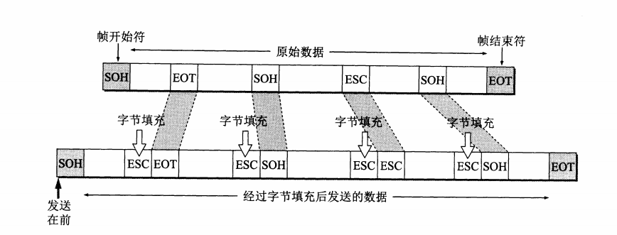

## 一 互联网简介

互联网的组成

- 边缘部分：所有连接在互联网上的主机组成，由用户直接使用
- 核心部分：由大量网络和连接这些网络的路由器组成，这部分是为边缘部分提供服务的

网络边缘的端系统之间的通信方式：

- 客户-服务器方式（C/S方式）：客户是请求服务方，服务器是服务提供方；两者都使用网络核心部分提供的服务
- 对等连接方式（P2P方式）：不区分服务请求方和服务提供方，只要运行P2P软件就可平等、对等连接通信

路由器：

- 实现分组交换的关键构件，其任务是转发收到的分组
- 分组交换采用存储转发技术，分组又称为包；分组在哪段链路上传送才会占用这段链路的通信资源，具有搞笑、灵活、迅速以及可靠地优点。
- 每个分组都有首部和尾部，包含了源地址和目的地址等控制信息，在同一个传输线路上同时传输多个分组互相不会影响，因此在同一条传输线路上允许同时传输多个分组，也就是说分组交换不需要占用传输线路。

计算机网络的性能指标：

- 速率：数据的传输速率，也叫比比特率

- 带宽：某个信号具有的频带宽度，用来表示网络中某信道传输数据的能力

- 吞吐量：单位时间内通过某个网络的实际的数据量

- 时延：数据（一个报文或分组，甚至比特）从网络（或链路）的一端传送到另一端所需的时间

  ​		  总时延=发送时延+传播时延+处理时延+排队时延

- 时延带宽积：传播时延×带宽，又称为以比特为单位的链路长度

- 往返时间RTT：计算机网络双向交互一次所需的时间

- 利用率：信道利用率（某信道有百分之的时间是被利用的）；网络利用率（全网络的信道利用率的加权平均值）

- 计算机网络体系结构

  

  

  

  >- **应用层** ：为特定应用程序提供数据传输服务，例如 HTTP、DNS 等协议。数据单位为报文。
  >- **传输层** ：为两台主机中进程之间提供通用数据传输服务。由于应用层协议很多，定义通用的传输层协议就可以支持不断增多的应用层协议。运输层包括两种协议：传输控制协议 TCP，提供面向连接、可靠的数据传输服务，数据单位为报文段；用户数据报协议 UDP，提供无连接、尽最大努力的数据传输服务，数据单位为用户数据报。TCP 主要提供完整性服务，UDP 主要提供及时性服务。
  >- **网络层** ：为分组交换网上的不同主机提供数据传输服务。而传输层协议是为主机中的进程提供数据传输服务。网络层把传输层传递下来的报文段或者用户数据报封装成分组。
  >- **数据链路层** ：网络层针对的还是主机之间的数据传输服务，而主机之间可以有很多链路，链路层协议就是为同一链路的主机提供数据传输服务。数据链路层把网络层传下来的分组封装成帧。
  >- **物理层** ：考虑的是怎样在传输媒体上传输数据比特流，而不是指具体的传输媒体。物理层的作用是尽可能屏蔽传输媒体和通信手段的差异，使数据链路层感觉不到这些差异。

- TCP/IP 协议：应用层，传输层，网络层，网络接口层，应用层可能会直接使用IP层或者网络接口层

- 数据在各层之间的传递：在向下的过程中，需要添加下层协议所需要的首部或尾部，向上的过程中不断拆除首部和尾部

## 二 物理层

物理层的主要任务为确定与传输媒体的接口有关的一些特性：

- **机械特性**：指明接口所用接线器的形状尺寸，引脚数目和排列、固定和锁定装置等
- **电器特性**：指明接口电缆的各条线上出现的电压的范围
- **功能特性**：某条线上出现的某一电平的电压的意义
- **过程特性**：指明对于不同功能的各种可能事件的出现顺序

传输数据的单位：比特

数据传输系统：源系统（源点、发送器） --> 传输系统 --> 目的系统（接收器、终点）

### 2.1 通信方式

根据信息在传输线上的传送方向，分为以下三种通信方式：

- 单工通信：单向通信，只有一个方向的通信而没有反方向的交互
- 半双工通信：双向交替通信，通信的双方都能发送信息，但不能同时发送（也不能同时接收）
- 全双工通信：双向同时通信，通信的双方可以同时发送和接收信息

### 2.2 调制方法

来自信源的信号称为基带信号，包含较多的低频成分，甚至有直流成分，必须对其进行调制，主要有两种方式：基带调制（编码）、带通调制（使用载波的调制）

- 基带调制：不归零制(正电平为1），归零制（正脉冲为1），曼彻斯特编码（位周期中心的向上跳变为0），差分曼彻斯特编码（每一位中心处都有跳变，位开始边界有跳变代表0，位开始边界没有跳变代表1）

  

  

- 带通调制：调幅（AM）、调频（FM）、调相（PM）

  
  
  

### 2.3 物理层下的传输媒体

传输媒体也叫传输介质或传输媒介

- 导引型传输媒体：双绞线、同轴电缆、光缆
- 非导引型传输媒体：无线、红外、大气激光

### 2.4 通道复用技术

- 频分复用（FDM，Frequency Division Multiplexing）：不同用户在不同频带，所用用户在同样时间占用不同带宽资源
- 时分复用（TDM，Time Division Multiplexing）：不同用户在同一时间段的不同时间片，所有用户在不同时间占用同样的频带宽度
- 波分复用（WDM，Wavelength Division Multiplexing）：光的频分复用
- 码分复用（CDM，Code Division Multiplexing）：不同用户使用不同的码，可以在同样时间使用同样频带通信

## 三 数据链路层

数据链路层属于计算机网络的低层，主要使用的信道有以下两种：

- **点对点信道**：使用一对一的点对点通信

- **广播信道**：使用一对多的广播通信方式

### 3.1 点对点信道的数据链路层

链路是指从一个结点到相邻结点的一段物理线路，数据链路则是将一些必要的通信协议（控制数据的传输）的实现（软件和硬件）加到链路上形成的

点对点信道的数据链路层的协议数据单元：帧

三个基本问题：

- **封装成帧**：在网络层传下来一段数据的前后分别添加首部和尾部，就构成一帧，首部和尾部的作用就是进行帧定界（确定帧的开始和结束）

  每一种链路层协议都规定了所能传送的帧的数据部分长度上限：最大传送单元MTU

  

  

- 透明传输

  透明表示一个实际存在的事物看起来好像不存在一样。

  帧使用首部和尾部进行定界，如果帧的数据部分含有和首部尾部相同的内容，那么帧的开始和结束位置就会被错误的判定。需要在数据部分出现首部尾部相同的内容前面插入转义字符。如果数据部分出现转义字符，那么就在转义字符前面再加个转义字符。在接收端进行处理之后(删除对应的转义字符）可以还原出原始数据。这个过程透明传输的内容是转义字符，用户察觉不到转义字符的存在。

  

  

  

- 差错检测

  传输过程中出现0变成1,1变成 0，就表示出现 比特差错。

  误码率：传输错误的比特占所传输比特总数的比率

  目前广泛采用 **循环冗余检验CRC**的差错检测技术

>点对点协议PPP
>
>- 用户计算机和ISP进行通信时所使用的数据链路层协议
>
>- PPP 的帧格式(信息部分长度不超过1500)：
>
> | F        | A            | C            | 协议 | IP数据报 | FCS                 | F        |
> | -------- | ------------ | ------------ | ---- | -------- | ------------------- | -------- |
> | 帧定界符 | 暂时没有意义 | 暂时没有意义 | 协议 | IP数据报 | 使用 CRC 的检验序列 | 帧定界符 |

### 3.2 使用广播信道的数据链路层

#### 3.2.1 局域网

局域网是一种典型的广播信道，主要特点是网络为一个单位所拥有，且地理范围和站点数目均有限。

主要有以太网、令牌环网、FDDI 和 ATM 等局域网技术，目前以太网占领着有线局域网市场。

- 具有广播功能，从一个站点可方便访问全网
- 便于系统的扩展和演变，各设备的位置可灵活调整和改变
- 提高系统可靠性，可用性和生存性

局域网按拓扑分为星形网，环形网，总线网

共享信道实现：

- 静态划分信道：频分复用、时分复用、波分复用、码分复用等
- 动态媒体接入控制：随机接入、受控接入（多点线路探寻（轮询））

适配器

- 实现计算机与外界局域网的连接
- 又叫网络接口卡NIC（网卡）

#### 3.2.2 CSMA/CD 协议

CSMA/CD 协议：载波监听多点接入/碰撞检测

协议要点：

- **多点接入**：总线型网络，许多计算机以多点接入的方式连接在一根总线上，协议的实质是载波监听和碰撞检测
- **载波监听**：用电子技术检测总线上有没有其他计算机也在发送，实质就是**检测信道**，**不管在发送前还是发送中，每个站都必须不停检测信道**；在发送前，如果监听到信道正在使用，就必须等待
- **碰撞检测**：**边发送边监听**，在发送中，如果监听到信道已有其它主机正在发送数据，就表示发生了碰撞；虽然每个主机在发送数据之前都已经监听到信道为空闲，但是由于电磁波的传播时延的存在，还是有可能会发生碰撞。

记端到端的传播时延为 τ，最先发送的站点最多经过 2τ 就可以知道是否发生了碰撞，称 2τ 为 **争用期** 。只有经过争用期之后还没有检测到碰撞，才能肯定这次发送不会发生碰撞。

当发生碰撞时，站点要停止发送，等待一段时间再发送。这个时间采用 **截断二进制指数退避算法** 来确定。从离散的整数集合 {0, 1, .., (2k-1)} 中随机取出一个数，记作 r，然后取 r 倍的争用期作为重传等待时间。

#### 3.2.3 以太网

**MAC层的硬件地址**

- 固化到适配器的ROM中的地址。

- MAC地址是链路层地址，长度为6字节(48bits)，用于唯一标识网络适配器（网卡）
- 一台主机有多少个网络适配器就有多少个MAC地址。

**交换机**

- 工作在数据链路层的多接口的网桥，存在多个接口

- 相互通信的主机都是独占传输媒体，无碰撞地传输数据

- 交换机的接口还有存储器，能将繁忙时候的帧进行缓存      

- 交换机具有学习能力，学习的是交换表的内容，交换表中存储着MAC地址到地址的映射；因此交换机是一种即插即用设备，不需要网络管理员手动配置交换表内容

  
  
  

**以太网**

- 一种星型拓扑结构局域网

- 早期使用**集线器**进行连接，集线器是一种物理层设备， 作用于比特而不是帧，当一个比特到达接口时，集线器重新生成这个比特，并将其能量强度放大，从而扩大网络的传输距离，之后再将这个比特发送到其它所有接口。如果集线器同时收到两个不同接口的帧，那么就发生了碰撞。

- 目前以太网使用交换机替代了集线器，交换机是一种链路层设备，它不会发生碰撞，能根据 MAC 地址进行存储转发。

- 以太网帧格式：

  - **类型** ：标记上层使用的协议；
  - **数据** ：长度在 46-1500 之间，如果太小则需要填充；
  - **FCS** ：帧检验序列，使用的是 CRC 检验方法；

  | 目的地址 | 源地址 | 类型 | IP数据报 | FCS  |
  | -------- | ------ | ---- | -------- | ---- |
  | 6        | 6      | 2    | 46~1500  | 4    |

  #### 3.2.4 广播通信：

  - 硬件地址（物理地址、MAC 地址）
  - 单播（unicast）帧（一对一）：收到的帧的 MAC 地址与本站的硬件地址相同
  - 广播（broadcast）帧（一对全体）：发送给本局域网上所有站点的帧
  - 多播（multicast）帧（一对多）：发送给本局域网上一部分站点的帧

## 四 网络层

**网络层只提供简单灵活的、无连接的、尽最大努力交付的数据包服务**，网络层不提供服务质量的保证。这里的数据报就是经常使用的分组。

使用IP协议可以把异构的物理网络连接起来，使得在网络层看起来好像一个统一的网络。**互联网可以由多种异构网络互连组成**

### 4.1 网际协议IP

网际协议IP是用来使互连起来的许多计算机网络能够进行通信的，因此TCP/IP体系中的网络层被称为**网际层**或**IP层**.

与IP协议配套使用的还有三个协议：

- 地址解析协议ARP
- 网际控制报文ICMP
- 网际组管理协议IGMP

从一般概念来讲，将互联网连接起来要使用一些中间设备，由一下四种不同的中间设备：

1. 物理层使用的中间设备叫转发器
2. 数据链路层使用的中间设备叫做网桥或桥接器
3. 网络层使用的中间设备叫做路由器
4. 在网络层以上使用的中间设备叫网关

#### 4.1.1 IP地址编址

- 分类的IP地址
- 划分子网的IP地址
- 无分类编址，构成超网

**分类的IP地址**

>由两部分组成，网络号和主机号，其中不同分类具有不同的网络号长度，并且是固定的
>
>IP地址：：= {<网络号>，<主机号>}
>
>IP地址网络号与字节号：
>
>
>
>
>
>
>
>IP地址的指派范围：
>
>
>
>

**划分子网的IP地址**

>通过在主机号字段中拿一部分作为子网号，把两级IP地址划分为三级IP地址
>
>`IP地址::={<网络号>,<子网号>,<主机号>}`
>
>要使用子网，必须配置子网掩码。一个 B 类地址的默认子网掩码为 255.255.0.0，如果 B 类地址的子网占两个比特，那么子网掩码为 11111111 11111111 11000000 00000000，也就是 255.255.192.0。
>
>将IP地址与子网掩码逐位相与得到对应的网络地址：
>
>如已知IP地址为141.14.72.24，子网掩码时255.255.192.0，求网络地址。
>
>
>
>注意，外部网络看不到子网的存在，数据报到达同一个网络地址，然后根据子网掩码来送到指定主机。
>
>使用子网划分后，路由表必须包含三项内容：**(目的网络地址，子网掩码，下一跳地址)**

**无分类**

>无分类编址 CIDR 消除了传统 A 类、B 类和 C 类地址以及划分子网的概念，使用网络前缀和主机号来对 IP 地址进行编码，网络前缀的长度可以根据需要变化。
>
>`IP 地址 ::= {< 网络前缀号 >, < 主机号 >}`
>
>CIDR 的记法上采用在 IP 地址后面加上网络前缀长度的方法，例如 128.14.35.7/20 表示前 20 位为网络前缀，后12位表示主机号。
>
>CIDR 的地址掩码可以继续称为子网掩码，子网掩码首 1 长度为网络前缀的长度。
>
>一个 CIDR 地址块中有很多地址，一个 CIDR 表示的网络就可以表示原来的很多个网络，并且在路由表中只需要一个路由就可以代替原来的多个路由，减少了路由表项的数量。把这种通过使用网络前缀来减少路由表项的方式称为路由聚合，也称为 **构成超网** 。
>
>在路由表中的项目由“网络前缀”和“下一跳地址”组成，在查找时可能会得到不止一个匹配结果，应当采用最长前缀匹配来确定应该匹配哪一个。

#### 4.1.2 IP地址与硬件地址

物理地址：数据链路层和物理层使用的地址

IP地址：是网络层和以上各层使用的地址，是一种逻辑地址

IP地址与硬件地址的区别：

**IP地址放在IP数据报的首部，硬件地址放在MAC帧的首部，在网络层和网络层以上使用的是IP地址，而数据链路层及以下使用的是硬件地址**

#### 4.1.3 地址解析协议ARP

地址解析协议：在通信过程中，IP数据报的源地址和目的地址不变，而MAC地址随着链路的改变而改变。ARP通过IP地址来找出其相应的硬件地址，通常将ARP协议划分到网络层。也有将其划分到数据链路层。

**地址解析协议ARP通过在主机ARP高速缓存中存放一个从IP地址到硬件地址的映射表，并且这个映射表还经常动态更新**

当主机A要想本局域网的某台主机B发送IP数据报，就先在其ARP高速缓存中查看有无主机B的IP地址。如果有，就在ARP高速缓存中查出其对应的硬件地址，再把这个硬件地址写入MAC帧，然后通过局域网将该MAC帧发往此硬件地址。如果主机 A 知道主机 B 的 IP 地址，但是 ARP 高速缓存中没有该 IP 地址到 MAC 地址的映射，此时主机 A 通过广播的方式发送 ARP 请求分组，主机 B 收到该请求后会发送 ARP 响应分组给主机 A 告知其 MAC 地址，随后主机 A 向其高速缓存中写入主机 B 的 IP 地址到 MAC 地址的映射。

**ARP对保存在高速缓存中的每一个映射地址项目都设置生存时间，以解决对应映射的硬件地址改变的情况；ARP是解决同一个局域网上的主机或路由器的IP地址和硬件地址的映射问题**

#### 4.1.4 IP数据报

IP数据报的格式能说明IP协议都具有什么功能，在TCP/IP的标准中，各种数据格式通常以32位（4字节）为单位来描述。

- **版本** : 有 4（IPv4）和 6（IPv6）两个值；
- **首部长度** : 占 4 位，因此最大值为 15。值为 1 表示的是 1 个 32 位字的长度，也就是 4 字节。因为固定部分长度为 20 字节，因此该值最小为 5。如果可选字段的长度不是 4 字节的整数倍，就用尾部的填充部分来填充。
- **区分服务** : 用来获得更好的服务，一般情况下不使用。
- **总长度** : 包括首部长度和数据部分长度。数据报长度超过数据链路层的MTU值，就必须把过长的数据报进行分片处理。
- **生存时间** ：TTL，它的存在是为了防止无法交付的数据报在互联网中不断兜圈子。以路由器跳数为单位，当 TTL 为 0 时就丢弃数据报。
- **协议** ：指出携带的数据是使用何种协议，应该上交给哪个协议进行处理，例如 ICMP、TCP、UDP 等。
- **首部检验和** ：因为数据报每经过一个路由器，都要重新计算检验和，因此检验和不包含数据部分可以减少计算的工作量。
- **标识** :占16位， 在数据报长度过长从而发生分片的情况下，相同数据报的不同分片具有相同的标识符。便于正确组装成为原来的数据报。
- **片偏移** :占13位， 和标识符一起，用于发生分片的情况。片偏移的单位为 8 字节。
- **标志**：占3位，标志字段中的最低位记为MF，MF=1表示后面还有切片，MF=0表示这已是若干数据报中最后一个；标志字段中间的一位记为DF，表示不能分片，DF=0时才允许分片。
- **可变部分**：是一个选项字段，用来支持排错、测量以及安全等措施。

#### 4.1.5 IP层转发分组的流程

**路由表的构成**

1. 网络 ID（Network ID, Network number）：就是目标地址的网络 ID。
2. 子网掩码（subnet mask）：用来判断 IP 所属网络
3. 下一跳地址/接口（Next hop / interface）：就是数据在发送到目标地址的旅途中下一站的地址。其中 interface 指向 next hop（即为下一个 route）。一个自治系统（AS, Autonomous system）中的 route 应该包含区域内所有的子网络，而默认网关（Network id: `0.0.0.0`, Netmask: `0.0.0.0`）指向自治系统的出口。

根据应用和执行的不同，路由表可能含有如下附加信息：

1. 花费（Cost）：就是数据发送过程中通过路径所需要的花费。
2. 路由的服务质量
3. 路由中需要过滤的出/入连接列表

在路由表中，对每一条路由最主要的是以下两个信息：**(目的网络地址，下一跳地址)**

- 从数据报的首部提取目的主机的 IP 地址 D，得到目的网络地址 N。
- 若 N 就是与此路由器直接相连的某个网络地址，则进行直接交付；
- 若路由表中有目的地址为 D 的特定主机路由，则把数据报传送给表中所指明的下一跳路由器；
- 若路由表中有到达网络 N 的路由，则把数据报传送给路由表中所指明的下一跳路由器；
- 若路由表中有一个默认路由，则把数据报传送给路由表中所指明的默认路由器；
- 报告转发分组出错。

### 4.2 网际控制报文协议ICMP

ICMP 允许主机或者路由器报告差错情况和提供有关异常情况的报告，ICMP 报文作为 IP 层数据报的数据，加上数据报的首部，组成 IP 数据报发送出去。格式如下：

**ICMP 报文的种类**

>分为两种：**ICMP差错报告报文和ICMP询问报文**
>
>上图中的取决于ICMP报文的类型的 4 个字节可能取值如下：
>
>

**ICMP的应用举例**

>- **ping**
>
>  Ping 是 ICMP 的一个重要应用，主要用来测试两台主机之间的连通性。
>
>  Ping 的原理是通过向目的主机发送 ICMP Echo 请求报文，目的主机收到之后会发送 Echo 回答报文。Ping 会根据时间和成功响应的次数估算出数据包往返时间以及丢包率。
>
>- **traceroute**
>
>  Traceroute 是 ICMP 的另一个应用，用来跟踪一个分组从源点到终点的路径。
>
>  Traceroute 发送的 IP 数据报封装的是无法交付的 UDP 用户数据报，并由目的主机发送终点不可达差错报告报文。
>
>  1. 源主机向目的主机发送一连串的 IP 数据报。第一个数据报 P1 的生存时间 TTL 设置为 1，当 P1 到达路径上的第一个路由器 R1 时，R1 收下它并把 TTL 减 1，此时 TTL 等于 0，R1 就把 P1 丢弃，并向源主机发送一个 ICMP 时间超过差错报告报文；
>  2. 源主机接着发送第二个数据报 P2，并把 TTL 设置为 2。P2 先到达 R1，R1 收下后把 TTL 减 1 再转发给 R2，R2 收下后也把 TTL 减 1，由于此时 TTL 等于 0，R2 就丢弃 P2，并向源主机发送一个 ICMP 时间超过差错报文。
>  3. 不断执行这样的步骤，直到最后一个数据报刚刚到达目的主机，主机不转发数据报，也不把 TTL 值减 1。但是因为数据报封装的是无法交付的 UDP，因此目的主机要向源主机发送 ICMP 终点不可达差错报告报文。
>  4. 之后源主机知道了到达目的主机所经过的路由器 IP 地址以及到达每个路由器的往返时间。

### 4.3 互联网的路由选择协议

路由选择协议的核心是路由算法，使用分层次的路由选择方法，可将互联网划分为许多较小的**自治系统(AS)**，AS是在单一技术管理下的一组路由器，而这些路由器使用一种自治系统内部的路由选择协议和共同的度量。一个AS对其他
AS表现出的时一个**单一的和一致的路由选择策略**。可将互联网的路由选择协议划分为：

- **内部网关协议IGP（自治系统内部）**：在一个自治系统内部使用的路由选择协议，与在互联网中的其他自治系统选用什么路由选择协议无关。如RIP，OSPF等
- **外部网关协议EGP（自治系统之间）**：源主机和目的主机处在不同的自治系统中，当需要在两者之间传递数据报时，就需要外部网关协议将路由选择信息传递到另一个自治系统中。如BGP

#### 4.3.1 路由器的结构

>路由器是一种具有多个输入端口和输出端口的专用计算机，其任务是转发分组
>
>
>
>路由器主要分为**路由选择**和**分组转发**
>
>路由选择：其核心构件是路由选择处理机，根据所选定的路由选择协议构造路由表，同时经常或定期地和相邻路由器交换路由信息从而不断更新和维护路由表。
>
>分组转发：由**交换结构**、一组**输入端口**和一组**输出端口**组成
>
>- 交换结构：根据转发表对分组进行处理，将某个输入端口进入的分组从一个合适的输出端口转发出去

#### 4.3.2 内部网关协议RIP

RIP：路由信息协议，一种分布式的基于距离向量的路由选择协议。距离是指跳数，直接相连的路由器跳数为 1。跳数最多为 15，超过 15 表示不可达。

RIP 按固定的时间间隔仅和相邻路由器交换自己的路由表，经过若干次交换之后，所有路由器最终会知道到达本自治系统中任何一个网络的最短距离和下一跳路由器地址。

**RIP协议的特点**：

- 仅和相邻路由器交换信息
- 路由器交换的信息时当前本路由器所知道的全部信息，即自己现在的路由表
- 按固定的时间间隔交换路由信息

**距离向量算法**：

- 对地址为 X 的相邻路由器发来的 RIP 报文，先修改报文中的所有项目，把下一跳字段中的地址改为 X，并把所有的距离字段加 1；
- 对修改后的 RIP 报文中的每一个项目，进行以下步骤：
- 若原来的路由表中没有目的网络 N，则把该项目添加到路由表中；
- 否则：若下一跳路由器地址是 X，则把收到的项目替换原来路由表中的项目；否则：若收到的项目中的距离 d 小于路由表中的距离，则进行更新（例如原始路由表项为 Net2, 5, P，新表项为 Net2, 4, X，则更新）；否则什么也不做。
- 若 3 分钟还没有收到相邻路由器的更新路由表，则把该相邻路由器标为不可达，即把距离置为 16。

**RIP协议的优缺点**：

- 实现简单，开销较小
- 最大使用距离是 15，限制了网络规模；每次交换完整的路由表，随网络规模增大，开销也随之增大；网络出现问题，会耗费较长时间将此消息传递给所有路由器

#### 4.3.3 内部网关协议OSPF

OSPF：开放最短路径优先 ，是为了克服 RIP 的缺点而开发出来的。

开放表示 OSPF 不受某一家厂商控制，而是公开发表的；最短路径优先表示使用了 Dijkstra 提出的最短路径算法 SPF。

**OSPF协议的特点**：

- 向本自治系统中的所有路由器发送信息，这种方法是洪泛法。
- 发送的信息就是与相邻路由器的链路状态，链路状态包括与哪些路由器相连以及链路的度量，度量用费用、距离、时延、带宽等来表示。
- 只有当链路状态发生变化时，路由器才会发送信息。

所有路由器都具有全网的拓扑结构图，并且是一致的。相比于 RIP，OSPF 的更新过程收敛的很快。

#### 4.3.4 外部网管协议BGP

BGP：边界网关协议，AS 之间的路由选择很困难，主要是由于：

- 互联网规模很大；
- 各个 AS 内部使用不同的路由选择协议，无法准确定义路径的度量；
- AS 之间的路由选择必须考虑有关的策略，比如有些 AS 不愿意让其它 AS 经过。

BGP 采用路径向量路由选择协议，只能寻找一条比较好的路由，而不是最佳路由

每个 AS 都必须至少选择一个路由器作为 **BGP 发言人**，通过在两个相邻 BGP 发言人之间建立 TCP 连接来交换路由信息。当BGP发言人交换了网络可达性的信息后，各BGP发言人就根据所采用的策略从收到的路由信息中找处到达各自治系统的较好路由。

### 4.4 网际组管理协议IGMP

IP有三种地址：单播地址，广播地址，多播地址

- 每个以太网帧包含源主机和目的主机的以太网地址。通常每个以太网帧发往单个目的主机，目的地址指明单个接收接口，因而称为单播
- 一个主机要向网上的所有其他主机发送帧，就是广播
- 一个主机要向网上的多个主机发送帧，就是多播

**多播**：IP多播提供两类服务

- 向多个目的地址传送数据
- 客户对服务器的请求

**IGMP（网际组管理协议）**：用于支持主机和路由器进行多播的网际组管理协议

- 加入一个多播组

  多播的基础就是一个进程的概念（使用的术语进程是指操作系统执行的一个程序），该进程在一个主机的给定接口上加入了一个多播组。在一个给定接口上的多播组中的成员是动态的—它随时因进程加入和离开多播组而变化。

  一个主机通过组地址和接口来识别一个多播组。主机必须保留一个表，此表中包含所有至少含有一个进程的多播组以及多播组中的进程数量。

- IGMP 报告和查询

  多播路由器使用IGMP报文来记录与该路由器相连网络中组成员的变化情况

IGMP的工作分为两个阶段：

1. 当某台主机加入新的多播组的多播地址发送一个 IGMP 报文，声明自己要成为该组的成员。本地的多播路由器收到IGMP报文后，还要利用多播路由选择协议把这种组成员关系转发给互联网上的其他多播路由器。
2. 组成员关系是动态的，本地多播路由器要周期性地探询本地局域网上的主机，以便知道这些主机是否继续是组的成员。只要有一台主机对某个组响应，那么多播路由器认为这个组是活跃的。但一个组在经过几次的探询之后没有一台主机响应，多播路由器就认为本网络的主机已经都离开了这个组，也就不再将这个组的成员关系转发给其他的多播路由器。

### 4.5 虚拟专用网VPN和网络地址转换NAT

#### 4.5.1 虚拟专用网VPN

由于 IP 地址的紧缺，一个机构能申请到的 IP 地址数往往远小于本机构所拥有的主机数。并且一个机构并不需要把所有的主机接入到外部的互联网中，机构内的计算机可以使用仅在本机构有效的 IP 地址（专用地址）。

在互联网中的所有路由器，对目的地址是专用地址的数据报一律不进行转发。

有三个专用地址块：

- 10.0.0.0 ~ 10.255.255.255
- 172.16.0.0 ~ 172.31.255.255
- 192.168.0.0 ~ 192.168.255.255

利用公用的互联网作为本机构各专用网之间的通信载体，这样的专用网称为**虚拟专用网VPN**，专用指机构内的主机只与本机构内的其它主机通信；虚拟指好像是，而实际上并不是，它有经过公用的互联网。

下图中，场所 A 和 B 的通信经过互联网，如果场所 A 的主机 X 要和另一个场所 B 的主机 Y 通信，IP 数据报的源地址是 10.1.0.1，目的地址是 10.2.0.3。数据报先发送到与互联网相连的路由器 R1，R1 对内部数据进行加密，然后重新加上数据报的首部，源地址是路由器 R1 的全球地址 125.1.2.3，目的地址是路由器 R2 的全球地址 194.4.5.6。路由器 R2 收到数据报后将数据部分进行解密，恢复原来的数据报，此时目的地址为 10.2.0.3，就交付给 Y

#### 4.5.2 网络地址转换NAT

专用网内部的主机使用本地 IP 地址又想和互联网上的主机通信时，可以使用 NAT 来将本地 IP 转换为全球 IP。

在以前，NAT 将本地 IP 和全球 IP 一一对应，这种方式下拥有 n 个全球 IP 地址的专用网内最多只可以同时有 n 台主机接入互联网。为了更有效地利用全球 IP 地址，现在常用的 NAT 转换表把传输层的端口号也用上了，使得多个专用网内部的主机共用一个全球 IP 地址。使用端口号的 NAT 也叫做网络地址与端口转换 NAPT，下表是NAT地址转换表举例：

| 方向 | 字段         | 旧的IP地址  | 新的IP地址  |
| ---- | ------------ | ----------- | ----------- |
| 出   | 源IP地址     | 192.168.0.3 | 172.38.1.5  |
| 入   | 目的IP地址   | 172.38.1.5  | 192.168.0.3 |
| 出   | 源IP地址     | 192.168.0.7 | 172.38.1.6  |
| 入   | 目的 IP 地址 | 172.38.1.6  | 192.168.0.7 |

## 五 传输层

### 5.1 传输层协议描述

**传输层向它上面的应用层提供通信服务**，属于面向通信部分的最高层，同时也是用户功能中的最低层

从传输层的角度来看，主机之间通信的真正端点不是主机而是主机中的进程，也就是说**端到端的通信是应用进程之间的通信**

**复用**：发送方不同的应用进程都可以使用同一个传输层协议传送数据

**分用**：接收方的传输层在剥去报文的首部之后能够把这些数据正确交付目的应用进程

网络层为主机之间提供逻辑通信，传输层为应用进程之间提供端到端的逻辑通信

传输层还要对收到的报文进行差错检测，网络层IP数据报首部中的检验和只检验首部是否出现差错

传输层向高层用户屏蔽了下面网络层的核心细节，使应用程序看起来像是在两个传输层实体之间有一条端到端的逻辑通信信道。

TCP/IP传输层的两个主要协议：

- **用户数据报协议UDP**：传输数据之前不需要先建立连接
- **传输控制协议TCP**：提供面向连接的服务

### 5.2 用户数据报协议UDP

UDP的特点：

- UDP 是**无连接**的，减少开销和发送数据之前的时延
- UDP 使用**尽最大努力交付**，即不保证可靠交付
- UDP 是**面向报文**的，对应用层下来的报文既不合并也不拆分，**保留这些报文的边界**
- UDP **没有拥塞控制**
- UDP 支持一对一、一对多、多对一和多对多的交互通信
- UDP 的首部开销很小，只有 8 个字节

UDP 的首部格式

- **源端口**：源端口号，在需要对方回信时选用
- **目的端口**：目的端口号，在终点交付报文时必须使用
- **长度**：UDP用户数据报的长度（首部+数据）
- **校验和**：检测 UDP 用户数据报在传输中是否出错，有错就丢弃
- **伪首部**：在计算校验和时，添加在 UDP 用户数据报面前，得到的临时数据报，以此来计算校验和

**UDP 的校验和时把首部和数据部分一起都检验**

### 5.3 传输控制协议 TCP

#### 5.3.1 概述

TCP主要的特点：

- **TCP 是面向连接的传输层协议**，使用前需建立 TCP 连接，使用完需释放 TCP 连接
- 每一个 TCP 连接只能有两个端点，**TCP 连接是点对点（一对一）的**
- TCP 提供**可靠交付**的服务，无差错、不丢失、不重复，并且按序到达
- TCP 提供**全双工通信**，TCP 连接的两端设有发送缓存和接收缓存
- **面向字节流**，TCP 中的**流**指的是流入到进程或从进程流出的字节序列

TCP 的连接：

每一条 TCP 连接有两个端点，端点称为**套接字或插口**，端口号拼接到 IP 地址就是套接字。
$$
套接字socket = （IP 地址：端口号）
$$
**每一条 TCP 连接唯一地被通信两端的两个端点（两个套接字）所确定**：
$$
TCP 连接 ：：= {socket1，socket2} = {(IP1:port1), (IP2, port2)}
$$

#### 5.3.2 TCP 可靠传输的工作原理

**停止等待协议**：每发送完一个分组就停止发送，等待对方的确认，在收到确认之后再发送下一个分组。

- 出现差错

  采用**超时重传**，发送方在一定时间内（**比数据在分组传输的平均往返时间更长一些）**没有收到确认，就重传前面发送过的分组

- 确认丢失和确认迟到

  发送方在接收到重传的分组之后才去的行动：

  1. 丢弃这个重复的分组
  2. 向发送方发送确认

  
  
  

上面的可靠传输协议称为**自动重传请求ARQ**

为了提高信道利用率，发送发可不适用低效率的停止等待协议，而是采用**流水线传输**（发送方可连续发送多个分组，不必每发完一个分组就停止来等待确认）。

**连续 ARQ 协议**

- 连续 ARQ 协议规定，发送方每收到一个确认，就把发送窗口向前滑动一个分组的位置
- 接收方一般采用**累计确认**的方式，即接收方是在收到几个分组之后，**对按序到达的最后一个分组发送确认**，表示：到这个分组为止的所有分组都已正确收到。优点是实现简单，即使确认丢失也不重传；缺点是不能正确反映接收方已经正确收到的所有分组的信息。

#### 5.3.3 TCP 报文段的首部

TCP 报文段首部的前 20 个字节是固定的，后面有 4n 字节是根据需要而增加的选项。最小长度是 20 字节。

- **源端口和目的端口**：各占 2 字节，写入源端口号和目的端口号，来实现分用功能（交付给主机的应用程序）

- **序号**：TCP 连接中传送的字节流的**每一个字节按顺序编号**，序号表示本报文段所发送的数据的第一个字节的序号

- **确认号**：4 字节，**期望收到对方下一个报文段的第一个数据字节的序号**
  $$
  若确认号=N，则表明：到序号N-1为止的所有数据都已正确收到
  $$

- **数据偏移**：占 4 位，实际指出 TCP 报文段的首部长度，数据偏移的单位是**4 字节**

- **标志位**：

  1. URG：紧急指针（urgent pointer）字段有效
  2. ACK：确认序列号有效（ACK=1）
  3. PSH：接收方应该尽快将这个报文交给应用层
  4. RST：重置连接（TCP 连接出现严重差错，要释放连接，再重新建立连接）
  5. SYN：在连接时用来同步序号，SYN=1表示是一个连接请求或连接接收报文
  6. FIN：断开一个连接

- **窗口**：发送本报文段一方的接受窗口，**作为接收方让发送方设置其发送窗口的依据**

- **校验和**：检验和字段检验的范围包括首部和数据两部分

- **紧急指针**：在URG=1有意义，指出紧急数据的末尾在报文段中的位置

#### 5.3.4 TCP 可靠传输的实现（滑动窗口）

**以字节为单位的滑动窗口**

发送方根据接收方发送过来的报文段的确认号和序号，加上其他信息（网络拥塞）来构造发送窗口：

- 发送窗口

  >1. 发送窗口表示：在没有收到接收方 B 的确认的情况下，A 可以连续把窗口内的数据都发送出去。凡是已经发送的数据，在未收到确认之前都必须暂时保留以便超时重传使用。
  >2. 发送窗口后沿的后面部分表示已发送并且收到确认，不再保留，后沿可能不动（没有收到新的确认）或者前移（收到新的确认）；前沿的前面部分表示不允许发送，前沿通常不断向前移动（收到新的确认）或者不动（没有收到新的确认，收到确认但对方通知窗口变小）
  >3. 允许发送但尚未发送的字节数称为可用窗口或有效窗口
  >4. 当发送窗口左部字节收到确认之后，发送窗口向右滑动对应的字节数

- 接收窗口

  >1. 到 30 号位置的数据是已经发送过确认并已交付主机，不再保留
  >2. B 只对按序接收到的数据中的最高序号给出确认
  >3. 将数据交付给主机后，删除这些数据，然后接收窗口向右滑动对应字节数

发送方的应用进程把字节流写入 TCP 的发送缓存，接收方的应用进程从 TCP 的接收缓存中读取字节流。TCP 的缓存和窗口的关系：

窗口是缓存的一部分。

发送缓存用来暂时存放：

- 发送应用进程传送给发送方 TCP 准备发送的数据
- TCP 已发送出但未收到确认的数据

接收缓存用来暂时存放：

- 按序到达的、但尚未被接收应用进程读取的数据
- 未按序到达的数据

**注意：**

1. A 的发送窗口和 B 的接收窗口并不总是一样大
2. 对于不按序到达的数据，接收方可将其直接丢弃（管理简单，资源利用差），通常将其临时存放在接收窗口中，等到缺失的字节后，再按序交付给上层的应用进程
3. TCP 要求接收方必须有**累积确认**的功能，这样可减少传输开销
4. TCP 的每一方都有自己的发送窗口和接收窗口

#### 5.3.5 TCP 的流量控制

流量控制：让发送方的发送速率不要太快，要让接收方来得及接收

接收方发送的确认报文中的窗口字段可以用来控制发送方窗口大小，从而影响发送方的发送速率。将窗口字段设置为 0，则发送方不能发送数据。

发送方的发送窗口不能超过接收方给出的接收窗口的数值

#### 5.3.6 TCP 的拥塞控制

在一段时间，对网络中某一资源的需求超过了该资源能够提供的可用部分，网络的性能就会变坏，这就是拥塞

**拥塞控制**：防止过多的数据注入到网络中，这样可以使网络中的路由器或链路不会过载

如果网络出现拥塞，分组将会丢失，此时发送方会继续重传，从而导致网络拥塞程度更高。因此当出现拥塞时，应当控制发送方的速率。这一点和流量控制很像，但是出发点不同。流量控制是为了让接收方能来得及接收，而拥塞控制是为了降低整个网络的拥塞程度。

**TCP的拥塞控制方法**

TCP 进行拥塞控制有四种方法：**慢开始、拥塞避免、快重传和快恢复**

**慢开始和拥塞避免**

判断网络拥塞的依据：出现了超时（发生了重传）

发送方需要维护一个叫做**拥塞窗口（cwnd）**的状态变量，注意拥塞窗口与发送方窗口的区别：拥塞窗口只是一个状态变量，实际决定发送方能发送多少数据的是发送方窗口。

- **慢开始**

  一开始设置 cwnd=1，发送第一个报文段，接收方收到后确认，发送发收到确认之后，设置 cwnd=2，并发送两个报文段，收到接收方的两个确认之后，设置 cwnd = 2+2。。。发送方每收到一个对新报文段的确认就使得发送方的拥塞窗口加 1。**每经过一个传输轮次，拥塞窗口 cwnd 就加倍**

为了防止拥塞窗口 cwnd 增长过大引起网络拥塞，还需要设置一个**慢开始门限 ssthresh **状态变量

>1. 当 cwnd < ssthresh 时，使用慢开始算法
>2. 当 cwnd > ssthresh 时，改用拥塞避免算法
>3. 当 cwnd = ssthresh 时，既可用慢开始，也可用拥塞避免

- **拥塞避免**

  当 cwnd > ssthresh 的时候使用拥塞避免算法，让 cwnd 缓慢地增大，即每经过一个往返时间 RTT 就把发送方的拥塞窗口加 1，使得拥塞窗口按线性增长，是网络不容易出现拥塞。

  当出现超时的时候，出现网络拥塞，就将门限值 ssthresh = cwnd / 2；同时设置 cwnd = 1，进入慢开始算法。

  TCP 拥塞窗口在拥塞控制时的变化情况：

  

  
  
  *注意：个别报文段的丢失会发生超时，使得错误认为发生网络拥塞，这样会降低传输效率*

**快重传和快恢复**

 

- **快重传**

  让发送方尽早知道发生了个别报文段的丢失，要求接收方不要等待自己发送数据时进行确认，而是要立即发送确认，及时收到了失序的报文段也要立即发出对已收到的报文段的重复确认。

  

- **快恢复**

  只要一连收到3个重复确认，就知道没有收到对应报文段，立即进行快重传发送方知道只是丢失个别报文段，执行快恢复算法。发送方将调整门限值 ssthresh = cwnd / 2， cwnd = ssthresh。注意**此时直接进入拥塞避免算法**。

#### 5.3.7 TCP 的传输控制(三次握手与四次挥手)

**连接的建立（三次握手）**

使用`connect`建立连接时，客户端和服务器端会相互发送三个数据包：

>客户端调用`socket`创建套接字之后，因为没有建立连接，所以套接字处于CLOSED状态；服务器调用`listen`函数后，服务器端的套接字进入被动LISTEN状态，开始监听客户端请求。
>
>这时科幻段发起请求：
>
>1. 客户端调用`connect`函数后，TCP会组建一个数据包，并设置SYN标志位，表示该数据包是用来建立同步连接的，同时生成随机数1000，填充进序号字段，之后向服务器端发送数据包，客户端进入SYN-SEND状态
>2. 服务器端收到数据包，检测到已经设置了SYN标志位，就知道这是客户端发来的建立连接的请求包。服务器端也会组建一个数据包，并设置SYN和ACK标志位，SYN表示该数据包用来建立连接，ACK用来确认书到了刚才客户端发送的数据包
>
>  - 服务器生成一个随机数2000，填充序号字段，2000和客户端数据包没有关系
>  - 服务器将客户端数据包序号1000加1得到1001，并用这个数字填充确认号(Ack)字段
>  - 服务器将数据包发送出去之后，进入SYN-RECV状态
>
>3. 客户端收到数据包，检测到已经设置了SYN和ACK标志位，知道这是服务器发来的确认包，客户端会检测确认号（Ack）段，看它是否为1000 + 1，如果是说明连接建立成功。
>
>  - 接下来客户端会继续组建数据包，并设置ACK标志位，表示客户端正确接受了服务器发来的确认包，同时将服务器发来的数据包的序列号 2000 加 1得到2001，并用这个数字来填充确认号(Ack)字段。
>  - 客户端将数据包发出，进入ESTABLISED状态，表示连接建立成功
>
>4. 服务器收到数据包，检测到已经设置好ACK标志位，知道这是客户端发来的确认包，服务器会检测确认号（Ack）字段，看它的值是否为 2000 + 1，如果是表示连接建立成功，服务器进入 ESTABLISED 状态
>5. 至此，服务器和客户端都进入 ESTABLISED 状态，连接建立成功，接下来可以传输数据

**TCP 数据传输过程**

连接建立后的数据传输如下图：

主机 A 每次会发送指定字节数的数据，同时将数据包的Seq初始设置，如上图设置为 1200；主机 B 为了确认这一点，向主机 A 发送ACK包，并将确认号(Ack)字段设置为 1301.

>- 为了保证数据准确到达，目标机器收到数据包（包括SYN包，FIN包，普通数据包等）后必须立即回传ACK包，这样发送方才能确认数据传输成功
>- Ack号确定公式： Seq号 + 传输的字节数  + 1；加 1 是为了告诉对方下一次传输的Seq号

下图是传输发生错误的处理过程：

为完成发生错误时(主机B没收到数据包，主机A没收到ACK包)完成数据包的重传，TCP套接字每次发送数据包时都会启动定时器，如果在一定时间内没有收到目标机器传回的ACK包，那么定时器超时，数据包就会重传。

>**重传超时时间（RTO）**：理论上最好是网络RTT时间（往返时间：从发送端发送数据开始，到发送端收到来自接收端的ACK包，总经历的时延），但一般采用自适应的动态算法（Karn算法或者Jacobson算法）来确定超时时间。
>
>**重传次数**：TCP数据包重传次数根据系统设置不同有所区别。
>
>发送端只有在收到对方的 ACK 确认包后，才会清空输出缓冲区中的数据。

**连接的断开（四次挥手）**

断开连接让计算机释放不再使用的资源，如果连接不能正常断开，不仅会造成数据传输错误，还会导致套接字不能关闭，持续占用资源。

>建立连接后，客户端和服务器都处于`ESTABLISED`状态。这时，客户端发起断开连接的请求：
>
>1. 客户端调用 close() 函数后，向服务器发送 FIN 数据包，进入`FIN_WAIT_1`状态。FIN 是 Finish 的缩写，表示完成任务需要断开连接。
>
>2. 服务器收到数据包后，检测到设置了 FIN 标志位，知道要断开连接，于是向客户端发送“确认包”，进入`CLOSE_WAIT`状态。
>
>注意：服务器收到请求后并不是立即断开连接，而是先向客户端发送“确认包”，告诉它我知道了，我需要准备一下才能断开连接。
>
>3. 客户端收到“确认包”后进入`FIN_WAIT_2`状态，等待服务器准备完毕后再次发送数据包。 
>
>4. 等待片刻后，服务器准备完毕，可以断开连接，于是再主动向客户端发送 FIN 包，告诉它我准备好了，断开连接吧。然后进入`LAST_ACK`状态。
>
>5. 客户端收到服务器的 FIN 包后，再向服务器发送 ACK 包，告诉它你断开连接吧。然后进入`TIME_WAIT`状态。
>
>6. 服务器收到客户端的 ACK 包后，就断开连接，关闭套接字，进入`CLOSED`状态。

**TIME_WAIT**：客户端最后一次发送ACK包之后进入 TIME_WAIT状态，如果ACK包因为网络问题没有到达服务器，服务器会再次发送FIN包，客户端进入TIME_WAIT状态等待片刻，确认对方收到ACK包后才进入CLOSED状态，这个等待时间一般为 **2MSL**

>报文最大生存时间(MSL)：数据包在网络中是有生存时间的，超过这个时间还未到达目标主机就会被丢弃，并通知源主机，这个生存时间就是MSL
>
>TIME_WAIT等待2MSL后计入CLOSED状态，ACK包到达服务器需要MSL时间，服务器重传FIN需要MSL时间，2MSL就是数据包往返的最大时间。
>
>- 确保最后一个确认报文能够到达。如果 B 没收到 A 发送来的确认报文，那么就会重新发送连接释放请求报文，A 等待一段时间就是为了处理这种情况的发生。
>- 等待一段时间是为了让本连接持续时间内所产生的所有报文都从网络中消失，使得下一个新的连接不会出现旧的连接请求报文。**防止已失效的连接请求报文段出现在本连接中**

#### 5.3.8 问题

1. 为什么 TCP 连接要进行三次握手？

    - 信道不可靠，要在不可靠信道进行可靠传输，三次通信是理论最小值

    - 发送和接受双方都序号确认对方收到自己发送的序列号，至少需要三次通信

    - **为了防止已失效的连接请求又传送到服务器端**

        *客户端发送的连接请求如果在网络中滞留，那么就会隔很长一段时间才能收到服务器端发回的连接确认。客户端等待一个超时重传时间之后，就会重新请求连接。但是这个滞留的连接请求最后还是会到达服务器，如果不进行三次握手，那么服务器就会打开两个连接。如果有第三次握手，客户端会忽略服务器之后发送的对滞留连接请求的连接确认，不进行第三次握手，因此就不会再次打开连接。*

2. 为社么TCP 释放连接要进行四次挥手

    因为 TCP 是全双工模式，客户端请求关闭连接后，客户端向服务端的连接关闭（一二次挥手），**服务端继续传输之前没传完的数据给客户端（数据传输）**，服务端向客户端的连接关闭（三四次挥手）。所以 TCP 释放连接时服务器的 ACK 和 FIN 是分开发送的（中间隔着数据传输），而 TCP 建立连接时服务器的 ACK 和 SYN 是一起发送的（第二次握手），所以 TCP 建立连接需要三次，而释放连接则需要四次。

3. #### TCP 与 UDP 的区别

    - TCP 面向连接，UDP 是无连接的；
    - TCP 提供可靠的服务，也就是说，通过 TCP 连接传送的数据，无差错，不丢失，不重复，且按序到达；UDP 尽最大努力交付，即不保证可靠交付
    - TCP 的逻辑通信信道是全双工的可靠信道；UDP 则是不可靠信道
    - 每一条 TCP 连接只能是点到点的；UDP 支持一对一，一对多，多对一和多对多的交互通信
    - TCP 面向字节流（可能出现黏包问题），实际上是 TCP 把数据看成一连串无结构的字节流；UDP 是面向报文的（不会出现黏包问题）
    - UDP 没有拥塞控制，因此网络出现拥塞不会使源主机的发送速率降低（对实时应用很有用，如 IP 电话，实时视频会议等）
    - TCP 首部开销20字节；UDP 的首部开销小，只有 8 个字节

4. **TCP 如何保证可靠传输**：
   
    - 确认和超时重传
    - 数据合理分片和排序
    - 流量控制
    - 拥塞控制
    - 数据校验

5. **TCP 黏包问题**

    ##### 原因

    TCP 是一个基于字节流的传输服务（UDP 基于报文的），“流” 意味着 TCP 所传输的数据是没有边界的。所以可能会出现两个数据包黏在一起的情况。

    ##### 解决

    - 发送定长包。如果每个消息的大小都是一样的，那么在接收对等方只要累计接收数据，直到数据等于一个定长的数值就将它作为一个消息。
    - 包头加上包体长度。包头是定长的 4 个字节，说明了包体的长度。接收对等方先接收包头长度，依据包头长度来接收包体。
    - 在数据包之间设置边界，如添加特殊符号 `\r\n` 标记。FTP 协议正是这么做的。但问题在于如果数据正文中也含有 `\r\n`，则会误判为消息的边界