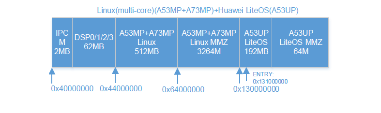
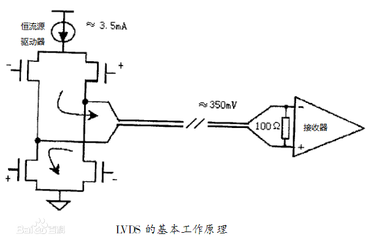

## 自我介绍

你好，我叫高维露，我本科毕业于华中科技大学自动化学院，专业是自动化，硕士目前就读于华中科技大学人工智能与自动化学院，专业是控制工程。今天我来应聘贵公司的嵌入式软件开发工程师。我所在的实验室主要研究方向图像目标检测的算法研究和硬件实现，我目前参与的主要项目是一个基于FPGA和海思系列芯片实现船舰目标检测，我所负责的任务是海思芯片上实现检测识别算法的部署以及与FPGA的通信，算法部署方面主要是通过将调整后的网络模型和参数文件生成海思芯片可加载的数据指令文件；与FPGA侧的通信主要是通过LVDS实现的，目前已经打通整个数据通路，后续正在做一些性能上面的优化工作。经过实验室项目的参与，对于嵌入式平台开发，对于AI算法在嵌入式平台上的落地实现产生了很大的兴趣，但同时也深知自己在嵌入式方面的知识有所欠缺，但我会未来的时间去不断学习，完善自己的知识体系，发挥自己的价值。

## TP -LINK（嵌入式软件工程师）

### 一面

1. C 语言中一个程序的编译过程：

    >- **预处理**：展开头文件、宏替换、去掉注释、条件编译，生成`.i`文件
    >- **编译**：检查语法，生成汇编代码，即`.s`文件
    >- **汇编**：汇编代码转换成机器码，生成`.o`文件
    >- **链接**：链接库文件和目标文件(`.o`文件)生成可执行文件

2. 定义一个指向整形数组的指针（理解错意思了）

    >利用数组指针：指向数组的指针 `类型名 (*p)[元素个数]`，一般利用于二维数组
    >
    >```c++
    >int a[10][20];
    >int (*p)[20] = a;
    >```
    >
    >指针数组的定义：元素是指针的数组，`类型名 *p[指针个数]`，一般对应于二级指针
    >
    >```c++
    >int *p[3];
    >int a[3][4];
    >for(int i = 0; i < 3; ++i)
    >{
    >    p[i] = a[i];
    >    ++p;
    >}
    >```
    >
    >数组中 &a 和 &a[0] 的区别：
    >
    >```c++
    >int a[5] = {1, 2, 3, 4, 5};
    >int *ptr = (int *)(&a + 1);
    >printf("%d,%d",*(a+1), *(ptr-1));
    >
    >// 输出结果： 2 5
    >// 数组的名字 a：表示一个址项数组首地址的指针。a表示数组首地址（第一个元素地址），a+1表示第二个元素
    >// &a[0] : 表示数组的首地址，等于a
    >// &a: 表示存储指向数组首地址的指针的地址，类似一个二维指针。&a表示第一排数组，&a+1表示第二排数组
    >```
    >
    >
    >
    >[数组中的地址表示](https://blog.csdn.net/FX677588/article/details/74857473?utm_medium=distribute.pc_relevant.none-task-blog-BlogCommendFromMachineLearnPai2-2.nonecase&depth_1-utm_source=distribute.pc_relevant.none-task-blog-BlogCommendFromMachineLearnPai2-2.nonecase)

3. C语言关键字类型

    >```c
    >C语言
    >类型说明保字:int,long,short,float,double,char,unsigned,signed,const,void,volatile,enum,struct,union
    >语句定义保留字:if,else,goto,switch,case,do,while,for,continue,break,return,default,typedef
    >存储类说明保留字:auto,register,extern,static
    >长度运算符保留字:sizeof
    >    enum：枚举参数值
    >    extern：声明外部变量或函数，跨文件引用
    >    static：指定静态变量或者静态函数，限定本文件使用
    >    typedef：为数据类型定义别名
    >    volatile：变量的值可能在程序的外部被改变，寄存器里的值可能来不及改变，允许直接从内存读取数据
    >C++
    >virtual、typename、template、private、public、protected、operator、delete等等
    >	包含有 C 中的关键字
    >    explicit：当构造函数被指定时，将不会自动把构造函数作为转换构造函数
    >    friend：允许类或者函数访问一个类中的私有数据，友元类/函数
    >    inline：请求编译器扩张一个给定的函数，复制副本到相应位置，用空间换时间
    >```

    [关键字类型](https://blog.csdn.net/m0_38121874/article/details/82535129?utm_medium=distribute.pc_relevant.none-task-blog-searchFromBaidu-5.nonecase&depth_1-utm_source=distribute.pc_relevant.none-task-blog-searchFromBaidu-5.nonecase)

4. TCP 如何保证可靠性

    >- 报文中的校验和，检验报文头和数据
    >- 停止等待协议：利用序列号和确认应答来传输数据
    >- 超时重传机制：发送方在一定时间内没有收到确认，就重新发送数据
    >- 连接管理：三次握手和四次挥手，保证可靠连接
    >- 流量控制：根据接收端对数据的处理能力决定发送端的发送速度，防止丢包
    >- 拥塞控制：慢启动，拥塞避免，快重传，快恢复
    >- 窗口控制：滑动窗口

5. 介绍滑动窗口

    >停止等待协议要求每一次发送就停下来等待确认报文，然后再开始下一次发送，这样的效率很低。
    >
    >滑动窗口就是允许发送方在停止确认之前发送多个数据分组，在窗口内的数据分组分为以发送但未收到确认，和未发送的数据分组。接收端根据收到的数据分组序号，返回连续数据分组中序号最大的确认报文。发送方接收到确认之后，就像有滑动到确认报文对应的位置，开始下一次发送。这样能提高数据的传输速度，提高网络吞吐量。

6. TCP和UDP的区别

    >- TCP 面向连接，UDP 是无连接的；
    >- TCP 提供可靠的服务，也就是说，通过 TCP 连接传送的数据，无差错，不丢失，不重复，且按序到达；UDP 尽最大努力交付，即不保证可靠交付
    >- TCP 的逻辑通信信道是全双工的可靠信道；UDP 则是不可靠信道
    >- 每一条 TCP 连接只能是点到点的；UDP 支持一对一，一对多，多对一和多对多的交互通信
    >- TCP 面向字节流（可能出现黏包问题），实际上是 TCP 把数据看成一连串无结构的字节流；UDP 是面向报文的（不会出现黏包问题）
    >- UDP 没有拥塞控制，因此网络出现拥塞不会使源主机的发送速率降低（对实时应用很有用，如 IP 电话，实时视频会议等）
    >- TCP 首部开销20字节；UDP 的首部开销小，只有 8 个字节

7. 二叉树的遍历

    >前序遍历：根节点->左孩子->右孩子
    >
    >中序遍历：左孩子->根节点->右孩子
    >
    >后序遍历：左孩子->右孩子->根节点
    >
    >层序遍历：从根节点开始，依次遍历同一层的所有节点，遍历完之后在遍历

8. 深度优先和广度优先

    >深度优先：类似于前序遍历
    >
    >广度优先：类似于层序遍历

9. 专业和嵌入式的关系

    >AI 算法的落地实现，在硬件平台上的部署实现

### 二面 

1. 项目LVDS接口介绍

    [LVDS接口详解](https://blog.csdn.net/LinuxArmbiggod/article/details/83863479?utm_medium=distribute.pc_relevant.none-task-blog-BlogCommendFromMachineLearnPai2-4.nonecase&depth_1-utm_source=distribute.pc_relevant.none-task-blog-BlogCommendFromMachineLearnPai2-4.nonecase)

2. 项目QSPI接口介绍

    [QSPI介绍](https://www.cnblogs.com/commandNotFound/p/12663360.html)

3. 项目中遇到的问题以及如何解决（LVDS通信失败+调试）
4. QSPI、DMA、乒乓缓存介绍

4. C语言中的字节对齐

    >什么是对齐：计算机的内存空间是按 byte 划分的，从理论上讲对任何类型的变量都可以从特定地址开始访问，但实际上访问特定类型的变量都是从特定地址空间开始的，这就需要数据按一定规则在内存中排序，而不是顺序的一个一个排放。
    >
    >对齐的作用和原因：各个硬件平台对存储空间的处理有很大不同，有32位，64位等等，特定架构的 CPU 可能对一些数据类型只能从特定内存地址开始，如果没有字节对齐就可能读取出现错误；另外主要会对存取的效率会有影响，有的平台（例如32位系统）每次读都是从偶地址开始，对于从偶地址开始存放的 int 型数据，一个周期就能读取到，但对于从奇地址开始存放的 int 型数据，就需要读取两个周期，然后在开始拼凑才可以得到原始数据，这样读取效率就会下降很多。
    >
    >**字节对齐的原则**
    >
    >- 数据类型自身的对齐值：char 1、short 2、 int/float 4、单位字节
    >- 结构体或类的自身对齐值：其成员中自身对齐值最大的那个值
    >- 指定对齐值： `#pragma pack(value)`时的指定对齐值 value
    >- 数据成员、结构体和类的有效对齐值：自身对齐值和指定对齐值中小的那个值
    >
    >[字节对齐详解](https://blog.csdn.net/xhfwr/article/details/963793)
    >
    >[sizeof用法总结](https://blog.csdn.net/EVEcho/article/details/81115683?utm_medium=distribute.pc_relevant.none-task-blog-BlogCommendFromMachineLearnPai2-2.nonecase&depth_1-utm_source=distribute.pc_relevant.none-task-blog-BlogCommendFromMachineLearnPai2-2.nonecase)

5. int 与 unsigned int 的计算转换

    >**隐式类型转换**：内置数据类型有低精度向高精度转换、自定义数据类型？
    >
    >-  当不同类型的数据进行操作时，应当首先将其转换成相同的数据类型，然后进行操作，转换规则是由低级向高级转换，转换规则：(short/char)->int->unsigned->long->double、float->double
    >- 算术运算式中，低类型能够转换为高类型。
    >- 赋值表达式中，右边表达式的值自动隐式转换为左边变量的类型，并赋值给他。
    >- 函数调用中参数传递时，系统隐式地将实参转换为形参的类型后，赋给形参。
    >- 函数有返回值时，系统将隐式地将返回表达式类型转换为返回值类型，赋值给调用函数。
    >- 字符必须先转换为整数(C语言规定字符类型数据和整型数据之间可以通用) 
    >- short型转换为int型(同属于整型) 。
    >- float型数据在运算时一律转换为双精度(double)型，以提高运算精度(同属于实型)
    >
    >强制类型转换：`(type_name) expression`
    >
    >**当表达式中存在有符号类型和无符号类型时，所有的操作都将自动转换为无符号类型**
    >
    >```c
    >int a = 10;
    >int b = -20;
    >(a+b>0)?printf("a+b>0"):printf(a+b<0);
    >// 输出结果为 a+b>0
    >```
    >
    >[C 语言中数据类型自动转换原则](https://blog.csdn.net/u013498583/article/details/82899463)

6. 爱好

7. 向他问问题（有待准备）

## 联发科技（嵌入式软件工程师）

### 笔试:

主要考sizeof和strlen

编程题：分割字符串，大数相乘

### 一面

主要问项目上的事情，流程图介绍，然后深挖细节

编程：求一个字符串中，第一次重复出现三次的字符：hash的思想

### 二面:

介绍整个项目，从FPGA+Hi3559a两部分介绍

FPGA哪一款芯片？介绍一下

介绍以下Hi3559AV100这个平台

介绍一下FPGA和海思各自扮演的角色功能

进程和线程的区别

对于Linux操作系统的熟悉程度

进程中的通信

闲聊：为什么选择深圳，不去家乡；对于加班和出差的看法；有没有投其他的简历；对于联发科的了解

## 全志科技（嵌入式软件工程师

### 一面：

自我介绍，介绍项目，项目中主要职责，

算法部署流程，项目中的难点，突出的贡献，

工作地点要求，薪资要求，大学里最自豪的事情，最遗憾的事情，

有没有学过硬件方面的东西，模电数电成绩，电路理论，

对自己的评价，自己的优势，未来的职业规划，有没有学过AI？

业余爱好，软件设计，相关的课程，linux系统版本，

参与过其他社团？得过什么奖？具体职责

### 二面（HR面）

自我介绍，是项目负责人？

为什么选择深圳？

职业规划？

评价自己？优点，缺点？

薪资要求

怎么了解全职的？

为什么选择全志？

有没有女朋友？女朋友毕业去哪里？工作地点？女朋友怎么评价自己？

项目中遇到的问题？昨晚项目对自己的贡献是什么样的？

最遗憾的事情是什么？

家里人的情况？

有没有投其他公司？到了什么程度？

工作地点为什么选择深圳：

高中择校说起，大城市个人成长，女朋友

薪资要求：

不了解公司的薪酬制度是什么样，所以不能有个确切的数字，那么结合自己师兄师姐的工作情况，在深圳我的理想薪资是20k左右，那么具体的薪资我觉得要结合公司的具体的薪酬制度来看。当然薪资什么都是我觉得都是按能力说话，我想信自己努力工作，公司肯定会给予我对等的报酬。

对于加班的看法：

首先呢，我个人不排斥加班，但我会排斥毫无目的的加班，只是为了磨洋工，混时间的加班。我个人更倾向于尽最大可能在工作时间内将自己的任务完成，更喜欢高效的工作，当然比如说以为项目紧急，赶进度需要加班，我觉得完全可以接受，在学校的工作强度其实也很大的，每天8.30到晚上可能会很晚走这种情况都是有的，所以能接受加班的。另外我觉得公司和员工是互补，员工在认真的付出，那么我觉得公司是需要给一定的报酬的，毕竟两者是相互需要的。

对于自己的评价：

独立稳重，同时有毅力的人，小学开始一直在外，到目前为止，自己一个人在外生活的居多，所以很多事情都是自己决定，所以觉得自己是个独立的人，那么同时，一个人在外面也会遇到很多事情，从最初遇到事情不知所措，到慢慢的遇到事情想的是如何去处理这件事带来的结果，就不会惊慌，能快速去想解决办法。至于有毅力，也可能是因为自己一个人习惯了，所以对于工作，或者自己认定的事情，就会去尽最大努力做到最好，有决不放弃的决心，因为这样我觉得自己未来才不会后悔自己的选择。那么缺点的话性格上我觉得自己说话喜欢直来直去，可能会没有考虑到其他的人的感受，但我都是对事不对人的，这可能是我最需要改善的地方，与人交流需要换位思考，这样才能和同事，朋友相处的更加愉快。

未来职业的规划：

首先我是想在嵌入式这个领域去发展的，嵌入式这个领域涉及到很多实现的东西。虽然现在深度学习很火热，但最终落地到应用，比如说智能驾驶，智能家居，安防监控等等领域，这都需要嵌入式相关的知识。所以我个人很想往这个领域去发展。那么嵌入式我觉得可以分为系统级，应用级，底层这三个层次，我在实验室目前从事的工作大多数都属于应用层的开发，阅读技术文档，然后调用相关的API接口完成自己想要的功能，那么在这个过程中我就发现我不知道这些应用底层的实现，在开发的过程中遇到了很多问题，有些问题即使解决了也还有不明白的地方，所以我想工作以后我可能需要更多的去学习底层的一些东西，这些东西我相信公司的项目都会有所涉及，这也是我选择公司的一个评判标准之一，我想去那些行业上游的公司，比如全志这样的芯片公司，这样我才能接触到更多的底层的知识。那么再往后我可能想往系统层面去发展，嵌入式系统的最大特点我认为是专用性，那么我希望自己最后能够主持完整的产品开发，熟悉开发的整个流程，这不仅需要我有很强的专业技术基础，也需要我培养自己系统级的思想。

关于全志：

因为我想去行业上游的公司，像一些芯片厂商，那我就会去关注相关的信息，在求职初期我就去搜寻了相关的公司的信息，这其中就有全职。

后面在选择投递岗位之前，我也对全志去了解过。全志的总部设在珠海，是一家在智能应用处理器Soc，无线互联芯片设计领域表现很好的企业。产品涉及到智能硬件，消费电子，车联网等等领域比如说有平板，VR，等。芯片的话有A系列的A133，A50等，F系列等。

## 中兴

### 一面（技术面）

项目介绍，算法流程部署（自己开发/开源代码？）

主要负责工作，传输帧率多少（100）

对Linux熟悉吗？简历上有写？语言掌握程度？

C语言的字节对齐

volatile关键字的作用

线性表和链表怎么实现？优缺点？各自应用场景？

TCP三次握手建立连接？四次挥手释放连接？

TCP如何保证可靠传输？

### 二面

一面完直接说当场二面（综合面）

怎么评价自己？举例

压力工作？

为什么选深圳？期望薪资

团队合作，遇到问题怎么解决

职业规划

提问：培训，职责（安卓开发，应用层，驱动内核等），回复（还有后续流程）

## 大华

### 笔试

涉及到CPU指令集，操作系统，向量优化，局部性原理，进程线程、反转单链表、存储器结构、newmalloc、降低cache效率、soa和aos的区别等

### 一面

问项目上的事情，看有做海思上的移植部署，问相关的流程

linux熟悉不，对linux内核还需要加深理解

用DSP优化部署？

用CPU去优化？

利用并行化GPU优化

C++的有虚函数和无需函数内存分布上的区别？

C++的虚析构函数的作用？

建议去学学python，了解大华这个公司

### 大华了解

以视频为核心，端到端的视频监控解决方案

视频监控、DVR、NVR、摄像机，在显示。智能交通、监控，智能家居，平安城市等领域取得了很不错的成果

### 二面

海思3559a介绍

MMZ内存 cache和OS内存

cpu内存占有率

几个核，为什么选用FPGA，不直接用海思

性能限制在哪里

cache命中率：

提高cache line的大小

多级缓存

预取

算法尽量可能符合时间和空间局部性原理

## 大疆

**一面**

自我介绍

最大难点？

海思侧软件开发的工作


操作系统的内存管理


## 项目

**内存分配：**



MMZ内存和OS内存的区别：

OS内存主要由linux操作系统管理的内存，OS内存可以在设置环境变量的时候可进行设置，

MMZ内存：由MMZ驱动模块进行管理，供媒体业务单独使用，称为MMZ内存，负责编解码等功能使用。在加载MMZ模块是通过参数可进行设置该模块管理内存的大小,用户程序分配内存的时候可以指定在哪个分配池中分配内存，分配器将查找满足要求的分配池并从中分配合适的内存块给程序使用

 该驱动主要由两个文件组成：media-mem.c和mmz-userdev.c，加载驱动后相应的设备文件：/dev/mmz_userdev，应用层通过打开该设备文件进行ioctl（申请mmz内存、释放mmz内存、重映射mmz内存到内核等）和直接mmap操作，而媒体底层驱动模块则直接调用mmz驱动的导出接口进行相应操作

当应用打开设备文件/dev/mmz_userdev时会申请一个属于该进程的mmb_userdev_info结构体，mmb_userdev_info成员list指向属于该进程的所有mmb_info，mmb_info的mmb成员指向为其分配的mmb，而*mmaped存放mmb物理内存（phy_addr）进行映射后的虚拟地址供用户空间使用。

由于mmz大部分为媒体业务独立使用，内存在媒体硬件模块流转，应用无需访问，这时不用映射，只有当应用需要访问时才需要进行映射。可以把mmz管理的整个内存看做存储盘上的一个大文件，应用层要访问mmz的物理内存通过mmap方式进行映射（类似文件），映射的文件偏移就是mmb.phy_addr，映射大小就是申请的mmb.length，通过mmap方式映射到内核后根据返回的虚拟地址就可以访问该mmb内存

 支持

**离线训练**

得到模型文件和参数文件

**模型转换**：

模型转换使用海思提供的Ruyi工具，模型转换的过程其实也是模型量化的过程。海思模型转换仅支持caffemodel，所以需要准备好`.prototxt`文件和`.caffemodel`文件。

准备好这些文件后，使用Ruyi软件按照`海思SVP说明文档第五章`说明配置其他参数选项，然后运行进行转换即可，这里列举几个配置选项，其他不再赘述。转换完成后，即可得到海思的`.wk`模型描述文件。

**仿真运行**

模型仿真运行是基于Ruyi软件进行的，在海思的SDK中会提供sample，在仿真运行时可以仿照sample中的一个例子添加自己模型的前向推理，在实现过程包括网络模型初始化分配内存，读取图片，运行推理，得到结果。可以根据仿真器对训练的模型进行精度、性能、带宽进行初步评估。

当模型有中间层海思芯片不支持的时候，实际运行时会从custom层将模型切分成两段网络，第一段网络先在nnie运行，然后将结果传到cpu，在cpu实现不支持的那层的运算（即custom层），然后把运算得到的featuremap再从cpu传到nnie运行第二段网络，得到结果后再传到cpu做后处理。

**加载到板端**

加载模型、解析模型->硬件参数初始化->软件参数初始化->硬件处理

网络层的分类
一个网络的层可分为如下的3类：

- 标准层：NNIE支持的Caffe标准层，比如Convolution，Pooling层等；
- 扩展层：NNIE支持的公开但非Caffe标准层，分为2种：
    - 一种是基于Caffe框架进行自定义扩展的层，比如Faster RCNN中的ROIPooling层、SSD中Normalize层、RFCN中的PSROIPooling层，SegNet中的UpSample层等；
    - 另外一种是来源于其他深度学习框架的自定义层，比如YOLOv2中Passthrough层等；
- Non-support层：NNIE不支持的层，比如Caffe中专用于Tranning的层、其他非Caffe框架中的一些层或者用户自定义的私有层等。

扩展层规则
Faster RCNN、SSD、RFCN和SegNet等网络都包含了一些原始Caffe中没有定义的层结构，如ROIPooling、Normalize、PSROI Pooling和Upsample等。NNIE的mapper目前仅支持Caffe框架，且以Caffe-1.0为基础。为了使mapper能支持这些网络，需要对原始的Caffe进行扩展。


NNIE调试问题：

预处理一致性问题：NNIE_mapper与处理方式共有6种，要保证NNIE mapper的预处理方式跟训练时候的一致。

精度下降问题：将nnie_mapper配置选项log_level设置为3，nnie_mapper会输出各层量化推断结果

**问题**：

Mapper转换警告

- 非线性量化delta时，

**LVDS接口：**最大时钟800M，目前FPGA发送200M

低压差分信号，低功耗、低误码率、低串扰和低辐射的差分信号技术，核心是采用极低的电压摆幅告诉差动传输数据，可实现点对点或点对多的连接。

LVDS输出接口利用非常低的电压摆幅（约350mV）在两条PCB走线或一对平衡电缆上通过差分进行数据的传输，即低压差分信号传输，由于采用低压和低电流驱动方式，因此，实现了低噪声和低功耗。

最基本的LVDS器件就是LVDS驱动器和接收器。LVDS的驱动器由驱动差分线对的电流源组成，电流通常为3.5 mA。LVDS接收器具有很高的输入阻抗，因此驱动器输出的大部分电流都流过100 Ω的匹配电阻，并在接收器的输入端产生大约350 mV的电压。当驱动器翻转时，它改变流经电阻的电流方向，因此产生有效的逻辑“1”和逻辑“0”状态



发送器：并转串   接收器：串转并

1.单路6位LVDS输出接口 2.双路6位LVDS输出接口 3.单路8位1TL输出接口 4.双路8位1TL输出接口

**QSPI**


## 提问环节

1. 对于面试过程中的问题，主动提问，比如刚刚讲的什么理解不深刻，请面试官帮忙讲解一下

2. 如果能进入公司，转正的流程是怎么样的，如何晋升

3. 部门主要负责的职责是什么，主要工作是什么

4. 进入公司后的有无培训，流程是怎么样的？

5. 面试结果何时通知，怎么联系


#### 1.部门工作 

 核心技术 / 核心中台 / 核心业务 / 发展技术 / 发展业务 / 边缘业务

####   2.职业发展 

 合理晋升 / 不够透明 / 耗时过长 / 关系大于能力 / 资历大于产出 / 排挤压迫

####   3.个人成长 

 技术发展 / 领域发展 / 业务发展 / 技术熟悉 / 领域熟悉 / 业务熟悉

####   4.强度压力 

 强度大回报高 / 强度大 / 强度大无意义 / 强度小回报高 / 强度小 / 强度小回报低

####   5.领导同事 

  和谐融洽 / 各自为战 / 层级分明 / 明争暗斗 / paixi斗争 / 纸上谈兵 / 敷衍甩锅 / PUA


项目介绍：

